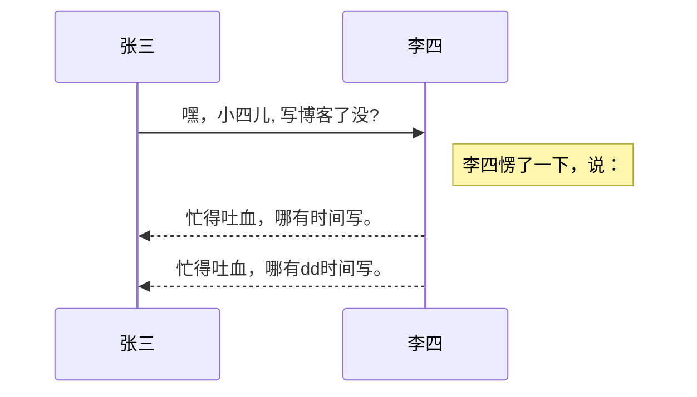
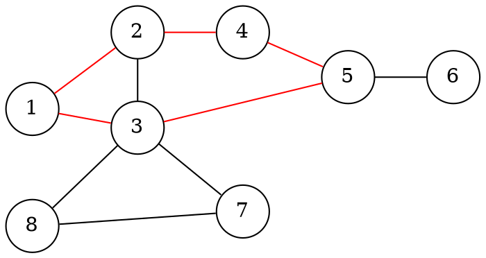

以下是官网示例 https://www.modevol.com/evoldown

# Evoldown


<div style="display: flex; flex-direction: row; align-items: center;">
<span style="display: flex; flex-direction: row; align-items: center; color: hsl(200 72% 50%); background-color: hsl(200 72% 50%/0.08); padding: 0 0.4em; border-radius: 0.4em;; line-height: 2.5em">
<span style="display: flex; flex-direction: row; align-items: center; margin-right: 0.4em; ">
<svg xmlns="http://www.w3.org/2000/svg" xmlns:xlink="http://www.w3.org/1999/xlink" version="1.1" id="Description" x="0px" y="0px" viewBox="0 0 480 480" style="enable-background:new 0 0 480 480;" xml:space="preserve" fill="currentColor" width="2em" height="2em">
<path d="M423,137c0-44.1121216-35.8878784-80-80-80c-84.1915588,0.7583809-110.0998383,113.3004456-36.2925415,151.2579346  c-5.2602539,12.726181-9.2548828,28.8413086-13.1195679,44.4295654  c-2.7939453,11.2666016-5.6816406,22.9169922-8.8095703,32.1679688c-1.4560547,4.3095703-2.5714111,9.6259766-3.78125,9.6259766  s-4.8193359-8.1904297-8.109375-17.1523438c-5.125-13.9599609-9.5595703-31.8603516-13.8486328-49.1708984  c-8.7045898-29.4732208-16.0753021-90.0476227-56.038208-91.158844  c-32.2970123-0.4763184-42.3325043,46.5488434-49.4030304,75.150177  c-3.8127289,14.4946747-8.1200104,34.2762299-14.4395599,44.8508911  c-7.9295044,0.0062866-15.9151611,0.0902405-23.7544556,1.4060059  c-13.7724152,2.2255859-26.5065613,8.2861328-35.9597015,18.6941223c-3.8976212,4.2600403-7.1308441,9.1513062-9.5832062,14.3764343  c-2.5186157,5.3421631-4.2374496,11.0603638-5.2716675,16.8699951c-1.2756424,7.0453186-1.5398521,14.2402954-1.5770836,21.3861084  c-0.019207,4.5404968-0.0158348,9.1194153-0.0047112,13.6599121c0.0201416,5.1043091,0.1254272,10.2408142,0.6298981,15.3231812  c0.7569885,7.8907471,2.5627136,15.7391052,5.8377151,22.9779053c1.7797394,3.9467773,3.9798355,7.6095581,6.5390854,11.098114  c0.6442184,0.7648621,1.4680481,1.8629456,2.1063309,2.6315308c0.6539993,0.6820068,1.4842377,1.6783447,2.1313553,2.3648071  c2.2123337,2.249054,4.6054153,4.4624939,7.1582794,6.3224182c3.5634308,2.6588745,7.4678726,4.9191284,11.5426483,6.6968384  c8.458931,3.7344055,17.6907425,5.4031982,26.885025,5.9051819c7.1495132,0.3993835,14.3291855,0.2623901,21.4864426,0.2860107  c8.5655212-0.0042725,17.2058411-0.1551208,25.6332397-1.8360901c20.277359-3.9068909,36.4927521-16.2268677,44.4356384-35.4599304  c1.4786072-3.6889648,2.674057-7.5184631,3.4970245-11.4074402c0.9887238-4.5610962,1.5328522-9.2298889,1.8126221-13.8855591  c0.2511139-4.1849365,0.2852325-8.4104309,0.294693-12.6019897c-0.0007019-4.59729,0.0194855-9.2321167-0.0249023-13.8292236  c-0.0744629-9.7965088-0.8462067-19.7219238-3.9051208-29.0841064  c-5.914566-18.3643494-19.4836578-31.9772644-37.8461609-37.9238892  c7.8092194-21.0115814,12.8518677-49.7680664,19.9764404-70.9776154c0.9317017-2.734848,1.9286652-6.8110199,2.5596313-6.8110199  s2.9365234,6.6577148,4.7319336,11.8979492c10.2387238,30.2937927,17.5126495,74.7228699,29.9034271,103.8105164  c17.4406586,45.9709473,62.2472076,55.171814,80.9047394,7.8404541c5.2562866-12.721283,9.2514038-28.8345642,13.1146851-44.4185486  c3.8088379-14.6082916,8.1817322-34.822937,14.5405884-45.4127808C389.2356567,214.8319702,423,179.7865601,423,137z   M181.536438,313.0449829c0.9487457,3.8279724,1.2322693,7.8303528,1.3649902,11.7605591  c0.1174927,3.9046326,0.0940399,7.8545532,0.0985718,11.760437c-0.0097046,4.5599365,0.0381012,9.1585388-0.1381073,13.7160034  c-0.4079895,9.8537903-2.0735626,19.8905029-12.2717743,24.0602112c-3.2990265,1.3651428-6.8917084,1.9567566-10.4311218,2.2704773  c-3.8664246,0.3357544-7.7797699,0.3675842-11.6582031,0.3835449c-3.4657288,0.006958-6.9653015,0.0057983-10.4310303,0.0015259  c-3.6724854-0.0114746-7.3796692-0.0318604-11.0446777-0.2906494c-3.5324707-0.2519226-7.113205-0.7453918-10.4682007-1.9194336  c-8.2780151-2.9126282-11.6557541-9.3336487-12.8324203-17.6408386c-0.7403564-5.344696-0.7009277-10.7861328-0.723259-16.1706238  c0.013176-5.3798523-0.0533142-10.7922974,0.0971069-16.1706543c0.3371735-10.1248169,1.708252-20.7862244,12.2686005-25.1338806  c4.6471558-1.9124756,9.7524185-2.3385315,14.7262268-2.5455627c5.5129547-0.1898804,11.0517883-0.1094055,16.5668945-0.125824  c3.4661865,0.0062866,6.9681702,0.0099182,10.4310913,0.1774597c3.0772858,0.1510315,6.1941071,0.4451599,9.2037964,1.1256104  C174.5272827,300.1626892,179.4888611,304.8049011,181.536438,313.0449829z M343,177c-22.0914307,0-40-17.9085693-40-40  c1.960907-53.0020828,78.0470886-52.9877472,80.000061,0.0005035C383,159.0914307,365.0914307,177,343,177z"/>
</svg> </span>
欢迎使用Evoldown</span>
    

</div>
    


> Evoldown 是一个所见即所得的Markdown编辑器。
>
> 不仅支持**CommonMark**和**GFM**，还加入了渐构特有的语法！
>
> 按下斜杠`/`可以查看所有命令，书写过程中伴随语法提示！

## 语法


<div style="display: flex; flex-direction: row; align-items: center;">
<span style="display: flex; flex-direction: row; align-items: center; color: hsl(0 72% 50%); background-color: hsl(0 72% 50%/0.08); padding: 0 0.4em; border-radius: 0.4em;; line-height: 2.5em">
<span style="display: flex; flex-direction: row; align-items: center; margin-right: 0.4em; ">
<svg xmlns="http://www.w3.org/2000/svg" xmlns:xlink="http://www.w3.org/1999/xlink" version="1.1" id="Example" x="0px" y="0px" viewBox="0 0 480 480" style="enable-background:new 0 0 480 480;" xml:space="preserve" fill="currentColor" width="2em" height="2em">
<path d="M438,310.3c0-4.9,0-9.6-0.3-15.2c-1.3-26.6-17-48.4-42.1-56.6c-0.2-0.1-0.5-0.2-0.7-0.2c-14.1-4.9-32.1-5.3-47.2-5.4  c-13.7,0.1-26.6-0.2-41,0.6c21.5-10.5,32.9-33.4,33-55.5c0.1-5.1,0.1-9.3,0.1-14c1.3-32.3-10.7-58.5-42.4-69.5  c-0.2-0.1-0.5-0.2-0.7-0.2c-14.1-4.9-32.1-5.3-47.2-5.4c-16.8,0.2-31.6-0.6-49.5,1.5c-0.2,0-0.4,0.1-0.6,0.1  c-38.5,4.4-61,32.7-59.7,67.7c0,4,0,7.8,0,11.6c-0.2,9.1,0.8,22.6,4.6,31.9c0.9,2.1,1.8,4.5,2.9,6.6l0.1,0.1  c5.6,10.9,14.5,19.5,25.6,25.2c-11.7-0.8-23-0.6-34.6-0.6c-11.5,0-23.3-0.1-36.3,1.5c-0.2,0-0.4,0.1-0.6,0.1  C56.6,240.7,39.7,271.3,42,311c0,6.6-0.2,12.4,1,20.5c1,7.5,3.2,14.2,6.5,20.8l0.1,0.1c10.4,20.5,31.5,31,54.5,33.5c0,0,0,0,0.1,0  c13.8,1.5,22.7,1.1,35.8,1.2c12.3,0,22.9,0.2,36.1-0.8c8.2-0.8,19-2.3,30.2-7.4c0.1-0.1,0.3-0.1,0.4-0.2c17.3-8,29.4-23.2,33.3-41.5  c1.2,5.4,2.9,10.3,5.4,15.2l0.1,0.1c10.4,20.5,31.5,31,54.5,33.5c0,0,0,0,0.1,0c13.8,1.5,22.7,1.1,35.8,1.2  c12.3,0,22.9,0.2,36.1-0.8c8.2-0.8,19-2.3,30.2-7.4c0.1-0.1,0.3-0.1,0.4-0.2c28.7-13.8,36.5-39.3,35.3-68.1  C438,310.5,438,310.4,438,310.3z M180,158.7c0.1-7.1,0.5-15,5.6-20.4c10.7-11.2,36.2-8.9,50.9-9.4c11.6,0.1,23.1-0.3,34.7,0.8  c9.4,1,21.1,3.2,25.8,12.5c3.7,7.4,2.9,16.2,3,24.3c0,12.3,0.9,26.1-12.3,31.9c-5.4,2.5-11.4,3.4-17.3,4  c-10.7,0.8-21.6,0.7-32.4,0.7c-15.2-0.5-44.9,2.5-54.1-11.8l-0.9-1.6l-0.1-0.1c-2.8-6.2-2.8-13.2-2.8-19.9  C180,166.1,180,162.4,180,158.7z M201.9,320.4c-0.1,9.5-3,17.9-12.2,22c-12.1,5.2-25.6,4.3-38.5,4.7c-7.7,0-15.3,0-23,0  c-13.2-0.5-34.1,0.5-42.3-11.8l-0.9-1.6l-0.1-0.1c-4.1-9.7-2.4-20.6-2.8-30.9c-0.5-18.7,7.2-26.2,25.4-28.6  c10.3-1.3,20.8-1.2,31.1-1.2c11.6,0.1,23.1-0.3,34.7,0.8C206,276.7,202.2,293.9,201.9,320.4z M254.5,254.9c-8.5,9-12.6,19.1-14.5,28  c-3.6-17.6-15.1-32.4-31-40.5c12.8,0.8,23.1,0.6,36,0.6c8.6,0,16.7,0,26.2-0.6C265.4,245.4,259.7,249.4,254.5,254.9z M397.9,320.4  c-0.1,9.5-3,17.9-12.2,22c-12.1,5.2-25.6,4.3-38.5,4.7c-7.7,0-15.3,0-23,0c-13.2-0.5-34.1,0.5-42.3-11.8l-0.9-1.6l-0.1-0.1  c-4.1-9.7-2.4-20.6-2.8-30.9c-0.5-18.7,7.2-26.2,25.4-28.6c10.3-1.3,20.8-1.2,31.1-1.2c11.6,0.1,23.1-0.3,34.7,0.8  C402,276.7,398.2,293.9,397.9,320.4z"/>
</svg> </span>
行内样式</span>
    

</div>
    

更流畅的书写*Markdown*，使用选择提示增加行内样式。

*倾斜*

**加粗**

***加粗和倾斜混用***

~~删除~~

^上标^~下标~

`行内块`

[!隐藏的*倾斜*!]

https://www.baidu.com

[内部链接](#样式)

[外部链接](https://www.baidu.com)

行内公式：$$\sum_{i=1}^n a_i=0$$


<div style="display: flex; flex-direction: row; align-items: center;">
<span style="display: flex; flex-direction: row; align-items: center; color: hsl(0 72% 50%); background-color: hsl(0 72% 50%/0.08); padding: 0 0.4em; border-radius: 0.4em;; line-height: 2.5em">
<span style="display: flex; flex-direction: row; align-items: center; margin-right: 0.4em; ">
<svg xmlns="http://www.w3.org/2000/svg" xmlns:xlink="http://www.w3.org/1999/xlink" version="1.1" id="Example" x="0px" y="0px" viewBox="0 0 480 480" style="enable-background:new 0 0 480 480;" xml:space="preserve" fill="currentColor" width="2em" height="2em">
<path d="M438,310.3c0-4.9,0-9.6-0.3-15.2c-1.3-26.6-17-48.4-42.1-56.6c-0.2-0.1-0.5-0.2-0.7-0.2c-14.1-4.9-32.1-5.3-47.2-5.4  c-13.7,0.1-26.6-0.2-41,0.6c21.5-10.5,32.9-33.4,33-55.5c0.1-5.1,0.1-9.3,0.1-14c1.3-32.3-10.7-58.5-42.4-69.5  c-0.2-0.1-0.5-0.2-0.7-0.2c-14.1-4.9-32.1-5.3-47.2-5.4c-16.8,0.2-31.6-0.6-49.5,1.5c-0.2,0-0.4,0.1-0.6,0.1  c-38.5,4.4-61,32.7-59.7,67.7c0,4,0,7.8,0,11.6c-0.2,9.1,0.8,22.6,4.6,31.9c0.9,2.1,1.8,4.5,2.9,6.6l0.1,0.1  c5.6,10.9,14.5,19.5,25.6,25.2c-11.7-0.8-23-0.6-34.6-0.6c-11.5,0-23.3-0.1-36.3,1.5c-0.2,0-0.4,0.1-0.6,0.1  C56.6,240.7,39.7,271.3,42,311c0,6.6-0.2,12.4,1,20.5c1,7.5,3.2,14.2,6.5,20.8l0.1,0.1c10.4,20.5,31.5,31,54.5,33.5c0,0,0,0,0.1,0  c13.8,1.5,22.7,1.1,35.8,1.2c12.3,0,22.9,0.2,36.1-0.8c8.2-0.8,19-2.3,30.2-7.4c0.1-0.1,0.3-0.1,0.4-0.2c17.3-8,29.4-23.2,33.3-41.5  c1.2,5.4,2.9,10.3,5.4,15.2l0.1,0.1c10.4,20.5,31.5,31,54.5,33.5c0,0,0,0,0.1,0c13.8,1.5,22.7,1.1,35.8,1.2  c12.3,0,22.9,0.2,36.1-0.8c8.2-0.8,19-2.3,30.2-7.4c0.1-0.1,0.3-0.1,0.4-0.2c28.7-13.8,36.5-39.3,35.3-68.1  C438,310.5,438,310.4,438,310.3z M180,158.7c0.1-7.1,0.5-15,5.6-20.4c10.7-11.2,36.2-8.9,50.9-9.4c11.6,0.1,23.1-0.3,34.7,0.8  c9.4,1,21.1,3.2,25.8,12.5c3.7,7.4,2.9,16.2,3,24.3c0,12.3,0.9,26.1-12.3,31.9c-5.4,2.5-11.4,3.4-17.3,4  c-10.7,0.8-21.6,0.7-32.4,0.7c-15.2-0.5-44.9,2.5-54.1-11.8l-0.9-1.6l-0.1-0.1c-2.8-6.2-2.8-13.2-2.8-19.9  C180,166.1,180,162.4,180,158.7z M201.9,320.4c-0.1,9.5-3,17.9-12.2,22c-12.1,5.2-25.6,4.3-38.5,4.7c-7.7,0-15.3,0-23,0  c-13.2-0.5-34.1,0.5-42.3-11.8l-0.9-1.6l-0.1-0.1c-4.1-9.7-2.4-20.6-2.8-30.9c-0.5-18.7,7.2-26.2,25.4-28.6  c10.3-1.3,20.8-1.2,31.1-1.2c11.6,0.1,23.1-0.3,34.7,0.8C206,276.7,202.2,293.9,201.9,320.4z M254.5,254.9c-8.5,9-12.6,19.1-14.5,28  c-3.6-17.6-15.1-32.4-31-40.5c12.8,0.8,23.1,0.6,36,0.6c8.6,0,16.7,0,26.2-0.6C265.4,245.4,259.7,249.4,254.5,254.9z M397.9,320.4  c-0.1,9.5-3,17.9-12.2,22c-12.1,5.2-25.6,4.3-38.5,4.7c-7.7,0-15.3,0-23,0c-13.2-0.5-34.1,0.5-42.3-11.8l-0.9-1.6l-0.1-0.1  c-4.1-9.7-2.4-20.6-2.8-30.9c-0.5-18.7,7.2-26.2,25.4-28.6c10.3-1.3,20.8-1.2,31.1-1.2c11.6,0.1,23.1-0.3,34.7,0.8  C402,276.7,398.2,293.9,397.9,320.4z"/>
</svg> </span>
块级样式</span>
    

</div>
    

> 引用
>
> > 多级引用

* 无序列表1

* 无序列表2

1. 有序列表

2. 有序列表

* [ ] 任务1

* [x] 已完成

1. [ ] 有序任务

[^1]: 注脚内容

引用注脚：[^1]


<div style="display: flex; flex-direction: row; align-items: center;">
<span style="display: flex; flex-direction: row; align-items: center; color: hsl(0 72% 50%); background-color: hsl(0 72% 50%/0.08); padding: 0 0.4em; border-radius: 0.4em;; line-height: 2.5em">
<span style="display: flex; flex-direction: row; align-items: center; margin-right: 0.4em; ">
<svg xmlns="http://www.w3.org/2000/svg" xmlns:xlink="http://www.w3.org/1999/xlink" version="1.1" id="Example" x="0px" y="0px" viewBox="0 0 480 480" style="enable-background:new 0 0 480 480;" xml:space="preserve" fill="currentColor" width="2em" height="2em">
<path d="M438,310.3c0-4.9,0-9.6-0.3-15.2c-1.3-26.6-17-48.4-42.1-56.6c-0.2-0.1-0.5-0.2-0.7-0.2c-14.1-4.9-32.1-5.3-47.2-5.4  c-13.7,0.1-26.6-0.2-41,0.6c21.5-10.5,32.9-33.4,33-55.5c0.1-5.1,0.1-9.3,0.1-14c1.3-32.3-10.7-58.5-42.4-69.5  c-0.2-0.1-0.5-0.2-0.7-0.2c-14.1-4.9-32.1-5.3-47.2-5.4c-16.8,0.2-31.6-0.6-49.5,1.5c-0.2,0-0.4,0.1-0.6,0.1  c-38.5,4.4-61,32.7-59.7,67.7c0,4,0,7.8,0,11.6c-0.2,9.1,0.8,22.6,4.6,31.9c0.9,2.1,1.8,4.5,2.9,6.6l0.1,0.1  c5.6,10.9,14.5,19.5,25.6,25.2c-11.7-0.8-23-0.6-34.6-0.6c-11.5,0-23.3-0.1-36.3,1.5c-0.2,0-0.4,0.1-0.6,0.1  C56.6,240.7,39.7,271.3,42,311c0,6.6-0.2,12.4,1,20.5c1,7.5,3.2,14.2,6.5,20.8l0.1,0.1c10.4,20.5,31.5,31,54.5,33.5c0,0,0,0,0.1,0  c13.8,1.5,22.7,1.1,35.8,1.2c12.3,0,22.9,0.2,36.1-0.8c8.2-0.8,19-2.3,30.2-7.4c0.1-0.1,0.3-0.1,0.4-0.2c17.3-8,29.4-23.2,33.3-41.5  c1.2,5.4,2.9,10.3,5.4,15.2l0.1,0.1c10.4,20.5,31.5,31,54.5,33.5c0,0,0,0,0.1,0c13.8,1.5,22.7,1.1,35.8,1.2  c12.3,0,22.9,0.2,36.1-0.8c8.2-0.8,19-2.3,30.2-7.4c0.1-0.1,0.3-0.1,0.4-0.2c28.7-13.8,36.5-39.3,35.3-68.1  C438,310.5,438,310.4,438,310.3z M180,158.7c0.1-7.1,0.5-15,5.6-20.4c10.7-11.2,36.2-8.9,50.9-9.4c11.6,0.1,23.1-0.3,34.7,0.8  c9.4,1,21.1,3.2,25.8,12.5c3.7,7.4,2.9,16.2,3,24.3c0,12.3,0.9,26.1-12.3,31.9c-5.4,2.5-11.4,3.4-17.3,4  c-10.7,0.8-21.6,0.7-32.4,0.7c-15.2-0.5-44.9,2.5-54.1-11.8l-0.9-1.6l-0.1-0.1c-2.8-6.2-2.8-13.2-2.8-19.9  C180,166.1,180,162.4,180,158.7z M201.9,320.4c-0.1,9.5-3,17.9-12.2,22c-12.1,5.2-25.6,4.3-38.5,4.7c-7.7,0-15.3,0-23,0  c-13.2-0.5-34.1,0.5-42.3-11.8l-0.9-1.6l-0.1-0.1c-4.1-9.7-2.4-20.6-2.8-30.9c-0.5-18.7,7.2-26.2,25.4-28.6  c10.3-1.3,20.8-1.2,31.1-1.2c11.6,0.1,23.1-0.3,34.7,0.8C206,276.7,202.2,293.9,201.9,320.4z M254.5,254.9c-8.5,9-12.6,19.1-14.5,28  c-3.6-17.6-15.1-32.4-31-40.5c12.8,0.8,23.1,0.6,36,0.6c8.6,0,16.7,0,26.2-0.6C265.4,245.4,259.7,249.4,254.5,254.9z M397.9,320.4  c-0.1,9.5-3,17.9-12.2,22c-12.1,5.2-25.6,4.3-38.5,4.7c-7.7,0-15.3,0-23,0c-13.2-0.5-34.1,0.5-42.3-11.8l-0.9-1.6l-0.1-0.1  c-4.1-9.7-2.4-20.6-2.8-30.9c-0.5-18.7,7.2-26.2,25.4-28.6c10.3-1.3,20.8-1.2,31.1-1.2c11.6,0.1,23.1-0.3,34.7,0.8  C402,276.7,398.2,293.9,397.9,320.4z"/>
</svg> </span>
代码块</span>
    

</div>
    

```python
# python代码块
hello = 'world'
```

`Ctrl+回城`可以跳出代码块

还可以用代码块制图，支持Mermaid和Dot






<div style="display: flex; flex-direction: row; align-items: center;">
<span style="display: flex; flex-direction: row; align-items: center; color: hsl(0 72% 50%); background-color: hsl(0 72% 50%/0.08); padding: 0 0.4em; border-radius: 0.4em;; line-height: 2.5em">
<span style="display: flex; flex-direction: row; align-items: center; margin-right: 0.4em; ">
<svg xmlns="http://www.w3.org/2000/svg" xmlns:xlink="http://www.w3.org/1999/xlink" version="1.1" id="Example" x="0px" y="0px" viewBox="0 0 480 480" style="enable-background:new 0 0 480 480;" xml:space="preserve" fill="currentColor" width="2em" height="2em">
<path d="M438,310.3c0-4.9,0-9.6-0.3-15.2c-1.3-26.6-17-48.4-42.1-56.6c-0.2-0.1-0.5-0.2-0.7-0.2c-14.1-4.9-32.1-5.3-47.2-5.4  c-13.7,0.1-26.6-0.2-41,0.6c21.5-10.5,32.9-33.4,33-55.5c0.1-5.1,0.1-9.3,0.1-14c1.3-32.3-10.7-58.5-42.4-69.5  c-0.2-0.1-0.5-0.2-0.7-0.2c-14.1-4.9-32.1-5.3-47.2-5.4c-16.8,0.2-31.6-0.6-49.5,1.5c-0.2,0-0.4,0.1-0.6,0.1  c-38.5,4.4-61,32.7-59.7,67.7c0,4,0,7.8,0,11.6c-0.2,9.1,0.8,22.6,4.6,31.9c0.9,2.1,1.8,4.5,2.9,6.6l0.1,0.1  c5.6,10.9,14.5,19.5,25.6,25.2c-11.7-0.8-23-0.6-34.6-0.6c-11.5,0-23.3-0.1-36.3,1.5c-0.2,0-0.4,0.1-0.6,0.1  C56.6,240.7,39.7,271.3,42,311c0,6.6-0.2,12.4,1,20.5c1,7.5,3.2,14.2,6.5,20.8l0.1,0.1c10.4,20.5,31.5,31,54.5,33.5c0,0,0,0,0.1,0  c13.8,1.5,22.7,1.1,35.8,1.2c12.3,0,22.9,0.2,36.1-0.8c8.2-0.8,19-2.3,30.2-7.4c0.1-0.1,0.3-0.1,0.4-0.2c17.3-8,29.4-23.2,33.3-41.5  c1.2,5.4,2.9,10.3,5.4,15.2l0.1,0.1c10.4,20.5,31.5,31,54.5,33.5c0,0,0,0,0.1,0c13.8,1.5,22.7,1.1,35.8,1.2  c12.3,0,22.9,0.2,36.1-0.8c8.2-0.8,19-2.3,30.2-7.4c0.1-0.1,0.3-0.1,0.4-0.2c28.7-13.8,36.5-39.3,35.3-68.1  C438,310.5,438,310.4,438,310.3z M180,158.7c0.1-7.1,0.5-15,5.6-20.4c10.7-11.2,36.2-8.9,50.9-9.4c11.6,0.1,23.1-0.3,34.7,0.8  c9.4,1,21.1,3.2,25.8,12.5c3.7,7.4,2.9,16.2,3,24.3c0,12.3,0.9,26.1-12.3,31.9c-5.4,2.5-11.4,3.4-17.3,4  c-10.7,0.8-21.6,0.7-32.4,0.7c-15.2-0.5-44.9,2.5-54.1-11.8l-0.9-1.6l-0.1-0.1c-2.8-6.2-2.8-13.2-2.8-19.9  C180,166.1,180,162.4,180,158.7z M201.9,320.4c-0.1,9.5-3,17.9-12.2,22c-12.1,5.2-25.6,4.3-38.5,4.7c-7.7,0-15.3,0-23,0  c-13.2-0.5-34.1,0.5-42.3-11.8l-0.9-1.6l-0.1-0.1c-4.1-9.7-2.4-20.6-2.8-30.9c-0.5-18.7,7.2-26.2,25.4-28.6  c10.3-1.3,20.8-1.2,31.1-1.2c11.6,0.1,23.1-0.3,34.7,0.8C206,276.7,202.2,293.9,201.9,320.4z M254.5,254.9c-8.5,9-12.6,19.1-14.5,28  c-3.6-17.6-15.1-32.4-31-40.5c12.8,0.8,23.1,0.6,36,0.6c8.6,0,16.7,0,26.2-0.6C265.4,245.4,259.7,249.4,254.5,254.9z M397.9,320.4  c-0.1,9.5-3,17.9-12.2,22c-12.1,5.2-25.6,4.3-38.5,4.7c-7.7,0-15.3,0-23,0c-13.2-0.5-34.1,0.5-42.3-11.8l-0.9-1.6l-0.1-0.1  c-4.1-9.7-2.4-20.6-2.8-30.9c-0.5-18.7,7.2-26.2,25.4-28.6c10.3-1.3,20.8-1.2,31.1-1.2c11.6,0.1,23.1-0.3,34.7,0.8  C402,276.7,398.2,293.9,397.9,320.4z"/>
</svg> </span>
数学公式</span>
    

</div>
    

$$
\begin{bmatrix}1 & 2 & 3\\ \ 4 & 5 & 6\\ \ 7 & 8 & 9\end{bmatrix}

$$


<div style="display: flex; flex-direction: row; align-items: center;">
<span style="display: flex; flex-direction: row; align-items: center; color: hsl(0 72% 50%); background-color: hsl(0 72% 50%/0.08); padding: 0 0.4em; border-radius: 0.4em;; line-height: 2.5em">
<span style="display: flex; flex-direction: row; align-items: center; margin-right: 0.4em; ">
<svg xmlns="http://www.w3.org/2000/svg" xmlns:xlink="http://www.w3.org/1999/xlink" version="1.1" id="Example" x="0px" y="0px" viewBox="0 0 480 480" style="enable-background:new 0 0 480 480;" xml:space="preserve" fill="currentColor" width="2em" height="2em">
<path d="M438,310.3c0-4.9,0-9.6-0.3-15.2c-1.3-26.6-17-48.4-42.1-56.6c-0.2-0.1-0.5-0.2-0.7-0.2c-14.1-4.9-32.1-5.3-47.2-5.4  c-13.7,0.1-26.6-0.2-41,0.6c21.5-10.5,32.9-33.4,33-55.5c0.1-5.1,0.1-9.3,0.1-14c1.3-32.3-10.7-58.5-42.4-69.5  c-0.2-0.1-0.5-0.2-0.7-0.2c-14.1-4.9-32.1-5.3-47.2-5.4c-16.8,0.2-31.6-0.6-49.5,1.5c-0.2,0-0.4,0.1-0.6,0.1  c-38.5,4.4-61,32.7-59.7,67.7c0,4,0,7.8,0,11.6c-0.2,9.1,0.8,22.6,4.6,31.9c0.9,2.1,1.8,4.5,2.9,6.6l0.1,0.1  c5.6,10.9,14.5,19.5,25.6,25.2c-11.7-0.8-23-0.6-34.6-0.6c-11.5,0-23.3-0.1-36.3,1.5c-0.2,0-0.4,0.1-0.6,0.1  C56.6,240.7,39.7,271.3,42,311c0,6.6-0.2,12.4,1,20.5c1,7.5,3.2,14.2,6.5,20.8l0.1,0.1c10.4,20.5,31.5,31,54.5,33.5c0,0,0,0,0.1,0  c13.8,1.5,22.7,1.1,35.8,1.2c12.3,0,22.9,0.2,36.1-0.8c8.2-0.8,19-2.3,30.2-7.4c0.1-0.1,0.3-0.1,0.4-0.2c17.3-8,29.4-23.2,33.3-41.5  c1.2,5.4,2.9,10.3,5.4,15.2l0.1,0.1c10.4,20.5,31.5,31,54.5,33.5c0,0,0,0,0.1,0c13.8,1.5,22.7,1.1,35.8,1.2  c12.3,0,22.9,0.2,36.1-0.8c8.2-0.8,19-2.3,30.2-7.4c0.1-0.1,0.3-0.1,0.4-0.2c28.7-13.8,36.5-39.3,35.3-68.1  C438,310.5,438,310.4,438,310.3z M180,158.7c0.1-7.1,0.5-15,5.6-20.4c10.7-11.2,36.2-8.9,50.9-9.4c11.6,0.1,23.1-0.3,34.7,0.8  c9.4,1,21.1,3.2,25.8,12.5c3.7,7.4,2.9,16.2,3,24.3c0,12.3,0.9,26.1-12.3,31.9c-5.4,2.5-11.4,3.4-17.3,4  c-10.7,0.8-21.6,0.7-32.4,0.7c-15.2-0.5-44.9,2.5-54.1-11.8l-0.9-1.6l-0.1-0.1c-2.8-6.2-2.8-13.2-2.8-19.9  C180,166.1,180,162.4,180,158.7z M201.9,320.4c-0.1,9.5-3,17.9-12.2,22c-12.1,5.2-25.6,4.3-38.5,4.7c-7.7,0-15.3,0-23,0  c-13.2-0.5-34.1,0.5-42.3-11.8l-0.9-1.6l-0.1-0.1c-4.1-9.7-2.4-20.6-2.8-30.9c-0.5-18.7,7.2-26.2,25.4-28.6  c10.3-1.3,20.8-1.2,31.1-1.2c11.6,0.1,23.1-0.3,34.7,0.8C206,276.7,202.2,293.9,201.9,320.4z M254.5,254.9c-8.5,9-12.6,19.1-14.5,28  c-3.6-17.6-15.1-32.4-31-40.5c12.8,0.8,23.1,0.6,36,0.6c8.6,0,16.7,0,26.2-0.6C265.4,245.4,259.7,249.4,254.5,254.9z M397.9,320.4  c-0.1,9.5-3,17.9-12.2,22c-12.1,5.2-25.6,4.3-38.5,4.7c-7.7,0-15.3,0-23,0c-13.2-0.5-34.1,0.5-42.3-11.8l-0.9-1.6l-0.1-0.1  c-4.1-9.7-2.4-20.6-2.8-30.9c-0.5-18.7,7.2-26.2,25.4-28.6c10.3-1.3,20.8-1.2,31.1-1.2c11.6,0.1,23.1-0.3,34.7,0.8  C402,276.7,398.2,293.9,397.9,320.4z"/>
</svg> </span>
表格</span>
    

</div>
    

| 表头1 | 表头2 | 表头3 |
| :-- | :-- | :-- |
| 内容1 | 内容2 | 内容3 |


<div style="display: flex; flex-direction: row; align-items: center;">
<span style="display: flex; flex-direction: row; align-items: center; color: hsl(0 72% 50%); background-color: hsl(0 72% 50%/0.08); padding: 0 0.4em; border-radius: 0.4em;; line-height: 2.5em">
<span style="display: flex; flex-direction: row; align-items: center; margin-right: 0.4em; ">
<svg xmlns="http://www.w3.org/2000/svg" xmlns:xlink="http://www.w3.org/1999/xlink" version="1.1" id="Example" x="0px" y="0px" viewBox="0 0 480 480" style="enable-background:new 0 0 480 480;" xml:space="preserve" fill="currentColor" width="2em" height="2em">
<path d="M438,310.3c0-4.9,0-9.6-0.3-15.2c-1.3-26.6-17-48.4-42.1-56.6c-0.2-0.1-0.5-0.2-0.7-0.2c-14.1-4.9-32.1-5.3-47.2-5.4  c-13.7,0.1-26.6-0.2-41,0.6c21.5-10.5,32.9-33.4,33-55.5c0.1-5.1,0.1-9.3,0.1-14c1.3-32.3-10.7-58.5-42.4-69.5  c-0.2-0.1-0.5-0.2-0.7-0.2c-14.1-4.9-32.1-5.3-47.2-5.4c-16.8,0.2-31.6-0.6-49.5,1.5c-0.2,0-0.4,0.1-0.6,0.1  c-38.5,4.4-61,32.7-59.7,67.7c0,4,0,7.8,0,11.6c-0.2,9.1,0.8,22.6,4.6,31.9c0.9,2.1,1.8,4.5,2.9,6.6l0.1,0.1  c5.6,10.9,14.5,19.5,25.6,25.2c-11.7-0.8-23-0.6-34.6-0.6c-11.5,0-23.3-0.1-36.3,1.5c-0.2,0-0.4,0.1-0.6,0.1  C56.6,240.7,39.7,271.3,42,311c0,6.6-0.2,12.4,1,20.5c1,7.5,3.2,14.2,6.5,20.8l0.1,0.1c10.4,20.5,31.5,31,54.5,33.5c0,0,0,0,0.1,0  c13.8,1.5,22.7,1.1,35.8,1.2c12.3,0,22.9,0.2,36.1-0.8c8.2-0.8,19-2.3,30.2-7.4c0.1-0.1,0.3-0.1,0.4-0.2c17.3-8,29.4-23.2,33.3-41.5  c1.2,5.4,2.9,10.3,5.4,15.2l0.1,0.1c10.4,20.5,31.5,31,54.5,33.5c0,0,0,0,0.1,0c13.8,1.5,22.7,1.1,35.8,1.2  c12.3,0,22.9,0.2,36.1-0.8c8.2-0.8,19-2.3,30.2-7.4c0.1-0.1,0.3-0.1,0.4-0.2c28.7-13.8,36.5-39.3,35.3-68.1  C438,310.5,438,310.4,438,310.3z M180,158.7c0.1-7.1,0.5-15,5.6-20.4c10.7-11.2,36.2-8.9,50.9-9.4c11.6,0.1,23.1-0.3,34.7,0.8  c9.4,1,21.1,3.2,25.8,12.5c3.7,7.4,2.9,16.2,3,24.3c0,12.3,0.9,26.1-12.3,31.9c-5.4,2.5-11.4,3.4-17.3,4  c-10.7,0.8-21.6,0.7-32.4,0.7c-15.2-0.5-44.9,2.5-54.1-11.8l-0.9-1.6l-0.1-0.1c-2.8-6.2-2.8-13.2-2.8-19.9  C180,166.1,180,162.4,180,158.7z M201.9,320.4c-0.1,9.5-3,17.9-12.2,22c-12.1,5.2-25.6,4.3-38.5,4.7c-7.7,0-15.3,0-23,0  c-13.2-0.5-34.1,0.5-42.3-11.8l-0.9-1.6l-0.1-0.1c-4.1-9.7-2.4-20.6-2.8-30.9c-0.5-18.7,7.2-26.2,25.4-28.6  c10.3-1.3,20.8-1.2,31.1-1.2c11.6,0.1,23.1-0.3,34.7,0.8C206,276.7,202.2,293.9,201.9,320.4z M254.5,254.9c-8.5,9-12.6,19.1-14.5,28  c-3.6-17.6-15.1-32.4-31-40.5c12.8,0.8,23.1,0.6,36,0.6c8.6,0,16.7,0,26.2-0.6C265.4,245.4,259.7,249.4,254.5,254.9z M397.9,320.4  c-0.1,9.5-3,17.9-12.2,22c-12.1,5.2-25.6,4.3-38.5,4.7c-7.7,0-15.3,0-23,0c-13.2-0.5-34.1,0.5-42.3-11.8l-0.9-1.6l-0.1-0.1  c-4.1-9.7-2.4-20.6-2.8-30.9c-0.5-18.7,7.2-26.2,25.4-28.6c10.3-1.3,20.8-1.2,31.1-1.2c11.6,0.1,23.1-0.3,34.7,0.8  C402,276.7,398.2,293.9,397.9,320.4z"/>
</svg> </span>
导图描述</span>
    

</div>
    

//: 这是一个描述

//: 这是另一个描述


<div style="display: flex; flex-direction: row; align-items: center;">
<span style="display: flex; flex-direction: row; align-items: center; color: hsl(0 72% 50%); background-color: hsl(0 72% 50%/0.08); padding: 0 0.4em; border-radius: 0.4em;; line-height: 2.5em">
<span style="display: flex; flex-direction: row; align-items: center; margin-right: 0.4em; ">
<svg xmlns="http://www.w3.org/2000/svg" xmlns:xlink="http://www.w3.org/1999/xlink" version="1.1" id="Example" x="0px" y="0px" viewBox="0 0 480 480" style="enable-background:new 0 0 480 480;" xml:space="preserve" fill="currentColor" width="2em" height="2em">
<path d="M438,310.3c0-4.9,0-9.6-0.3-15.2c-1.3-26.6-17-48.4-42.1-56.6c-0.2-0.1-0.5-0.2-0.7-0.2c-14.1-4.9-32.1-5.3-47.2-5.4  c-13.7,0.1-26.6-0.2-41,0.6c21.5-10.5,32.9-33.4,33-55.5c0.1-5.1,0.1-9.3,0.1-14c1.3-32.3-10.7-58.5-42.4-69.5  c-0.2-0.1-0.5-0.2-0.7-0.2c-14.1-4.9-32.1-5.3-47.2-5.4c-16.8,0.2-31.6-0.6-49.5,1.5c-0.2,0-0.4,0.1-0.6,0.1  c-38.5,4.4-61,32.7-59.7,67.7c0,4,0,7.8,0,11.6c-0.2,9.1,0.8,22.6,4.6,31.9c0.9,2.1,1.8,4.5,2.9,6.6l0.1,0.1  c5.6,10.9,14.5,19.5,25.6,25.2c-11.7-0.8-23-0.6-34.6-0.6c-11.5,0-23.3-0.1-36.3,1.5c-0.2,0-0.4,0.1-0.6,0.1  C56.6,240.7,39.7,271.3,42,311c0,6.6-0.2,12.4,1,20.5c1,7.5,3.2,14.2,6.5,20.8l0.1,0.1c10.4,20.5,31.5,31,54.5,33.5c0,0,0,0,0.1,0  c13.8,1.5,22.7,1.1,35.8,1.2c12.3,0,22.9,0.2,36.1-0.8c8.2-0.8,19-2.3,30.2-7.4c0.1-0.1,0.3-0.1,0.4-0.2c17.3-8,29.4-23.2,33.3-41.5  c1.2,5.4,2.9,10.3,5.4,15.2l0.1,0.1c10.4,20.5,31.5,31,54.5,33.5c0,0,0,0,0.1,0c13.8,1.5,22.7,1.1,35.8,1.2  c12.3,0,22.9,0.2,36.1-0.8c8.2-0.8,19-2.3,30.2-7.4c0.1-0.1,0.3-0.1,0.4-0.2c28.7-13.8,36.5-39.3,35.3-68.1  C438,310.5,438,310.4,438,310.3z M180,158.7c0.1-7.1,0.5-15,5.6-20.4c10.7-11.2,36.2-8.9,50.9-9.4c11.6,0.1,23.1-0.3,34.7,0.8  c9.4,1,21.1,3.2,25.8,12.5c3.7,7.4,2.9,16.2,3,24.3c0,12.3,0.9,26.1-12.3,31.9c-5.4,2.5-11.4,3.4-17.3,4  c-10.7,0.8-21.6,0.7-32.4,0.7c-15.2-0.5-44.9,2.5-54.1-11.8l-0.9-1.6l-0.1-0.1c-2.8-6.2-2.8-13.2-2.8-19.9  C180,166.1,180,162.4,180,158.7z M201.9,320.4c-0.1,9.5-3,17.9-12.2,22c-12.1,5.2-25.6,4.3-38.5,4.7c-7.7,0-15.3,0-23,0  c-13.2-0.5-34.1,0.5-42.3-11.8l-0.9-1.6l-0.1-0.1c-4.1-9.7-2.4-20.6-2.8-30.9c-0.5-18.7,7.2-26.2,25.4-28.6  c10.3-1.3,20.8-1.2,31.1-1.2c11.6,0.1,23.1-0.3,34.7,0.8C206,276.7,202.2,293.9,201.9,320.4z M254.5,254.9c-8.5,9-12.6,19.1-14.5,28  c-3.6-17.6-15.1-32.4-31-40.5c12.8,0.8,23.1,0.6,36,0.6c8.6,0,16.7,0,26.2-0.6C265.4,245.4,259.7,249.4,254.5,254.9z M397.9,320.4  c-0.1,9.5-3,17.9-12.2,22c-12.1,5.2-25.6,4.3-38.5,4.7c-7.7,0-15.3,0-23,0c-13.2-0.5-34.1,0.5-42.3-11.8l-0.9-1.6l-0.1-0.1  c-4.1-9.7-2.4-20.6-2.8-30.9c-0.5-18.7,7.2-26.2,25.4-28.6c10.3-1.3,20.8-1.2,31.1-1.2c11.6,0.1,23.1-0.3,34.7,0.8  C402,276.7,398.2,293.9,397.9,320.4z"/>
</svg> </span>
导图等级控制</span>
    

</div>
    

使用导图折回来控制导图位置，其他从“语法”层级换到了Evoldown层级

/#


<div style="display: flex; flex-direction: row; align-items: center;">
<span style="display: flex; flex-direction: row; align-items: center; color: hsl(0 72% 50%); background-color: hsl(0 72% 50%/0.08); padding: 0 0.4em; border-radius: 0.4em;; line-height: 2.5em">
<span style="display: flex; flex-direction: row; align-items: center; margin-right: 0.4em; ">
<svg xmlns="http://www.w3.org/2000/svg" xmlns:xlink="http://www.w3.org/1999/xlink" version="1.1" id="Example" x="0px" y="0px" viewBox="0 0 480 480" style="enable-background:new 0 0 480 480;" xml:space="preserve" fill="currentColor" width="2em" height="2em">
<path d="M438,310.3c0-4.9,0-9.6-0.3-15.2c-1.3-26.6-17-48.4-42.1-56.6c-0.2-0.1-0.5-0.2-0.7-0.2c-14.1-4.9-32.1-5.3-47.2-5.4  c-13.7,0.1-26.6-0.2-41,0.6c21.5-10.5,32.9-33.4,33-55.5c0.1-5.1,0.1-9.3,0.1-14c1.3-32.3-10.7-58.5-42.4-69.5  c-0.2-0.1-0.5-0.2-0.7-0.2c-14.1-4.9-32.1-5.3-47.2-5.4c-16.8,0.2-31.6-0.6-49.5,1.5c-0.2,0-0.4,0.1-0.6,0.1  c-38.5,4.4-61,32.7-59.7,67.7c0,4,0,7.8,0,11.6c-0.2,9.1,0.8,22.6,4.6,31.9c0.9,2.1,1.8,4.5,2.9,6.6l0.1,0.1  c5.6,10.9,14.5,19.5,25.6,25.2c-11.7-0.8-23-0.6-34.6-0.6c-11.5,0-23.3-0.1-36.3,1.5c-0.2,0-0.4,0.1-0.6,0.1  C56.6,240.7,39.7,271.3,42,311c0,6.6-0.2,12.4,1,20.5c1,7.5,3.2,14.2,6.5,20.8l0.1,0.1c10.4,20.5,31.5,31,54.5,33.5c0,0,0,0,0.1,0  c13.8,1.5,22.7,1.1,35.8,1.2c12.3,0,22.9,0.2,36.1-0.8c8.2-0.8,19-2.3,30.2-7.4c0.1-0.1,0.3-0.1,0.4-0.2c17.3-8,29.4-23.2,33.3-41.5  c1.2,5.4,2.9,10.3,5.4,15.2l0.1,0.1c10.4,20.5,31.5,31,54.5,33.5c0,0,0,0,0.1,0c13.8,1.5,22.7,1.1,35.8,1.2  c12.3,0,22.9,0.2,36.1-0.8c8.2-0.8,19-2.3,30.2-7.4c0.1-0.1,0.3-0.1,0.4-0.2c28.7-13.8,36.5-39.3,35.3-68.1  C438,310.5,438,310.4,438,310.3z M180,158.7c0.1-7.1,0.5-15,5.6-20.4c10.7-11.2,36.2-8.9,50.9-9.4c11.6,0.1,23.1-0.3,34.7,0.8  c9.4,1,21.1,3.2,25.8,12.5c3.7,7.4,2.9,16.2,3,24.3c0,12.3,0.9,26.1-12.3,31.9c-5.4,2.5-11.4,3.4-17.3,4  c-10.7,0.8-21.6,0.7-32.4,0.7c-15.2-0.5-44.9,2.5-54.1-11.8l-0.9-1.6l-0.1-0.1c-2.8-6.2-2.8-13.2-2.8-19.9  C180,166.1,180,162.4,180,158.7z M201.9,320.4c-0.1,9.5-3,17.9-12.2,22c-12.1,5.2-25.6,4.3-38.5,4.7c-7.7,0-15.3,0-23,0  c-13.2-0.5-34.1,0.5-42.3-11.8l-0.9-1.6l-0.1-0.1c-4.1-9.7-2.4-20.6-2.8-30.9c-0.5-18.7,7.2-26.2,25.4-28.6  c10.3-1.3,20.8-1.2,31.1-1.2c11.6,0.1,23.1-0.3,34.7,0.8C206,276.7,202.2,293.9,201.9,320.4z M254.5,254.9c-8.5,9-12.6,19.1-14.5,28  c-3.6-17.6-15.1-32.4-31-40.5c12.8,0.8,23.1,0.6,36,0.6c8.6,0,16.7,0,26.2-0.6C265.4,245.4,259.7,249.4,254.5,254.9z M397.9,320.4  c-0.1,9.5-3,17.9-12.2,22c-12.1,5.2-25.6,4.3-38.5,4.7c-7.7,0-15.3,0-23,0c-13.2-0.5-34.1,0.5-42.3-11.8l-0.9-1.6l-0.1-0.1  c-4.1-9.7-2.4-20.6-2.8-30.9c-0.5-18.7,7.2-26.2,25.4-28.6c10.3-1.3,20.8-1.2,31.1-1.2c11.6,0.1,23.1-0.3,34.7,0.8  C402,276.7,398.2,293.9,397.9,320.4z"/>
</svg> </span>
其他</span>
    

</div>
    

输入`shift+回车`可以插入硬换行这样文字就变成了两行，但没有行间距

[00:00]最后还有时间戳

------- 

以下是作者示例文章 https://www.modevol.com/document/jh19i7n3uj2zfwl03nn9c7i9

# Evoldown速览


<div style="display: flex; flex-direction: row; align-items: center;">
<span style="display: flex; flex-direction: row; align-items: center; color: hsl(200 72% 50%); background-color: hsl(200 72% 50%/0.08); padding: 0 0.4em; border-radius: 0.4em;; line-height: 2.5em">
<span style="display: flex; flex-direction: row; align-items: center; margin-right: 0.4em; ">
<svg xmlns="http://www.w3.org/2000/svg" xmlns:xlink="http://www.w3.org/1999/xlink" version="1.1" id="Description" x="0px" y="0px" viewBox="0 0 480 480" style="enable-background:new 0 0 480 480;" xml:space="preserve" fill="currentColor" width="2em" height="2em">
<path d="M423,137c0-44.1121216-35.8878784-80-80-80c-84.1915588,0.7583809-110.0998383,113.3004456-36.2925415,151.2579346  c-5.2602539,12.726181-9.2548828,28.8413086-13.1195679,44.4295654  c-2.7939453,11.2666016-5.6816406,22.9169922-8.8095703,32.1679688c-1.4560547,4.3095703-2.5714111,9.6259766-3.78125,9.6259766  s-4.8193359-8.1904297-8.109375-17.1523438c-5.125-13.9599609-9.5595703-31.8603516-13.8486328-49.1708984  c-8.7045898-29.4732208-16.0753021-90.0476227-56.038208-91.158844  c-32.2970123-0.4763184-42.3325043,46.5488434-49.4030304,75.150177  c-3.8127289,14.4946747-8.1200104,34.2762299-14.4395599,44.8508911  c-7.9295044,0.0062866-15.9151611,0.0902405-23.7544556,1.4060059  c-13.7724152,2.2255859-26.5065613,8.2861328-35.9597015,18.6941223c-3.8976212,4.2600403-7.1308441,9.1513062-9.5832062,14.3764343  c-2.5186157,5.3421631-4.2374496,11.0603638-5.2716675,16.8699951c-1.2756424,7.0453186-1.5398521,14.2402954-1.5770836,21.3861084  c-0.019207,4.5404968-0.0158348,9.1194153-0.0047112,13.6599121c0.0201416,5.1043091,0.1254272,10.2408142,0.6298981,15.3231812  c0.7569885,7.8907471,2.5627136,15.7391052,5.8377151,22.9779053c1.7797394,3.9467773,3.9798355,7.6095581,6.5390854,11.098114  c0.6442184,0.7648621,1.4680481,1.8629456,2.1063309,2.6315308c0.6539993,0.6820068,1.4842377,1.6783447,2.1313553,2.3648071  c2.2123337,2.249054,4.6054153,4.4624939,7.1582794,6.3224182c3.5634308,2.6588745,7.4678726,4.9191284,11.5426483,6.6968384  c8.458931,3.7344055,17.6907425,5.4031982,26.885025,5.9051819c7.1495132,0.3993835,14.3291855,0.2623901,21.4864426,0.2860107  c8.5655212-0.0042725,17.2058411-0.1551208,25.6332397-1.8360901c20.277359-3.9068909,36.4927521-16.2268677,44.4356384-35.4599304  c1.4786072-3.6889648,2.674057-7.5184631,3.4970245-11.4074402c0.9887238-4.5610962,1.5328522-9.2298889,1.8126221-13.8855591  c0.2511139-4.1849365,0.2852325-8.4104309,0.294693-12.6019897c-0.0007019-4.59729,0.0194855-9.2321167-0.0249023-13.8292236  c-0.0744629-9.7965088-0.8462067-19.7219238-3.9051208-29.0841064  c-5.914566-18.3643494-19.4836578-31.9772644-37.8461609-37.9238892  c7.8092194-21.0115814,12.8518677-49.7680664,19.9764404-70.9776154c0.9317017-2.734848,1.9286652-6.8110199,2.5596313-6.8110199  s2.9365234,6.6577148,4.7319336,11.8979492c10.2387238,30.2937927,17.5126495,74.7228699,29.9034271,103.8105164  c17.4406586,45.9709473,62.2472076,55.171814,80.9047394,7.8404541c5.2562866-12.721283,9.2514038-28.8345642,13.1146851-44.4185486  c3.8088379-14.6082916,8.1817322-34.822937,14.5405884-45.4127808C389.2356567,214.8319702,423,179.7865601,423,137z   M181.536438,313.0449829c0.9487457,3.8279724,1.2322693,7.8303528,1.3649902,11.7605591  c0.1174927,3.9046326,0.0940399,7.8545532,0.0985718,11.760437c-0.0097046,4.5599365,0.0381012,9.1585388-0.1381073,13.7160034  c-0.4079895,9.8537903-2.0735626,19.8905029-12.2717743,24.0602112c-3.2990265,1.3651428-6.8917084,1.9567566-10.4311218,2.2704773  c-3.8664246,0.3357544-7.7797699,0.3675842-11.6582031,0.3835449c-3.4657288,0.006958-6.9653015,0.0057983-10.4310303,0.0015259  c-3.6724854-0.0114746-7.3796692-0.0318604-11.0446777-0.2906494c-3.5324707-0.2519226-7.113205-0.7453918-10.4682007-1.9194336  c-8.2780151-2.9126282-11.6557541-9.3336487-12.8324203-17.6408386c-0.7403564-5.344696-0.7009277-10.7861328-0.723259-16.1706238  c0.013176-5.3798523-0.0533142-10.7922974,0.0971069-16.1706543c0.3371735-10.1248169,1.708252-20.7862244,12.2686005-25.1338806  c4.6471558-1.9124756,9.7524185-2.3385315,14.7262268-2.5455627c5.5129547-0.1898804,11.0517883-0.1094055,16.5668945-0.125824  c3.4661865,0.0062866,6.9681702,0.0099182,10.4310913,0.1774597c3.0772858,0.1510315,6.1941071,0.4451599,9.2037964,1.1256104  C174.5272827,300.1626892,179.4888611,304.8049011,181.536438,313.0449829z M343,177c-22.0914307,0-40-17.9085693-40-40  c1.960907-53.0020828,78.0470886-52.9877472,80.000061,0.0005035C383,159.0914307,365.0914307,177,343,177z"/>
</svg> </span>
简介</span>
    

</div>
    

Evoldown 是一个所见即所得的[渐构](https://www.modevol.com/)全站通用Markdown编辑器。 对Markdown编写的了解是灵活使用该编辑器的要点。


<div style="display: flex; flex-direction: row; align-items: center;">
<span style="display: flex; flex-direction: row; align-items: center; color: hsl(200 72% 50%); background-color: hsl(200 72% 50%/0.08); padding: 0 0.4em; border-radius: 0.4em;; line-height: 2.5em">
<span style="display: flex; flex-direction: row; align-items: center; margin-right: 0.4em; ">
<svg xmlns="http://www.w3.org/2000/svg" xmlns:xlink="http://www.w3.org/1999/xlink" version="1.1" id="Description" x="0px" y="0px" viewBox="0 0 480 480" style="enable-background:new 0 0 480 480;" xml:space="preserve" fill="currentColor" width="2em" height="2em">
<path d="M423,137c0-44.1121216-35.8878784-80-80-80c-84.1915588,0.7583809-110.0998383,113.3004456-36.2925415,151.2579346  c-5.2602539,12.726181-9.2548828,28.8413086-13.1195679,44.4295654  c-2.7939453,11.2666016-5.6816406,22.9169922-8.8095703,32.1679688c-1.4560547,4.3095703-2.5714111,9.6259766-3.78125,9.6259766  s-4.8193359-8.1904297-8.109375-17.1523438c-5.125-13.9599609-9.5595703-31.8603516-13.8486328-49.1708984  c-8.7045898-29.4732208-16.0753021-90.0476227-56.038208-91.158844  c-32.2970123-0.4763184-42.3325043,46.5488434-49.4030304,75.150177  c-3.8127289,14.4946747-8.1200104,34.2762299-14.4395599,44.8508911  c-7.9295044,0.0062866-15.9151611,0.0902405-23.7544556,1.4060059  c-13.7724152,2.2255859-26.5065613,8.2861328-35.9597015,18.6941223c-3.8976212,4.2600403-7.1308441,9.1513062-9.5832062,14.3764343  c-2.5186157,5.3421631-4.2374496,11.0603638-5.2716675,16.8699951c-1.2756424,7.0453186-1.5398521,14.2402954-1.5770836,21.3861084  c-0.019207,4.5404968-0.0158348,9.1194153-0.0047112,13.6599121c0.0201416,5.1043091,0.1254272,10.2408142,0.6298981,15.3231812  c0.7569885,7.8907471,2.5627136,15.7391052,5.8377151,22.9779053c1.7797394,3.9467773,3.9798355,7.6095581,6.5390854,11.098114  c0.6442184,0.7648621,1.4680481,1.8629456,2.1063309,2.6315308c0.6539993,0.6820068,1.4842377,1.6783447,2.1313553,2.3648071  c2.2123337,2.249054,4.6054153,4.4624939,7.1582794,6.3224182c3.5634308,2.6588745,7.4678726,4.9191284,11.5426483,6.6968384  c8.458931,3.7344055,17.6907425,5.4031982,26.885025,5.9051819c7.1495132,0.3993835,14.3291855,0.2623901,21.4864426,0.2860107  c8.5655212-0.0042725,17.2058411-0.1551208,25.6332397-1.8360901c20.277359-3.9068909,36.4927521-16.2268677,44.4356384-35.4599304  c1.4786072-3.6889648,2.674057-7.5184631,3.4970245-11.4074402c0.9887238-4.5610962,1.5328522-9.2298889,1.8126221-13.8855591  c0.2511139-4.1849365,0.2852325-8.4104309,0.294693-12.6019897c-0.0007019-4.59729,0.0194855-9.2321167-0.0249023-13.8292236  c-0.0744629-9.7965088-0.8462067-19.7219238-3.9051208-29.0841064  c-5.914566-18.3643494-19.4836578-31.9772644-37.8461609-37.9238892  c7.8092194-21.0115814,12.8518677-49.7680664,19.9764404-70.9776154c0.9317017-2.734848,1.9286652-6.8110199,2.5596313-6.8110199  s2.9365234,6.6577148,4.7319336,11.8979492c10.2387238,30.2937927,17.5126495,74.7228699,29.9034271,103.8105164  c17.4406586,45.9709473,62.2472076,55.171814,80.9047394,7.8404541c5.2562866-12.721283,9.2514038-28.8345642,13.1146851-44.4185486  c3.8088379-14.6082916,8.1817322-34.822937,14.5405884-45.4127808C389.2356567,214.8319702,423,179.7865601,423,137z   M181.536438,313.0449829c0.9487457,3.8279724,1.2322693,7.8303528,1.3649902,11.7605591  c0.1174927,3.9046326,0.0940399,7.8545532,0.0985718,11.760437c-0.0097046,4.5599365,0.0381012,9.1585388-0.1381073,13.7160034  c-0.4079895,9.8537903-2.0735626,19.8905029-12.2717743,24.0602112c-3.2990265,1.3651428-6.8917084,1.9567566-10.4311218,2.2704773  c-3.8664246,0.3357544-7.7797699,0.3675842-11.6582031,0.3835449c-3.4657288,0.006958-6.9653015,0.0057983-10.4310303,0.0015259  c-3.6724854-0.0114746-7.3796692-0.0318604-11.0446777-0.2906494c-3.5324707-0.2519226-7.113205-0.7453918-10.4682007-1.9194336  c-8.2780151-2.9126282-11.6557541-9.3336487-12.8324203-17.6408386c-0.7403564-5.344696-0.7009277-10.7861328-0.723259-16.1706238  c0.013176-5.3798523-0.0533142-10.7922974,0.0971069-16.1706543c0.3371735-10.1248169,1.708252-20.7862244,12.2686005-25.1338806  c4.6471558-1.9124756,9.7524185-2.3385315,14.7262268-2.5455627c5.5129547-0.1898804,11.0517883-0.1094055,16.5668945-0.125824  c3.4661865,0.0062866,6.9681702,0.0099182,10.4310913,0.1774597c3.0772858,0.1510315,6.1941071,0.4451599,9.2037964,1.1256104  C174.5272827,300.1626892,179.4888611,304.8049011,181.536438,313.0449829z M343,177c-22.0914307,0-40-17.9085693-40-40  c1.960907-53.0020828,78.0470886-52.9877472,80.000061,0.0005035C383,159.0914307,365.0914307,177,343,177z"/>
</svg> </span>
支持语法</span>
    

</div>
    

* [Markdown作者blog](https://daringfireball.net/projects/markdown)

* [CommonMark](https://commonmark.org)

  * [Markdown爱好者的通用规范](https://commonmark.org/help/)

* [GFM](https://github.github.com/gfm/)

  * [GitHub上写入](https://docs.github.com/zh/get-started/writing-on-github)

* [LaTeX](https://www.latex-project.org/)

  * [LaTeX数学公式：博客园文章LaTeX公式手册(全网最全) - 樱花赞 ](https://www.cnblogs.com/1024th/p/11623258.html)

* [Mermaid](https://mermaid.js.org/)

* [Graphviz](https://graphviz.org/)

## 特有语法

### 行内样式


<div style="display: flex; flex-direction: row; align-items: center;">
<span style="display: flex; flex-direction: row; align-items: center; color: hsl(0 72% 50%); background-color: hsl(0 72% 50%/0.08); padding: 0 0.4em; border-radius: 0.4em;; line-height: 2.5em">
<span style="display: flex; flex-direction: row; align-items: center; margin-right: 0.4em; ">
<svg xmlns="http://www.w3.org/2000/svg" xmlns:xlink="http://www.w3.org/1999/xlink" version="1.1" id="Example" x="0px" y="0px" viewBox="0 0 480 480" style="enable-background:new 0 0 480 480;" xml:space="preserve" fill="currentColor" width="2em" height="2em">
<path d="M438,310.3c0-4.9,0-9.6-0.3-15.2c-1.3-26.6-17-48.4-42.1-56.6c-0.2-0.1-0.5-0.2-0.7-0.2c-14.1-4.9-32.1-5.3-47.2-5.4  c-13.7,0.1-26.6-0.2-41,0.6c21.5-10.5,32.9-33.4,33-55.5c0.1-5.1,0.1-9.3,0.1-14c1.3-32.3-10.7-58.5-42.4-69.5  c-0.2-0.1-0.5-0.2-0.7-0.2c-14.1-4.9-32.1-5.3-47.2-5.4c-16.8,0.2-31.6-0.6-49.5,1.5c-0.2,0-0.4,0.1-0.6,0.1  c-38.5,4.4-61,32.7-59.7,67.7c0,4,0,7.8,0,11.6c-0.2,9.1,0.8,22.6,4.6,31.9c0.9,2.1,1.8,4.5,2.9,6.6l0.1,0.1  c5.6,10.9,14.5,19.5,25.6,25.2c-11.7-0.8-23-0.6-34.6-0.6c-11.5,0-23.3-0.1-36.3,1.5c-0.2,0-0.4,0.1-0.6,0.1  C56.6,240.7,39.7,271.3,42,311c0,6.6-0.2,12.4,1,20.5c1,7.5,3.2,14.2,6.5,20.8l0.1,0.1c10.4,20.5,31.5,31,54.5,33.5c0,0,0,0,0.1,0  c13.8,1.5,22.7,1.1,35.8,1.2c12.3,0,22.9,0.2,36.1-0.8c8.2-0.8,19-2.3,30.2-7.4c0.1-0.1,0.3-0.1,0.4-0.2c17.3-8,29.4-23.2,33.3-41.5  c1.2,5.4,2.9,10.3,5.4,15.2l0.1,0.1c10.4,20.5,31.5,31,54.5,33.5c0,0,0,0,0.1,0c13.8,1.5,22.7,1.1,35.8,1.2  c12.3,0,22.9,0.2,36.1-0.8c8.2-0.8,19-2.3,30.2-7.4c0.1-0.1,0.3-0.1,0.4-0.2c28.7-13.8,36.5-39.3,35.3-68.1  C438,310.5,438,310.4,438,310.3z M180,158.7c0.1-7.1,0.5-15,5.6-20.4c10.7-11.2,36.2-8.9,50.9-9.4c11.6,0.1,23.1-0.3,34.7,0.8  c9.4,1,21.1,3.2,25.8,12.5c3.7,7.4,2.9,16.2,3,24.3c0,12.3,0.9,26.1-12.3,31.9c-5.4,2.5-11.4,3.4-17.3,4  c-10.7,0.8-21.6,0.7-32.4,0.7c-15.2-0.5-44.9,2.5-54.1-11.8l-0.9-1.6l-0.1-0.1c-2.8-6.2-2.8-13.2-2.8-19.9  C180,166.1,180,162.4,180,158.7z M201.9,320.4c-0.1,9.5-3,17.9-12.2,22c-12.1,5.2-25.6,4.3-38.5,4.7c-7.7,0-15.3,0-23,0  c-13.2-0.5-34.1,0.5-42.3-11.8l-0.9-1.6l-0.1-0.1c-4.1-9.7-2.4-20.6-2.8-30.9c-0.5-18.7,7.2-26.2,25.4-28.6  c10.3-1.3,20.8-1.2,31.1-1.2c11.6,0.1,23.1-0.3,34.7,0.8C206,276.7,202.2,293.9,201.9,320.4z M254.5,254.9c-8.5,9-12.6,19.1-14.5,28  c-3.6-17.6-15.1-32.4-31-40.5c12.8,0.8,23.1,0.6,36,0.6c8.6,0,16.7,0,26.2-0.6C265.4,245.4,259.7,249.4,254.5,254.9z M397.9,320.4  c-0.1,9.5-3,17.9-12.2,22c-12.1,5.2-25.6,4.3-38.5,4.7c-7.7,0-15.3,0-23,0c-13.2-0.5-34.1,0.5-42.3-11.8l-0.9-1.6l-0.1-0.1  c-4.1-9.7-2.4-20.6-2.8-30.9c-0.5-18.7,7.2-26.2,25.4-28.6c10.3-1.3,20.8-1.2,31.1-1.2c11.6,0.1,23.1-0.3,34.7,0.8  C402,276.7,398.2,293.9,397.9,320.4z"/>
</svg> </span>
样式源码</span>
    

</div>
    

```Evoldown
^上标^

~下标~

==高亮==

[!黑幕内容!]
```

### 段落操作


<div style="display: flex; flex-direction: row; align-items: center;">
<span style="display: flex; flex-direction: row; align-items: center; color: hsl(0 72% 50%); background-color: hsl(0 72% 50%/0.08); padding: 0 0.4em; border-radius: 0.4em;; line-height: 2.5em">
<span style="display: flex; flex-direction: row; align-items: center; margin-right: 0.4em; ">
<svg xmlns="http://www.w3.org/2000/svg" xmlns:xlink="http://www.w3.org/1999/xlink" version="1.1" id="Example" x="0px" y="0px" viewBox="0 0 480 480" style="enable-background:new 0 0 480 480;" xml:space="preserve" fill="currentColor" width="2em" height="2em">
<path d="M438,310.3c0-4.9,0-9.6-0.3-15.2c-1.3-26.6-17-48.4-42.1-56.6c-0.2-0.1-0.5-0.2-0.7-0.2c-14.1-4.9-32.1-5.3-47.2-5.4  c-13.7,0.1-26.6-0.2-41,0.6c21.5-10.5,32.9-33.4,33-55.5c0.1-5.1,0.1-9.3,0.1-14c1.3-32.3-10.7-58.5-42.4-69.5  c-0.2-0.1-0.5-0.2-0.7-0.2c-14.1-4.9-32.1-5.3-47.2-5.4c-16.8,0.2-31.6-0.6-49.5,1.5c-0.2,0-0.4,0.1-0.6,0.1  c-38.5,4.4-61,32.7-59.7,67.7c0,4,0,7.8,0,11.6c-0.2,9.1,0.8,22.6,4.6,31.9c0.9,2.1,1.8,4.5,2.9,6.6l0.1,0.1  c5.6,10.9,14.5,19.5,25.6,25.2c-11.7-0.8-23-0.6-34.6-0.6c-11.5,0-23.3-0.1-36.3,1.5c-0.2,0-0.4,0.1-0.6,0.1  C56.6,240.7,39.7,271.3,42,311c0,6.6-0.2,12.4,1,20.5c1,7.5,3.2,14.2,6.5,20.8l0.1,0.1c10.4,20.5,31.5,31,54.5,33.5c0,0,0,0,0.1,0  c13.8,1.5,22.7,1.1,35.8,1.2c12.3,0,22.9,0.2,36.1-0.8c8.2-0.8,19-2.3,30.2-7.4c0.1-0.1,0.3-0.1,0.4-0.2c17.3-8,29.4-23.2,33.3-41.5  c1.2,5.4,2.9,10.3,5.4,15.2l0.1,0.1c10.4,20.5,31.5,31,54.5,33.5c0,0,0,0,0.1,0c13.8,1.5,22.7,1.1,35.8,1.2  c12.3,0,22.9,0.2,36.1-0.8c8.2-0.8,19-2.3,30.2-7.4c0.1-0.1,0.3-0.1,0.4-0.2c28.7-13.8,36.5-39.3,35.3-68.1  C438,310.5,438,310.4,438,310.3z M180,158.7c0.1-7.1,0.5-15,5.6-20.4c10.7-11.2,36.2-8.9,50.9-9.4c11.6,0.1,23.1-0.3,34.7,0.8  c9.4,1,21.1,3.2,25.8,12.5c3.7,7.4,2.9,16.2,3,24.3c0,12.3,0.9,26.1-12.3,31.9c-5.4,2.5-11.4,3.4-17.3,4  c-10.7,0.8-21.6,0.7-32.4,0.7c-15.2-0.5-44.9,2.5-54.1-11.8l-0.9-1.6l-0.1-0.1c-2.8-6.2-2.8-13.2-2.8-19.9  C180,166.1,180,162.4,180,158.7z M201.9,320.4c-0.1,9.5-3,17.9-12.2,22c-12.1,5.2-25.6,4.3-38.5,4.7c-7.7,0-15.3,0-23,0  c-13.2-0.5-34.1,0.5-42.3-11.8l-0.9-1.6l-0.1-0.1c-4.1-9.7-2.4-20.6-2.8-30.9c-0.5-18.7,7.2-26.2,25.4-28.6  c10.3-1.3,20.8-1.2,31.1-1.2c11.6,0.1,23.1-0.3,34.7,0.8C206,276.7,202.2,293.9,201.9,320.4z M254.5,254.9c-8.5,9-12.6,19.1-14.5,28  c-3.6-17.6-15.1-32.4-31-40.5c12.8,0.8,23.1,0.6,36,0.6c8.6,0,16.7,0,26.2-0.6C265.4,245.4,259.7,249.4,254.5,254.9z M397.9,320.4  c-0.1,9.5-3,17.9-12.2,22c-12.1,5.2-25.6,4.3-38.5,4.7c-7.7,0-15.3,0-23,0c-13.2-0.5-34.1,0.5-42.3-11.8l-0.9-1.6l-0.1-0.1  c-4.1-9.7-2.4-20.6-2.8-30.9c-0.5-18.7,7.2-26.2,25.4-28.6c10.3-1.3,20.8-1.2,31.1-1.2c11.6,0.1,23.1-0.3,34.7,0.8  C402,276.7,398.2,293.9,397.9,320.4z"/>
</svg> </span>
段落格式</span>
    

</div>
    

```Evoldown
#类型 段落关键字

段落内容
```


<div style="display: flex; flex-direction: row; align-items: center;">
<span style="display: flex; flex-direction: row; align-items: center; color: hsl(200 72% 50%); background-color: hsl(200 72% 50%/0.08); padding: 0 0.4em; border-radius: 0.4em;; line-height: 2.5em">
<span style="display: flex; flex-direction: row; align-items: center; margin-right: 0.4em; ">
<svg xmlns="http://www.w3.org/2000/svg" xmlns:xlink="http://www.w3.org/1999/xlink" version="1.1" id="Description" x="0px" y="0px" viewBox="0 0 480 480" style="enable-background:new 0 0 480 480;" xml:space="preserve" fill="currentColor" width="2em" height="2em">
<path d="M423,137c0-44.1121216-35.8878784-80-80-80c-84.1915588,0.7583809-110.0998383,113.3004456-36.2925415,151.2579346  c-5.2602539,12.726181-9.2548828,28.8413086-13.1195679,44.4295654  c-2.7939453,11.2666016-5.6816406,22.9169922-8.8095703,32.1679688c-1.4560547,4.3095703-2.5714111,9.6259766-3.78125,9.6259766  s-4.8193359-8.1904297-8.109375-17.1523438c-5.125-13.9599609-9.5595703-31.8603516-13.8486328-49.1708984  c-8.7045898-29.4732208-16.0753021-90.0476227-56.038208-91.158844  c-32.2970123-0.4763184-42.3325043,46.5488434-49.4030304,75.150177  c-3.8127289,14.4946747-8.1200104,34.2762299-14.4395599,44.8508911  c-7.9295044,0.0062866-15.9151611,0.0902405-23.7544556,1.4060059  c-13.7724152,2.2255859-26.5065613,8.2861328-35.9597015,18.6941223c-3.8976212,4.2600403-7.1308441,9.1513062-9.5832062,14.3764343  c-2.5186157,5.3421631-4.2374496,11.0603638-5.2716675,16.8699951c-1.2756424,7.0453186-1.5398521,14.2402954-1.5770836,21.3861084  c-0.019207,4.5404968-0.0158348,9.1194153-0.0047112,13.6599121c0.0201416,5.1043091,0.1254272,10.2408142,0.6298981,15.3231812  c0.7569885,7.8907471,2.5627136,15.7391052,5.8377151,22.9779053c1.7797394,3.9467773,3.9798355,7.6095581,6.5390854,11.098114  c0.6442184,0.7648621,1.4680481,1.8629456,2.1063309,2.6315308c0.6539993,0.6820068,1.4842377,1.6783447,2.1313553,2.3648071  c2.2123337,2.249054,4.6054153,4.4624939,7.1582794,6.3224182c3.5634308,2.6588745,7.4678726,4.9191284,11.5426483,6.6968384  c8.458931,3.7344055,17.6907425,5.4031982,26.885025,5.9051819c7.1495132,0.3993835,14.3291855,0.2623901,21.4864426,0.2860107  c8.5655212-0.0042725,17.2058411-0.1551208,25.6332397-1.8360901c20.277359-3.9068909,36.4927521-16.2268677,44.4356384-35.4599304  c1.4786072-3.6889648,2.674057-7.5184631,3.4970245-11.4074402c0.9887238-4.5610962,1.5328522-9.2298889,1.8126221-13.8855591  c0.2511139-4.1849365,0.2852325-8.4104309,0.294693-12.6019897c-0.0007019-4.59729,0.0194855-9.2321167-0.0249023-13.8292236  c-0.0744629-9.7965088-0.8462067-19.7219238-3.9051208-29.0841064  c-5.914566-18.3643494-19.4836578-31.9772644-37.8461609-37.9238892  c7.8092194-21.0115814,12.8518677-49.7680664,19.9764404-70.9776154c0.9317017-2.734848,1.9286652-6.8110199,2.5596313-6.8110199  s2.9365234,6.6577148,4.7319336,11.8979492c10.2387238,30.2937927,17.5126495,74.7228699,29.9034271,103.8105164  c17.4406586,45.9709473,62.2472076,55.171814,80.9047394,7.8404541c5.2562866-12.721283,9.2514038-28.8345642,13.1146851-44.4185486  c3.8088379-14.6082916,8.1817322-34.822937,14.5405884-45.4127808C389.2356567,214.8319702,423,179.7865601,423,137z   M181.536438,313.0449829c0.9487457,3.8279724,1.2322693,7.8303528,1.3649902,11.7605591  c0.1174927,3.9046326,0.0940399,7.8545532,0.0985718,11.760437c-0.0097046,4.5599365,0.0381012,9.1585388-0.1381073,13.7160034  c-0.4079895,9.8537903-2.0735626,19.8905029-12.2717743,24.0602112c-3.2990265,1.3651428-6.8917084,1.9567566-10.4311218,2.2704773  c-3.8664246,0.3357544-7.7797699,0.3675842-11.6582031,0.3835449c-3.4657288,0.006958-6.9653015,0.0057983-10.4310303,0.0015259  c-3.6724854-0.0114746-7.3796692-0.0318604-11.0446777-0.2906494c-3.5324707-0.2519226-7.113205-0.7453918-10.4682007-1.9194336  c-8.2780151-2.9126282-11.6557541-9.3336487-12.8324203-17.6408386c-0.7403564-5.344696-0.7009277-10.7861328-0.723259-16.1706238  c0.013176-5.3798523-0.0533142-10.7922974,0.0971069-16.1706543c0.3371735-10.1248169,1.708252-20.7862244,12.2686005-25.1338806  c4.6471558-1.9124756,9.7524185-2.3385315,14.7262268-2.5455627c5.5129547-0.1898804,11.0517883-0.1094055,16.5668945-0.125824  c3.4661865,0.0062866,6.9681702,0.0099182,10.4310913,0.1774597c3.0772858,0.1510315,6.1941071,0.4451599,9.2037964,1.1256104  C174.5272827,300.1626892,179.4888611,304.8049011,181.536438,313.0449829z M343,177c-22.0914307,0-40-17.9085693-40-40  c1.960907-53.0020828,78.0470886-52.9877472,80.000061,0.0005035C383,159.0914307,365.0914307,177,343,177z"/>
</svg> </span>
段落类型</span>
    
<svg xmlns="http://www.w3.org/2000/svg" xmlns:xlink="http://www.w3.org/1999/xlink" version="1.1" id="Associated" x="0px" y="0px" viewBox="0 0 480 480" style="enable-background:new 0 0 480 480;" xml:space="preserve" fill="currentColor" width="2em" height="2em">
<path d="M261.0792,240.5c-12.9535,6.8219-28.086,7.5198-42.4307,8.2058c-17.2587,0.4765-34.566,0.2542-51.8293,0.2742  c-21.9819-0.5815-60.6724,1.6613-72.0996-21.0486c-5.7657-12.3175-4.1081-26.4525-4.4272-39.6662  c0.1326-14.8088-1.1107-32.7239,11.516-43.1156c14.1274-11.11,34.8226-11.2258,52.0537-11.9667  c14.86-0.3001,29.7685-0.1529,44.6305-0.1737c20.6726,0.4639,53.1112-1.2963,69.1049,13.1371  c10.0331,9.1247,10.3373,23.7304,10.388,36.3537h40.001c1.3445-41.6306-16.5041-73.2157-58.2537-84.1413  c-18.9309-4.9811-38.7106-5.1803-58.1662-5.3377c-15.6703-0.0026-31.3846-0.1275-47.0532,0.1361  c-25.4172,0.5511-52.5976,2.7479-73.9549,17.9132c-33.3085,24.0621-30.6002,59.1469-30.1363,95.7991  c-0.0245,35.4644,17.953,64.3177,52.52,75.1244c16.1178,5.2382,33.23,6.4036,50.0724,6.8202  c17.6679,0.3066,35.3784,0.1879,53.0483,0.1379c41.2821,0.1695,87.9569-5.0169,105.6704-48.4518H261.0792z"/>
<path d="M429.7075,287.9876c0.0147-13.5185,0.1256-27.3239-3.5581-40.4461c-11.7762-42.2993-51.4112-55.065-91.2172-56.0811  c-17.3602-0.7032-34.7785-0.3948-52.1486-0.4543c-44.2079-0.2858-95.9418,1.7049-114.9027,49.4938c0,0,49.3501,0,49.3501,0  c0.2224-0.3174,1.0665-0.5359,1.3138-0.8003c2.4435-1.3548,5.202-2.532,7.8389-3.4492c4.9862-1.6624,10.2694-2.7189,15.4673-3.4492  c18.3537-2.2908,36.9375-1.682,55.3922-1.8015c22.4889,0.4568,56.7925-2.0442,76.304,8.9231  c16.5023,9.1052,16.2388,28.073,16.1595,44.6171c-0.3076,12.8342,1.1898,26.2897-3.2018,38.5992  c-7.8838,20.2906-33.0192,22.2047-51.8293,23.3875c-14.852,0.6662-29.7686,0.418-44.6309,0.473  c-21.8005-0.4396-54.843,1.8514-73.424-9.8721c-13.3739-8.188-14.6938-24.404-14.5992-38.6277h-40.002  c-1.2069,41.2004,17.123,72.4371,58.2521,83.166c18.9045,4.9376,38.6311,5.1825,58.0535,5.314  c16.6912-0.0044,33.4251,0.1571,50.1135-0.1999c40.5716-0.4244,82.9819-10.3152,96.8766-53.5045  C430.0309,318.6912,429.7159,303.1418,429.7075,287.9876z"/>
</svg>
<span style="display: flex; flex-direction: row; align-items: center; color: hsl(0 72% 50%); background-color: hsl(0 72% 50%/0.08); padding: 0 0.4em; border-radius: 0.4em;; line-height: 2.5em">
<span style="display: flex; flex-direction: row; align-items: center; margin-right: 0.4em; ">
<svg xmlns="http://www.w3.org/2000/svg" xmlns:xlink="http://www.w3.org/1999/xlink" version="1.1" id="Example" x="0px" y="0px" viewBox="0 0 480 480" style="enable-background:new 0 0 480 480;" xml:space="preserve" fill="currentColor" width="2em" height="2em">
<path d="M438,310.3c0-4.9,0-9.6-0.3-15.2c-1.3-26.6-17-48.4-42.1-56.6c-0.2-0.1-0.5-0.2-0.7-0.2c-14.1-4.9-32.1-5.3-47.2-5.4  c-13.7,0.1-26.6-0.2-41,0.6c21.5-10.5,32.9-33.4,33-55.5c0.1-5.1,0.1-9.3,0.1-14c1.3-32.3-10.7-58.5-42.4-69.5  c-0.2-0.1-0.5-0.2-0.7-0.2c-14.1-4.9-32.1-5.3-47.2-5.4c-16.8,0.2-31.6-0.6-49.5,1.5c-0.2,0-0.4,0.1-0.6,0.1  c-38.5,4.4-61,32.7-59.7,67.7c0,4,0,7.8,0,11.6c-0.2,9.1,0.8,22.6,4.6,31.9c0.9,2.1,1.8,4.5,2.9,6.6l0.1,0.1  c5.6,10.9,14.5,19.5,25.6,25.2c-11.7-0.8-23-0.6-34.6-0.6c-11.5,0-23.3-0.1-36.3,1.5c-0.2,0-0.4,0.1-0.6,0.1  C56.6,240.7,39.7,271.3,42,311c0,6.6-0.2,12.4,1,20.5c1,7.5,3.2,14.2,6.5,20.8l0.1,0.1c10.4,20.5,31.5,31,54.5,33.5c0,0,0,0,0.1,0  c13.8,1.5,22.7,1.1,35.8,1.2c12.3,0,22.9,0.2,36.1-0.8c8.2-0.8,19-2.3,30.2-7.4c0.1-0.1,0.3-0.1,0.4-0.2c17.3-8,29.4-23.2,33.3-41.5  c1.2,5.4,2.9,10.3,5.4,15.2l0.1,0.1c10.4,20.5,31.5,31,54.5,33.5c0,0,0,0,0.1,0c13.8,1.5,22.7,1.1,35.8,1.2  c12.3,0,22.9,0.2,36.1-0.8c8.2-0.8,19-2.3,30.2-7.4c0.1-0.1,0.3-0.1,0.4-0.2c28.7-13.8,36.5-39.3,35.3-68.1  C438,310.5,438,310.4,438,310.3z M180,158.7c0.1-7.1,0.5-15,5.6-20.4c10.7-11.2,36.2-8.9,50.9-9.4c11.6,0.1,23.1-0.3,34.7,0.8  c9.4,1,21.1,3.2,25.8,12.5c3.7,7.4,2.9,16.2,3,24.3c0,12.3,0.9,26.1-12.3,31.9c-5.4,2.5-11.4,3.4-17.3,4  c-10.7,0.8-21.6,0.7-32.4,0.7c-15.2-0.5-44.9,2.5-54.1-11.8l-0.9-1.6l-0.1-0.1c-2.8-6.2-2.8-13.2-2.8-19.9  C180,166.1,180,162.4,180,158.7z M201.9,320.4c-0.1,9.5-3,17.9-12.2,22c-12.1,5.2-25.6,4.3-38.5,4.7c-7.7,0-15.3,0-23,0  c-13.2-0.5-34.1,0.5-42.3-11.8l-0.9-1.6l-0.1-0.1c-4.1-9.7-2.4-20.6-2.8-30.9c-0.5-18.7,7.2-26.2,25.4-28.6  c10.3-1.3,20.8-1.2,31.1-1.2c11.6,0.1,23.1-0.3,34.7,0.8C206,276.7,202.2,293.9,201.9,320.4z M254.5,254.9c-8.5,9-12.6,19.1-14.5,28  c-3.6-17.6-15.1-32.4-31-40.5c12.8,0.8,23.1,0.6,36,0.6c8.6,0,16.7,0,26.2-0.6C265.4,245.4,259.7,249.4,254.5,254.9z M397.9,320.4  c-0.1,9.5-3,17.9-12.2,22c-12.1,5.2-25.6,4.3-38.5,4.7c-7.7,0-15.3,0-23,0c-13.2-0.5-34.1,0.5-42.3-11.8l-0.9-1.6l-0.1-0.1  c-4.1-9.7-2.4-20.6-2.8-30.9c-0.5-18.7,7.2-26.2,25.4-28.6c10.3-1.3,20.8-1.2,31.1-1.2c11.6,0.1,23.1-0.3,34.7,0.8  C402,276.7,398.2,293.9,397.9,320.4z"/>
</svg> </span>
 段落格式</span>
    </div>
    

| 类型  | 语法                |
| :-- | :---------------- |
| 描述  | `
<div style="display: flex; flex-direction: row; align-items: center;">
<span style="display: flex; flex-direction: row; align-items: center; color: hsl(200 72% 50%); background-color: hsl(200 72% 50%/0.08); padding: 0 0.4em; border-radius: 0.4em;; line-height: 2.5em">
<span style="display: flex; flex-direction: row; align-items: center; margin-right: 0.4em; ">
<svg xmlns="http://www.w3.org/2000/svg" xmlns:xlink="http://www.w3.org/1999/xlink" version="1.1" id="Description" x="0px" y="0px" viewBox="0 0 480 480" style="enable-background:new 0 0 480 480;" xml:space="preserve" fill="currentColor" width="2em" height="2em">
<path d="M423,137c0-44.1121216-35.8878784-80-80-80c-84.1915588,0.7583809-110.0998383,113.3004456-36.2925415,151.2579346  c-5.2602539,12.726181-9.2548828,28.8413086-13.1195679,44.4295654  c-2.7939453,11.2666016-5.6816406,22.9169922-8.8095703,32.1679688c-1.4560547,4.3095703-2.5714111,9.6259766-3.78125,9.6259766  s-4.8193359-8.1904297-8.109375-17.1523438c-5.125-13.9599609-9.5595703-31.8603516-13.8486328-49.1708984  c-8.7045898-29.4732208-16.0753021-90.0476227-56.038208-91.158844  c-32.2970123-0.4763184-42.3325043,46.5488434-49.4030304,75.150177  c-3.8127289,14.4946747-8.1200104,34.2762299-14.4395599,44.8508911  c-7.9295044,0.0062866-15.9151611,0.0902405-23.7544556,1.4060059  c-13.7724152,2.2255859-26.5065613,8.2861328-35.9597015,18.6941223c-3.8976212,4.2600403-7.1308441,9.1513062-9.5832062,14.3764343  c-2.5186157,5.3421631-4.2374496,11.0603638-5.2716675,16.8699951c-1.2756424,7.0453186-1.5398521,14.2402954-1.5770836,21.3861084  c-0.019207,4.5404968-0.0158348,9.1194153-0.0047112,13.6599121c0.0201416,5.1043091,0.1254272,10.2408142,0.6298981,15.3231812  c0.7569885,7.8907471,2.5627136,15.7391052,5.8377151,22.9779053c1.7797394,3.9467773,3.9798355,7.6095581,6.5390854,11.098114  c0.6442184,0.7648621,1.4680481,1.8629456,2.1063309,2.6315308c0.6539993,0.6820068,1.4842377,1.6783447,2.1313553,2.3648071  c2.2123337,2.249054,4.6054153,4.4624939,7.1582794,6.3224182c3.5634308,2.6588745,7.4678726,4.9191284,11.5426483,6.6968384  c8.458931,3.7344055,17.6907425,5.4031982,26.885025,5.9051819c7.1495132,0.3993835,14.3291855,0.2623901,21.4864426,0.2860107  c8.5655212-0.0042725,17.2058411-0.1551208,25.6332397-1.8360901c20.277359-3.9068909,36.4927521-16.2268677,44.4356384-35.4599304  c1.4786072-3.6889648,2.674057-7.5184631,3.4970245-11.4074402c0.9887238-4.5610962,1.5328522-9.2298889,1.8126221-13.8855591  c0.2511139-4.1849365,0.2852325-8.4104309,0.294693-12.6019897c-0.0007019-4.59729,0.0194855-9.2321167-0.0249023-13.8292236  c-0.0744629-9.7965088-0.8462067-19.7219238-3.9051208-29.0841064  c-5.914566-18.3643494-19.4836578-31.9772644-37.8461609-37.9238892  c7.8092194-21.0115814,12.8518677-49.7680664,19.9764404-70.9776154c0.9317017-2.734848,1.9286652-6.8110199,2.5596313-6.8110199  s2.9365234,6.6577148,4.7319336,11.8979492c10.2387238,30.2937927,17.5126495,74.7228699,29.9034271,103.8105164  c17.4406586,45.9709473,62.2472076,55.171814,80.9047394,7.8404541c5.2562866-12.721283,9.2514038-28.8345642,13.1146851-44.4185486  c3.8088379-14.6082916,8.1817322-34.822937,14.5405884-45.4127808C389.2356567,214.8319702,423,179.7865601,423,137z   M181.536438,313.0449829c0.9487457,3.8279724,1.2322693,7.8303528,1.3649902,11.7605591  c0.1174927,3.9046326,0.0940399,7.8545532,0.0985718,11.760437c-0.0097046,4.5599365,0.0381012,9.1585388-0.1381073,13.7160034  c-0.4079895,9.8537903-2.0735626,19.8905029-12.2717743,24.0602112c-3.2990265,1.3651428-6.8917084,1.9567566-10.4311218,2.2704773  c-3.8664246,0.3357544-7.7797699,0.3675842-11.6582031,0.3835449c-3.4657288,0.006958-6.9653015,0.0057983-10.4310303,0.0015259  c-3.6724854-0.0114746-7.3796692-0.0318604-11.0446777-0.2906494c-3.5324707-0.2519226-7.113205-0.7453918-10.4682007-1.9194336  c-8.2780151-2.9126282-11.6557541-9.3336487-12.8324203-17.6408386c-0.7403564-5.344696-0.7009277-10.7861328-0.723259-16.1706238  c0.013176-5.3798523-0.0533142-10.7922974,0.0971069-16.1706543c0.3371735-10.1248169,1.708252-20.7862244,12.2686005-25.1338806  c4.6471558-1.9124756,9.7524185-2.3385315,14.7262268-2.5455627c5.5129547-0.1898804,11.0517883-0.1094055,16.5668945-0.125824  c3.4661865,0.0062866,6.9681702,0.0099182,10.4310913,0.1774597c3.0772858,0.1510315,6.1941071,0.4451599,9.2037964,1.1256104  C174.5272827,300.1626892,179.4888611,304.8049011,181.536438,313.0449829z M343,177c-22.0914307,0-40-17.9085693-40-40  c1.960907-53.0020828,78.0470886-52.9877472,80.000061,0.0005035C383,159.0914307,365.0914307,177,343,177z"/>
</svg> </span>
段落关键字</span>
    
<svg xmlns="http://www.w3.org/2000/svg" xmlns:xlink="http://www.w3.org/1999/xlink" version="1.1" id="NotFoundAssociated" x="0px" y="0px" viewBox="0 0 480 480" style="enable-background:new 0 0 480 480;" xml:space="preserve" fill="currentColor" width="2em" height="2em">
<path d="M191.3055,288.997l14.5781-40.0529c-13.02,0.1426-26.0547,0.0208-39.0643,0.0358  c-21.9819-0.5815-60.6724,1.6613-72.0996-21.0486c-5.7657-12.3175-4.1081-26.4525-4.4272-39.6662  c0.1326-14.8088-1.1107-32.7239,11.516-43.1156c14.1274-11.11,34.8226-11.2258,52.0537-11.9667  c14.86-0.3,29.7685-0.1529,44.6305-0.1737c13.6941,0.3073,32.5479-0.3566,48.3676,3.3524l13.7426-37.7574  c-0.2929-0.0793-0.5748-0.1682-0.8701-0.2454c-18.9309-4.9811-38.7106-5.1803-58.1662-5.3377  c-15.6703-0.0026-31.3846-0.1275-47.0532,0.1361c-25.4172,0.5511-52.5976,2.7479-73.955,17.9132  c-33.3085,24.0621-30.6002,59.1469-30.1363,95.7991c-0.0245,35.4644,17.953,64.3177,52.52,75.1244  c16.1178,5.2382,33.23,6.4036,50.0724,6.8202C165.7665,289.0352,178.5405,289.0331,191.3055,288.997z"/>
<path d="M291.7894,182.5h26.1971c0.573-17.7428-2.3546-33.6511-9.1187-46.9228L291.7894,182.5z"/>
<path d="M311.7333,240.5001H270.679l-16.1207,44.2915C279.2107,279.3191,300.8956,267.0751,311.7333,240.5001z"/>
<path d="M167.8809,240.4999h41.076l16.4813-45.2819C200.5244,200.6861,178.7838,213.0201,167.8809,240.4999z"/>
<path d="M171.1324,344.4219l16.7143-45.9221h-25.8273C161.5115,315.8368,164.4783,331.399,171.1324,344.4219z"/>
<path d="M429.7075,287.9876c0.0147-13.5185,0.1256-27.3239-3.5581-40.4461c-11.7762-42.2993-51.4112-55.065-91.2172-56.0811  c-15.3928-0.6235-30.8312-0.4528-46.2413-0.4473l-14.5665,40.0211c7.7114-0.0594,15.4263,0.0153,23.1189-0.0345  c22.4889,0.4568,56.7925-2.0442,76.304,8.9231c16.5023,9.1052,16.2388,28.073,16.1595,44.6171  c-0.3076,12.8342,1.1898,26.2897-3.2018,38.5992c-7.8838,20.2906-33.0192,22.2047-51.8293,23.3875  c-14.852,0.6662-29.7686,0.418-44.6309,0.473c-16.2668-0.3281-38.7903,0.8612-56.8971-3.3828l-13.7584,37.8008  c0.2969,0.0803,0.583,0.17,0.8823,0.2481c18.9045,4.9376,38.6311,5.1825,58.0535,5.314  c16.6912-0.0044,33.4251,0.1571,50.1135-0.1999c40.5716-0.4244,82.9819-10.3152,96.8766-53.5045  C430.0309,318.6912,429.7159,303.1418,429.7075,287.9876z"/>
<path d="M299.5894,134.7554c3.5648-10.4066,18.1811-48.9721,21.2513-59.0279c1.1201-3.9054,2.1536-7.9968,1.6464-12.0816  c-0.6193-6.6529-7.2071-9.206-12.7342-11.0929c-4.1589-1.4133-8.3187-3.4456-12.7887-3.4799  c-6.7501,0.1161-10.4303,6.7756-12.8904,12.2144c-28.5122,76.0103-95.224,261.3927-123.2341,337.8235  c-2.1272,6.7991-5.857,15.7825-1.3748,22.2172c2.5921,3.346,6.8772,4.6407,10.6862,6.084c6.1556,2.214,14.065,6.15,19.6501,0.7308  c2.9028-2.6786,4.7122-6.3,6.3191-9.8511c2.0009-4.5479,3.622-9.2654,5.3387-13.9247  C211.1671,377.6938,287.9726,166.6723,299.5894,134.7554z"/>
</svg>
<span style="display: flex; flex-direction: row; align-items: center; color: hsl(0 0% 70%); background-color: hsl(0 0% 70%/0.08); padding: 0 0.4em; border-radius: 0.4em;; line-height: 2.5em">
<span style="display: flex; flex-direction: row; align-items: center; margin-right: 0.4em; ">
 </span>
 `</span>
    </div>
           |
| 例子  | `
<div style="display: flex; flex-direction: row; align-items: center;">
<span style="display: flex; flex-direction: row; align-items: center; color: hsl(0 72% 50%); background-color: hsl(0 72% 50%/0.08); padding: 0 0.4em; border-radius: 0.4em;; line-height: 2.5em">
<span style="display: flex; flex-direction: row; align-items: center; margin-right: 0.4em; ">
<svg xmlns="http://www.w3.org/2000/svg" xmlns:xlink="http://www.w3.org/1999/xlink" version="1.1" id="Example" x="0px" y="0px" viewBox="0 0 480 480" style="enable-background:new 0 0 480 480;" xml:space="preserve" fill="currentColor" width="2em" height="2em">
<path d="M438,310.3c0-4.9,0-9.6-0.3-15.2c-1.3-26.6-17-48.4-42.1-56.6c-0.2-0.1-0.5-0.2-0.7-0.2c-14.1-4.9-32.1-5.3-47.2-5.4  c-13.7,0.1-26.6-0.2-41,0.6c21.5-10.5,32.9-33.4,33-55.5c0.1-5.1,0.1-9.3,0.1-14c1.3-32.3-10.7-58.5-42.4-69.5  c-0.2-0.1-0.5-0.2-0.7-0.2c-14.1-4.9-32.1-5.3-47.2-5.4c-16.8,0.2-31.6-0.6-49.5,1.5c-0.2,0-0.4,0.1-0.6,0.1  c-38.5,4.4-61,32.7-59.7,67.7c0,4,0,7.8,0,11.6c-0.2,9.1,0.8,22.6,4.6,31.9c0.9,2.1,1.8,4.5,2.9,6.6l0.1,0.1  c5.6,10.9,14.5,19.5,25.6,25.2c-11.7-0.8-23-0.6-34.6-0.6c-11.5,0-23.3-0.1-36.3,1.5c-0.2,0-0.4,0.1-0.6,0.1  C56.6,240.7,39.7,271.3,42,311c0,6.6-0.2,12.4,1,20.5c1,7.5,3.2,14.2,6.5,20.8l0.1,0.1c10.4,20.5,31.5,31,54.5,33.5c0,0,0,0,0.1,0  c13.8,1.5,22.7,1.1,35.8,1.2c12.3,0,22.9,0.2,36.1-0.8c8.2-0.8,19-2.3,30.2-7.4c0.1-0.1,0.3-0.1,0.4-0.2c17.3-8,29.4-23.2,33.3-41.5  c1.2,5.4,2.9,10.3,5.4,15.2l0.1,0.1c10.4,20.5,31.5,31,54.5,33.5c0,0,0,0,0.1,0c13.8,1.5,22.7,1.1,35.8,1.2  c12.3,0,22.9,0.2,36.1-0.8c8.2-0.8,19-2.3,30.2-7.4c0.1-0.1,0.3-0.1,0.4-0.2c28.7-13.8,36.5-39.3,35.3-68.1  C438,310.5,438,310.4,438,310.3z M180,158.7c0.1-7.1,0.5-15,5.6-20.4c10.7-11.2,36.2-8.9,50.9-9.4c11.6,0.1,23.1-0.3,34.7,0.8  c9.4,1,21.1,3.2,25.8,12.5c3.7,7.4,2.9,16.2,3,24.3c0,12.3,0.9,26.1-12.3,31.9c-5.4,2.5-11.4,3.4-17.3,4  c-10.7,0.8-21.6,0.7-32.4,0.7c-15.2-0.5-44.9,2.5-54.1-11.8l-0.9-1.6l-0.1-0.1c-2.8-6.2-2.8-13.2-2.8-19.9  C180,166.1,180,162.4,180,158.7z M201.9,320.4c-0.1,9.5-3,17.9-12.2,22c-12.1,5.2-25.6,4.3-38.5,4.7c-7.7,0-15.3,0-23,0  c-13.2-0.5-34.1,0.5-42.3-11.8l-0.9-1.6l-0.1-0.1c-4.1-9.7-2.4-20.6-2.8-30.9c-0.5-18.7,7.2-26.2,25.4-28.6  c10.3-1.3,20.8-1.2,31.1-1.2c11.6,0.1,23.1-0.3,34.7,0.8C206,276.7,202.2,293.9,201.9,320.4z M254.5,254.9c-8.5,9-12.6,19.1-14.5,28  c-3.6-17.6-15.1-32.4-31-40.5c12.8,0.8,23.1,0.6,36,0.6c8.6,0,16.7,0,26.2-0.6C265.4,245.4,259.7,249.4,254.5,254.9z M397.9,320.4  c-0.1,9.5-3,17.9-12.2,22c-12.1,5.2-25.6,4.3-38.5,4.7c-7.7,0-15.3,0-23,0c-13.2-0.5-34.1,0.5-42.3-11.8l-0.9-1.6l-0.1-0.1  c-4.1-9.7-2.4-20.6-2.8-30.9c-0.5-18.7,7.2-26.2,25.4-28.6c10.3-1.3,20.8-1.2,31.1-1.2c11.6,0.1,23.1-0.3,34.7,0.8  C402,276.7,398.2,293.9,397.9,320.4z"/>
</svg> </span>
段落关键字</span>
    
<svg xmlns="http://www.w3.org/2000/svg" xmlns:xlink="http://www.w3.org/1999/xlink" version="1.1" id="NotFoundAssociated" x="0px" y="0px" viewBox="0 0 480 480" style="enable-background:new 0 0 480 480;" xml:space="preserve" fill="currentColor" width="2em" height="2em">
<path d="M191.3055,288.997l14.5781-40.0529c-13.02,0.1426-26.0547,0.0208-39.0643,0.0358  c-21.9819-0.5815-60.6724,1.6613-72.0996-21.0486c-5.7657-12.3175-4.1081-26.4525-4.4272-39.6662  c0.1326-14.8088-1.1107-32.7239,11.516-43.1156c14.1274-11.11,34.8226-11.2258,52.0537-11.9667  c14.86-0.3,29.7685-0.1529,44.6305-0.1737c13.6941,0.3073,32.5479-0.3566,48.3676,3.3524l13.7426-37.7574  c-0.2929-0.0793-0.5748-0.1682-0.8701-0.2454c-18.9309-4.9811-38.7106-5.1803-58.1662-5.3377  c-15.6703-0.0026-31.3846-0.1275-47.0532,0.1361c-25.4172,0.5511-52.5976,2.7479-73.955,17.9132  c-33.3085,24.0621-30.6002,59.1469-30.1363,95.7991c-0.0245,35.4644,17.953,64.3177,52.52,75.1244  c16.1178,5.2382,33.23,6.4036,50.0724,6.8202C165.7665,289.0352,178.5405,289.0331,191.3055,288.997z"/>
<path d="M291.7894,182.5h26.1971c0.573-17.7428-2.3546-33.6511-9.1187-46.9228L291.7894,182.5z"/>
<path d="M311.7333,240.5001H270.679l-16.1207,44.2915C279.2107,279.3191,300.8956,267.0751,311.7333,240.5001z"/>
<path d="M167.8809,240.4999h41.076l16.4813-45.2819C200.5244,200.6861,178.7838,213.0201,167.8809,240.4999z"/>
<path d="M171.1324,344.4219l16.7143-45.9221h-25.8273C161.5115,315.8368,164.4783,331.399,171.1324,344.4219z"/>
<path d="M429.7075,287.9876c0.0147-13.5185,0.1256-27.3239-3.5581-40.4461c-11.7762-42.2993-51.4112-55.065-91.2172-56.0811  c-15.3928-0.6235-30.8312-0.4528-46.2413-0.4473l-14.5665,40.0211c7.7114-0.0594,15.4263,0.0153,23.1189-0.0345  c22.4889,0.4568,56.7925-2.0442,76.304,8.9231c16.5023,9.1052,16.2388,28.073,16.1595,44.6171  c-0.3076,12.8342,1.1898,26.2897-3.2018,38.5992c-7.8838,20.2906-33.0192,22.2047-51.8293,23.3875  c-14.852,0.6662-29.7686,0.418-44.6309,0.473c-16.2668-0.3281-38.7903,0.8612-56.8971-3.3828l-13.7584,37.8008  c0.2969,0.0803,0.583,0.17,0.8823,0.2481c18.9045,4.9376,38.6311,5.1825,58.0535,5.314  c16.6912-0.0044,33.4251,0.1571,50.1135-0.1999c40.5716-0.4244,82.9819-10.3152,96.8766-53.5045  C430.0309,318.6912,429.7159,303.1418,429.7075,287.9876z"/>
<path d="M299.5894,134.7554c3.5648-10.4066,18.1811-48.9721,21.2513-59.0279c1.1201-3.9054,2.1536-7.9968,1.6464-12.0816  c-0.6193-6.6529-7.2071-9.206-12.7342-11.0929c-4.1589-1.4133-8.3187-3.4456-12.7887-3.4799  c-6.7501,0.1161-10.4303,6.7756-12.8904,12.2144c-28.5122,76.0103-95.224,261.3927-123.2341,337.8235  c-2.1272,6.7991-5.857,15.7825-1.3748,22.2172c2.5921,3.346,6.8772,4.6407,10.6862,6.084c6.1556,2.214,14.065,6.15,19.6501,0.7308  c2.9028-2.6786,4.7122-6.3,6.3191-9.8511c2.0009-4.5479,3.622-9.2654,5.3387-13.9247  C211.1671,377.6938,287.9726,166.6723,299.5894,134.7554z"/>
</svg>
<span style="display: flex; flex-direction: row; align-items: center; color: hsl(0 0% 70%); background-color: hsl(0 0% 70%/0.08); padding: 0 0.4em; border-radius: 0.4em;; line-height: 2.5em">
<span style="display: flex; flex-direction: row; align-items: center; margin-right: 0.4em; ">
 </span>
 `</span>
    </div>
           |
| 迁移  | `
<div style="display: flex; flex-direction: row; align-items: center;">
<span style="display: flex; flex-direction: row; align-items: center; color: hsl(50 72% 50%); background-color: hsl(50 72% 50%/0.08); padding: 0 0.4em; border-radius: 0.4em;; line-height: 2.5em">
<span style="display: flex; flex-direction: row; align-items: center; margin-right: 0.4em; ">
<svg xmlns="http://www.w3.org/2000/svg" xmlns:xlink="http://www.w3.org/1999/xlink" version="1.1" id="Transfer" x="0px" y="0px" viewBox="0 0 480 480" style="enable-background:new 0 0 480 480;" xml:space="preserve" fill="currentColor" width="2em" height="2em">
<path d="M307.703125,210.7680664c-5.2568359,12.7216797-9.2519531,28.8359375-13.1152344,44.4194336  c-2.7939453,11.2666016-5.6816406,22.9169922-8.8095703,32.1679688c-1.4560547,4.3095703-2.4012146,9.6259766-3.78125,9.6259766  s-4.8193359-8.1904297-8.109375-17.1523438c-5.125-13.9599609-9.5595703-31.8603516-13.8486328-49.1708984  c-5.0595703-20.4233398-9.8388672-39.7138672-16.1054688-55.1879883C240.3310547,166.5737305,229.3666992,139.5,204,139.5  c-15.4829102,0-27.6870117,10.4492188-36.2739258,31.0576172c-5.2651367,12.6357422-9.2626953,28.6269531-13.1289062,44.0917969  c-2.7895508,11.1586914-5.6743164,22.6977539-8.7949219,31.8574219c-2.7006836,7.9287109-4.7792969,11.7207031-5.918457,13.4169922  C130.8129883,261.8222656,124,269.8652344,124,279.5c0,11.0458984,8.9541016,20,20,20  c15.4829102,0,27.6870117-10.4492188,36.2739258-31.0576172c5.2651367-12.6357422,9.2626953-28.6269531,13.1289062-44.0917969  c2.7895508-11.1586914,5.6743164-22.6977539,8.7949219-31.8574219c0.9316406-2.7348633,1.125412-6.8110352,2.5595703-6.8110352  s2.9365234,6.6577148,4.7319336,11.8979492c4.1396484,12.0849609,7.8237305,26.9545898,11.7236328,42.6972656  c5.3139648,21.4482422,10.8085938,43.6269531,18.1796875,61.1132812C250.3320312,327.3417969,265.3398438,340.5,284,340.5  c15.5107422,0,27.7226562-10.5205078,36.296875-31.2685547c5.2568359-12.7216797,9.2519531-28.8349609,13.1152344-44.4189453  c2.7939453-11.2666016,5.6816406-22.9169922,8.8095703-32.1679688c2.7128906-8.0258789,4.8027344-11.8637695,5.9492188-13.5800781  C357.2148438,217.1464844,364,209.1157227,364,199.5c0-11.0458984-8.9541016-20-20-20  C328.4892578,179.5,316.2773438,190.0200195,307.703125,210.7680664z"/>
<path d="M316.02771,139.394043c-3.113739,3.8918457-3.7638245,11.7770538,2.663147,12.1066742  c11.5291138,0.221756,23.6854858,2.2862701,35.8973999,6.4450226c12.1564941,4.189209,24.3348999,10.4842529,35.9283447,18.8652954  c5.4108276,3.890625,13.6165161,1.0736694,14.3508911-6.0869751c3.4873962-32.7914124-3.0340271-67.004631-17.7543945-98.0912781  c-1.770752-3.9590149-5.4906616-6.5255432-9.0908203-7.4833679c-3.4375305-0.9328308-7.1682434-0.1731796-9.3172607,2.727829  c0,0.0000153-14.477478,19.6552277-14.477478,19.6552277c-79.1870728-58.9397125-192.6675568-45.9846344-256.5351257,29.3168106  c-61.5824394,70.5361404-60.0806656,181.4681702,3.4743118,250.2660217  c53.3473969,60.4382324,146.0128326,79.678009,218.9783936,45.3891907  c37.8486023-17.1275024,69.7069702-47.0552979,89.0152283-83.8523865l0,0  c1.2908936-2.3168335,2.4628906-4.7159424,3.4884949-7.1622314c0.6293335-1.5122681,1.2333984-3.074646,1.6169128-4.6695557  c0.5302124-2.5432739,0.5359497-5.3747253-0.8253479-7.6690674c-1.3790283-2.3643494-3.8229065-3.8414001-6.2314148-4.9919434  c-2.0296021-0.9625549-4.144104-1.7628479-6.2357788-2.5777588c-2.4797058-0.9512939-4.9543152-1.9495544-7.4669189-2.8120728  c-2.2660828-0.7622681-4.6174011-1.4432983-7.024353-1.4865723c-1.3302307-0.0246277-2.6968994,0.1884155-3.921875,0.7200317  c-1.1009827,0.4781799-2.098175,1.2289429-2.9058838,2.1134033c-1.2145691,1.3700562-2.2452698,2.914978-3.1039429,4.5308228  c-0.5636597,1.0387878-1.0750122,2.1323242-1.5999146,3.1903076c-0.3776855,0.6908875-0.7738953,1.4189453-1.1481934,2.1116943l0,0  c-15.2223511,29.0522461-40.326416,52.5888977-70.1837158,66.1300354  c-57.5653839,27.0633545-130.7073669,11.8822632-172.7891083-35.798584  c-50.1210327-54.2974854-51.3218842-141.7980042-2.7136688-197.4607544  c50.3101196-59.3608475,140.0072632-69.6018372,202.3895569-23.0810242"/>
</svg> </span>
段落关键字</span>
    
<svg xmlns="http://www.w3.org/2000/svg" xmlns:xlink="http://www.w3.org/1999/xlink" version="1.1" id="NotFoundAssociated" x="0px" y="0px" viewBox="0 0 480 480" style="enable-background:new 0 0 480 480;" xml:space="preserve" fill="currentColor" width="2em" height="2em">
<path d="M191.3055,288.997l14.5781-40.0529c-13.02,0.1426-26.0547,0.0208-39.0643,0.0358  c-21.9819-0.5815-60.6724,1.6613-72.0996-21.0486c-5.7657-12.3175-4.1081-26.4525-4.4272-39.6662  c0.1326-14.8088-1.1107-32.7239,11.516-43.1156c14.1274-11.11,34.8226-11.2258,52.0537-11.9667  c14.86-0.3,29.7685-0.1529,44.6305-0.1737c13.6941,0.3073,32.5479-0.3566,48.3676,3.3524l13.7426-37.7574  c-0.2929-0.0793-0.5748-0.1682-0.8701-0.2454c-18.9309-4.9811-38.7106-5.1803-58.1662-5.3377  c-15.6703-0.0026-31.3846-0.1275-47.0532,0.1361c-25.4172,0.5511-52.5976,2.7479-73.955,17.9132  c-33.3085,24.0621-30.6002,59.1469-30.1363,95.7991c-0.0245,35.4644,17.953,64.3177,52.52,75.1244  c16.1178,5.2382,33.23,6.4036,50.0724,6.8202C165.7665,289.0352,178.5405,289.0331,191.3055,288.997z"/>
<path d="M291.7894,182.5h26.1971c0.573-17.7428-2.3546-33.6511-9.1187-46.9228L291.7894,182.5z"/>
<path d="M311.7333,240.5001H270.679l-16.1207,44.2915C279.2107,279.3191,300.8956,267.0751,311.7333,240.5001z"/>
<path d="M167.8809,240.4999h41.076l16.4813-45.2819C200.5244,200.6861,178.7838,213.0201,167.8809,240.4999z"/>
<path d="M171.1324,344.4219l16.7143-45.9221h-25.8273C161.5115,315.8368,164.4783,331.399,171.1324,344.4219z"/>
<path d="M429.7075,287.9876c0.0147-13.5185,0.1256-27.3239-3.5581-40.4461c-11.7762-42.2993-51.4112-55.065-91.2172-56.0811  c-15.3928-0.6235-30.8312-0.4528-46.2413-0.4473l-14.5665,40.0211c7.7114-0.0594,15.4263,0.0153,23.1189-0.0345  c22.4889,0.4568,56.7925-2.0442,76.304,8.9231c16.5023,9.1052,16.2388,28.073,16.1595,44.6171  c-0.3076,12.8342,1.1898,26.2897-3.2018,38.5992c-7.8838,20.2906-33.0192,22.2047-51.8293,23.3875  c-14.852,0.6662-29.7686,0.418-44.6309,0.473c-16.2668-0.3281-38.7903,0.8612-56.8971-3.3828l-13.7584,37.8008  c0.2969,0.0803,0.583,0.17,0.8823,0.2481c18.9045,4.9376,38.6311,5.1825,58.0535,5.314  c16.6912-0.0044,33.4251,0.1571,50.1135-0.1999c40.5716-0.4244,82.9819-10.3152,96.8766-53.5045  C430.0309,318.6912,429.7159,303.1418,429.7075,287.9876z"/>
<path d="M299.5894,134.7554c3.5648-10.4066,18.1811-48.9721,21.2513-59.0279c1.1201-3.9054,2.1536-7.9968,1.6464-12.0816  c-0.6193-6.6529-7.2071-9.206-12.7342-11.0929c-4.1589-1.4133-8.3187-3.4456-12.7887-3.4799  c-6.7501,0.1161-10.4303,6.7756-12.8904,12.2144c-28.5122,76.0103-95.224,261.3927-123.2341,337.8235  c-2.1272,6.7991-5.857,15.7825-1.3748,22.2172c2.5921,3.346,6.8772,4.6407,10.6862,6.084c6.1556,2.214,14.065,6.15,19.6501,0.7308  c2.9028-2.6786,4.7122-6.3,6.3191-9.8511c2.0009-4.5479,3.622-9.2654,5.3387-13.9247  C211.1671,377.6938,287.9726,166.6723,299.5894,134.7554z"/>
</svg>
<span style="display: flex; flex-direction: row; align-items: center; color: hsl(0 0% 70%); background-color: hsl(0 0% 70%/0.08); padding: 0 0.4em; border-radius: 0.4em;; line-height: 2.5em">
<span style="display: flex; flex-direction: row; align-items: center; margin-right: 0.4em; ">
 </span>
 `</span>
    </div>
           |
| 验证  | `
<div style="display: flex; flex-direction: row; align-items: center;">
<span style="display: flex; flex-direction: row; align-items: center; color: hsl(260 72% 50%); background-color: hsl(260 72% 50%/0.08); padding: 0 0.4em; border-radius: 0.4em;; line-height: 2.5em">
<span style="display: flex; flex-direction: row; align-items: center; margin-right: 0.4em; ">
<svg xmlns="http://www.w3.org/2000/svg" xmlns:xlink="http://www.w3.org/1999/xlink" version="1.1" id="Verification" x="0px" y="0px" viewBox="0 0 480 480" style="enable-background:new 0 0 480 480;" xml:space="preserve" fill="currentColor" width="2em" height="2em">
<polygon points="240.1,49.7 240.1,49.7 240.1,49.7 "/>
<path d="M240.1,49.7c3.5,0,6.9,0.1,10.4,0.3c104.8,5.7,185.1,95.2,179.4,200c-2.5,46.5-21.6,88.2-51.1,119.7c1-0.3,2.1-0.4,3.2-0.4  c4.9,0.1,9.2,3,12.8,6c3,2.5,5.8,5.4,8.4,8.3c4.2,4.6,8.3,9.2,12.5,13.8c3.2,3.6,6.3,7.1,9.1,11c1.9,2.5,3.6,5.3,4.8,8.2  c1.2,2.9,1.7,6.1,0.9,9.2l-0.4,1.2c-1,2.5-2.7,4.7-4.6,6.6c-2,2-4.2,3.9-6.3,5.8c-1.8,1.6-3.7,3.3-5.6,4.9c-1.8,1.4-3.7,2.7-5.8,3.6  c-1.6,0.7-3.4,1-5.2,0.9c-1.7-0.1-3.5-0.5-5.1-1.2c-3.7-1.6-6.9-4.2-9.8-6.9c-3.5-3.2-6.7-6.8-9.9-10.3c-3.5-3.8-6.9-7.7-10.3-11.6  c-2.9-3.3-5.7-6.6-8.2-10.1c-3.1-4.4-6.1-9.8-5.2-15.4l0.2-1c0.1-0.3,0.2-0.7,0.3-1c-32,24.2-71.8,38.5-114.5,38.5  c-3.5,0-6.9-0.1-10.4-0.3c-104.8-5.7-185.1-95.2-179.4-200C56,128.2,139.9,49.7,240.1,49.7C240.1,49.7,240.1,49.7,240.1,49.7   M240.1,89.7c-79.6,0-145.3,62.3-149.6,141.9c-2.2,40,11.4,78.5,38.1,108.3c26.8,29.8,63.5,47.4,103.5,49.6c2.8,0.1,5.5,0.2,8.3,0.2  c79.6,0,145.3-62.3,149.6-141.9c2.2-40-11.4-78.5-38.1-108.3c-26.8-29.8-63.5-47.4-103.5-49.6C245.6,89.8,242.9,89.7,240.1,89.7"/>
<path d="M165.5,156.9c5.9,13.9,12.8,23.9,30,26.8c9.1-10.6,21.3-18.5,34.4-19.5c13.1-1,23.5,5.3,24.6,19.6c2,26.2-49.4,50.6-38,99.2  c12.9,7.7,35,7.3,44.1,0.6c-7.4-41.8,51.5-63.5,48.1-107.8c-3.4-44.4-35.5-60.8-75.4-57.8C204.8,120.2,181.5,135.5,165.5,156.9z"/>
<path d="M240.2,291.4c-19.8,0-33.9,15.4-33.9,35.2c0,19.8,14.1,35.5,33.9,35.5c19.5,0,33.9-15.7,33.9-35.5  C274.1,306.7,259.7,291.4,240.2,291.4z"/>
</svg> </span>
段落关键字</span>
    
<svg xmlns="http://www.w3.org/2000/svg" xmlns:xlink="http://www.w3.org/1999/xlink" version="1.1" id="NotFoundAssociated" x="0px" y="0px" viewBox="0 0 480 480" style="enable-background:new 0 0 480 480;" xml:space="preserve" fill="currentColor" width="2em" height="2em">
<path d="M191.3055,288.997l14.5781-40.0529c-13.02,0.1426-26.0547,0.0208-39.0643,0.0358  c-21.9819-0.5815-60.6724,1.6613-72.0996-21.0486c-5.7657-12.3175-4.1081-26.4525-4.4272-39.6662  c0.1326-14.8088-1.1107-32.7239,11.516-43.1156c14.1274-11.11,34.8226-11.2258,52.0537-11.9667  c14.86-0.3,29.7685-0.1529,44.6305-0.1737c13.6941,0.3073,32.5479-0.3566,48.3676,3.3524l13.7426-37.7574  c-0.2929-0.0793-0.5748-0.1682-0.8701-0.2454c-18.9309-4.9811-38.7106-5.1803-58.1662-5.3377  c-15.6703-0.0026-31.3846-0.1275-47.0532,0.1361c-25.4172,0.5511-52.5976,2.7479-73.955,17.9132  c-33.3085,24.0621-30.6002,59.1469-30.1363,95.7991c-0.0245,35.4644,17.953,64.3177,52.52,75.1244  c16.1178,5.2382,33.23,6.4036,50.0724,6.8202C165.7665,289.0352,178.5405,289.0331,191.3055,288.997z"/>
<path d="M291.7894,182.5h26.1971c0.573-17.7428-2.3546-33.6511-9.1187-46.9228L291.7894,182.5z"/>
<path d="M311.7333,240.5001H270.679l-16.1207,44.2915C279.2107,279.3191,300.8956,267.0751,311.7333,240.5001z"/>
<path d="M167.8809,240.4999h41.076l16.4813-45.2819C200.5244,200.6861,178.7838,213.0201,167.8809,240.4999z"/>
<path d="M171.1324,344.4219l16.7143-45.9221h-25.8273C161.5115,315.8368,164.4783,331.399,171.1324,344.4219z"/>
<path d="M429.7075,287.9876c0.0147-13.5185,0.1256-27.3239-3.5581-40.4461c-11.7762-42.2993-51.4112-55.065-91.2172-56.0811  c-15.3928-0.6235-30.8312-0.4528-46.2413-0.4473l-14.5665,40.0211c7.7114-0.0594,15.4263,0.0153,23.1189-0.0345  c22.4889,0.4568,56.7925-2.0442,76.304,8.9231c16.5023,9.1052,16.2388,28.073,16.1595,44.6171  c-0.3076,12.8342,1.1898,26.2897-3.2018,38.5992c-7.8838,20.2906-33.0192,22.2047-51.8293,23.3875  c-14.852,0.6662-29.7686,0.418-44.6309,0.473c-16.2668-0.3281-38.7903,0.8612-56.8971-3.3828l-13.7584,37.8008  c0.2969,0.0803,0.583,0.17,0.8823,0.2481c18.9045,4.9376,38.6311,5.1825,58.0535,5.314  c16.6912-0.0044,33.4251,0.1571,50.1135-0.1999c40.5716-0.4244,82.9819-10.3152,96.8766-53.5045  C430.0309,318.6912,429.7159,303.1418,429.7075,287.9876z"/>
<path d="M299.5894,134.7554c3.5648-10.4066,18.1811-48.9721,21.2513-59.0279c1.1201-3.9054,2.1536-7.9968,1.6464-12.0816  c-0.6193-6.6529-7.2071-9.206-12.7342-11.0929c-4.1589-1.4133-8.3187-3.4456-12.7887-3.4799  c-6.7501,0.1161-10.4303,6.7756-12.8904,12.2144c-28.5122,76.0103-95.224,261.3927-123.2341,337.8235  c-2.1272,6.7991-5.857,15.7825-1.3748,22.2172c2.5921,3.346,6.8772,4.6407,10.6862,6.084c6.1556,2.214,14.065,6.15,19.6501,0.7308  c2.9028-2.6786,4.7122-6.3,6.3191-9.8511c2.0009-4.5479,3.622-9.2654,5.3387-13.9247  C211.1671,377.6938,287.9726,166.6723,299.5894,134.7554z"/>
</svg>
<span style="display: flex; flex-direction: row; align-items: center; color: hsl(0 0% 70%); background-color: hsl(0 0% 70%/0.08); padding: 0 0.4em; border-radius: 0.4em;; line-height: 2.5em">
<span style="display: flex; flex-direction: row; align-items: center; margin-right: 0.4em; ">
 </span>
 `</span>
    </div>
           |
| 广告  | `
<div style="display: flex; flex-direction: row; align-items: center;">
<span style="display: flex; flex-direction: row; align-items: center; color: hsl(300 72% 50%); background-color: hsl(300 72% 50%/0.08); padding: 0 0.4em; border-radius: 0.4em;; line-height: 2.5em">
<span style="display: flex; flex-direction: row; align-items: center; margin-right: 0.4em; ">
<svg xmlns="http://www.w3.org/2000/svg" xmlns:xlink="http://www.w3.org/1999/xlink" version="1.1" id="Advertisement" x="0px" y="0px" viewBox="0 0 480 480" style="enable-background:new 0 0 480 480;" xml:space="preserve" fill="currentColor" width="2em" height="2em">
<path d="M309,147c0-29.1-14.1-40-40-40c-10.6,0-20.9,2.4-33.4,18c-1,1.2-7.1,7.9-21.8,14.8c-16,7.4-45.1,16.3-93.2,16.3  c-4.2,0.1-9.4-0.1-13.5,0.1c-6.8,0.2-13.6,0.8-20.2,2.4c-11.3,2.7-22,8.5-29.9,17c-9.5,10.1-14.7,23.6-16.1,37.3  c-1.1,9.3-0.7,20.2-0.8,29.6c0,10.2,0.5,20.6,3.5,30.4c8.3,27.6,31.6,41.8,59.6,42.9c3.6,19.1,13.7,73.4,17.2,91.8  c0.5,2.3,1.1,4.6,2.3,6.7c3.6,6.6,11.3,4.9,17.5,3.8c3-0.6,6-1.1,9-1.8c4.1-0.9,8.8-2.6,10.3-7c0.8-2.3,0.7-4.8,0.4-7.2  c-2.8-16.9-12.6-67.6-15.8-85.2c44.3,3.7,72.3,11.8,91.6,30.3c12.7,13.6,25.9,18,33.4,18c25.9,0,40.2-12.4,40-40v-65.4  c5.9-2.7,14.5-4.6,27-4.6v-40c-12.5,0-21.1-2-27-4.6V147z M269,325c0,0-29-49-148.4-49c-4.2-0.1-9.4,0.1-13.5-0.1  c-4.6-0.2-9.2-0.6-13.5-2.1c-14-4.8-13.4-20.1-13.6-32.3c0.1-6.5-0.2-15.7,0.3-22c0.6-8.8,3.2-17.1,12-20.7  c4.6-1.9,9.8-2.3,14.7-2.5c117.9,1.8,154-37.3,161.9-49.1V325z"/>
<path d="M440.5,232.4c-0.1-8.8,0-18.1-10.5-20.2c-2.8-0.6-5.6-0.6-8.4-0.5c-3.5,0.1-7,0.5-10.4,0.8  c-6.8,0.7-13.7,1.2-20.4,2.5c-5.1,1.1-10.9,3-13.4,8.1c-1,2.1-1.4,4.5-1.5,6.9c-0.1,2.3-0.1,4.6-0.1,6.9c0,5.4-0.3,11.4,4,15.3  c2.9,2.6,6.7,3.8,10.4,4.7c3.6,0.8,7.3,1.2,10.9,1.6c3.1,0.3,6.3,0.6,9.4,0.9c3.1,0.3,6.3,0.6,9.4,0.8c2.8,0.2,5.7,0.2,8.4-0.2  c7.7-1,11-5.3,11.7-12.8c0.3-2.6,0.3-5.2,0.3-7.8C440.5,237.1,440.5,234.7,440.5,232.4z"/>
<path d="M347,115.9c0.6,4,2.8,7.5,4.5,11.1c1.8,3.4,3.4,7.1,6.2,9.7c1.5,1.3,3.4,2.3,5.3,2.7c1.9,0.4,3.8,0.4,5.7,0.2  c3.5-0.4,7-1.4,10.4-2.6c3-1,5.9-2.2,8.9-3.4c3.1-1.2,6.2-2.4,9.3-3.7c2.9-1.2,5.8-2.4,8.6-3.9c2.3-1.2,4.6-2.7,6.5-4.7  c4.8-5.2,2.9-11.3,0.3-17c-1.9-4-4-8-6-11.9c-3.5-6.7-7.7-13.9-16.4-12.1c-3.1,0.6-6,2-8.8,3.5c-3.2,1.8-6.3,3.8-9.3,5.7  c-3.6,2.3-7.3,4.7-10.9,7.1c-3.6,2.5-7.3,5.1-10.2,8.4c-1.4,1.6-2.6,3.4-3.4,5.3C346.9,112.3,346.7,114.1,347,115.9z"/>
<path d="M415.1,356c-0.9-5.1-5.5-8.2-9.7-10.4c-3.2-1.7-6.6-3.1-10-4.4c-3.1-1.2-6.2-2.5-9.3-3.7  c-3.7-1.5-7.5-2.9-11.3-4c-5.2-1.4-11.4-2.5-16.1,0.9c-1.8,1.4-3.2,3.3-4.3,5.2c-1.1,1.9-2.1,3.9-3.1,5.8c-1.6,3.2-3.5,6.4-4.2,9.9  c-0.4,2-0.2,4.2,0.5,6.1c0.9,2.5,2.6,4.6,4.5,6.5c2.3,2.3,4.9,4.2,7.5,6.1c3.7,2.6,7.5,5,11.3,7.4c3.1,2,6.1,4,9.3,5.8  c2.4,1.4,5,2.7,7.6,3.6c2.2,0.7,4.6,1.2,6.9,0.7c3.9-0.6,6.8-3.7,8.9-6.9c1.6-2.4,2.9-5,4.2-7.5c1.5-3,3.1-6.1,4.6-9.1  C414,364.4,415.8,360.2,415.1,356z"/>
</svg> </span>
段落关键字</span>
    
<svg xmlns="http://www.w3.org/2000/svg" xmlns:xlink="http://www.w3.org/1999/xlink" version="1.1" id="NotFoundAssociated" x="0px" y="0px" viewBox="0 0 480 480" style="enable-background:new 0 0 480 480;" xml:space="preserve" fill="currentColor" width="2em" height="2em">
<path d="M191.3055,288.997l14.5781-40.0529c-13.02,0.1426-26.0547,0.0208-39.0643,0.0358  c-21.9819-0.5815-60.6724,1.6613-72.0996-21.0486c-5.7657-12.3175-4.1081-26.4525-4.4272-39.6662  c0.1326-14.8088-1.1107-32.7239,11.516-43.1156c14.1274-11.11,34.8226-11.2258,52.0537-11.9667  c14.86-0.3,29.7685-0.1529,44.6305-0.1737c13.6941,0.3073,32.5479-0.3566,48.3676,3.3524l13.7426-37.7574  c-0.2929-0.0793-0.5748-0.1682-0.8701-0.2454c-18.9309-4.9811-38.7106-5.1803-58.1662-5.3377  c-15.6703-0.0026-31.3846-0.1275-47.0532,0.1361c-25.4172,0.5511-52.5976,2.7479-73.955,17.9132  c-33.3085,24.0621-30.6002,59.1469-30.1363,95.7991c-0.0245,35.4644,17.953,64.3177,52.52,75.1244  c16.1178,5.2382,33.23,6.4036,50.0724,6.8202C165.7665,289.0352,178.5405,289.0331,191.3055,288.997z"/>
<path d="M291.7894,182.5h26.1971c0.573-17.7428-2.3546-33.6511-9.1187-46.9228L291.7894,182.5z"/>
<path d="M311.7333,240.5001H270.679l-16.1207,44.2915C279.2107,279.3191,300.8956,267.0751,311.7333,240.5001z"/>
<path d="M167.8809,240.4999h41.076l16.4813-45.2819C200.5244,200.6861,178.7838,213.0201,167.8809,240.4999z"/>
<path d="M171.1324,344.4219l16.7143-45.9221h-25.8273C161.5115,315.8368,164.4783,331.399,171.1324,344.4219z"/>
<path d="M429.7075,287.9876c0.0147-13.5185,0.1256-27.3239-3.5581-40.4461c-11.7762-42.2993-51.4112-55.065-91.2172-56.0811  c-15.3928-0.6235-30.8312-0.4528-46.2413-0.4473l-14.5665,40.0211c7.7114-0.0594,15.4263,0.0153,23.1189-0.0345  c22.4889,0.4568,56.7925-2.0442,76.304,8.9231c16.5023,9.1052,16.2388,28.073,16.1595,44.6171  c-0.3076,12.8342,1.1898,26.2897-3.2018,38.5992c-7.8838,20.2906-33.0192,22.2047-51.8293,23.3875  c-14.852,0.6662-29.7686,0.418-44.6309,0.473c-16.2668-0.3281-38.7903,0.8612-56.8971-3.3828l-13.7584,37.8008  c0.2969,0.0803,0.583,0.17,0.8823,0.2481c18.9045,4.9376,38.6311,5.1825,58.0535,5.314  c16.6912-0.0044,33.4251,0.1571,50.1135-0.1999c40.5716-0.4244,82.9819-10.3152,96.8766-53.5045  C430.0309,318.6912,429.7159,303.1418,429.7075,287.9876z"/>
<path d="M299.5894,134.7554c3.5648-10.4066,18.1811-48.9721,21.2513-59.0279c1.1201-3.9054,2.1536-7.9968,1.6464-12.0816  c-0.6193-6.6529-7.2071-9.206-12.7342-11.0929c-4.1589-1.4133-8.3187-3.4456-12.7887-3.4799  c-6.7501,0.1161-10.4303,6.7756-12.8904,12.2144c-28.5122,76.0103-95.224,261.3927-123.2341,337.8235  c-2.1272,6.7991-5.857,15.7825-1.3748,22.2172c2.5921,3.346,6.8772,4.6407,10.6862,6.084c6.1556,2.214,14.065,6.15,19.6501,0.7308  c2.9028-2.6786,4.7122-6.3,6.3191-9.8511c2.0009-4.5479,3.622-9.2654,5.3387-13.9247  C211.1671,377.6938,287.9726,166.6723,299.5894,134.7554z"/>
</svg>
<span style="display: flex; flex-direction: row; align-items: center; color: hsl(0 0% 70%); background-color: hsl(0 0% 70%/0.08); padding: 0 0.4em; border-radius: 0.4em;; line-height: 2.5em">
<span style="display: flex; flex-direction: row; align-items: center; margin-right: 0.4em; ">
 </span>
 `</span>
    </div>
           |
| 自定义 | `
<div style="display: flex; flex-direction: row; align-items: center;">
<span style="display: flex; flex-direction: row; align-items: center; color: hsl(0 0% 50%); background-color: hsl(0 0% 50%/0.08); padding: 0 0.4em; border-radius: 0.4em;; line-height: 2.5em">
<span style="display: flex; flex-direction: row; align-items: center; margin-right: 0.4em; ">
<svg xmlns="http://www.w3.org/2000/svg" xmlns:xlink="http://www.w3.org/1999/xlink" version="1.1" id="Custom" x="0px" y="0px" viewBox="0 0 480 480" style="enable-background:new 0 0 480 480;" xml:space="preserve" fill="currentColor" width="2em" height="2em">
<path d="M142.4,97.5c1.7,0,3.5,0,5.2,0c4.1,0,8.2,0.1,12.3,0.5c3.8,0.4,7.6,1.2,11,3c7.8,4.2,9.7,12.4,10.3,20.6  c0.4,5.4,0.3,10.8,0.3,16.2c0,5.1,0.1,10.3-0.3,15.4c-0.5,7-1.9,14.7-7.8,19.2c-4,3.1-9.2,4.2-14.1,4.7c-3.9,0.4-7.8,0.4-11.7,0.4  c-1.9,0-3.8,0-5.7,0c-1.8,0-3.6,0-5.4,0c-3.7,0-7.4,0-11-0.3c-8.8-0.6-17.2-2.8-21.1-11.5c-1.6-3.5-2.2-7.3-2.5-11  c-0.4-4.4-0.4-8.8-0.4-13.2c0-4.9,0-9.8,0.1-14.7c0.3-10.8,1.3-22.5,12.9-26.8c3.5-1.3,7.3-1.9,11-2.1c3.9-0.3,7.8-0.3,11.7-0.3  C138.9,97.5,140.6,97.5,142.4,97.5 M142.4,57.5l-3.3,0l-1.9,0h0l0,0c-4.3,0-9.1,0-14.3,0.4l0,0l0,0c-5.4,0.4-13.6,1.3-22.3,4.6  C84.2,68.6,72.1,81,66.2,97.3c-3.7,10.2-4.4,20.1-4.6,28.5l0,0.1l0,0.1c-0.1,4-0.1,7.8-0.1,11.5c0,1.3,0,2.6,0,3.9l0,0.1l0,0.1  l0,0.7c0,4.7,0,10.1,0.5,15.9l0,0l0,0c0.8,9,2.7,16.8,5.9,23.9c5.8,12.8,15.6,22.7,28.4,28.7c7.7,3.5,16.3,5.6,26.3,6.3  c5.1,0.4,9.9,0.4,13.7,0.4l0,0l0,0c1.8,0,3.6,0,5.4,0c1.9,0,3.9,0,5.8,0l0,0l0,0c4.7,0,9.8-0.1,15.3-0.6l0,0l0,0  c13.8-1.3,25.1-5.5,34.5-12.7h0c14.2-10.8,22.1-27.1,23.5-48.3c0.4-5.5,0.4-10.6,0.4-15.2c0-0.9,0-1.9,0-2.8l0-0.1l0-0.1  c0-1,0-2.1,0-3.1c0-4.7,0-9.9-0.4-15.6c-2.1-31.3-18.3-46.3-31.4-53.3c-7.5-4-15.8-6.4-25.5-7.5l-0.1,0l-0.1,0  c-5.8-0.6-11-0.7-16.2-0.7l0,0l0,0C146,57.5,144.2,57.5,142.4,57.5L142.4,57.5z"/>
<path d="M347.4,173.5c1.7,0,3.5,0,5.2,0c4.1,0,8.2,0.1,12.3,0.5c3.8,0.4,7.6,1.2,11,3c7.8,4.2,9.7,12.4,10.3,20.6  c0.4,5.4,0.3,10.8,0.3,16.2c0,5.1,0.1,10.3-0.3,15.4c-0.5,7-1.9,14.7-7.8,19.2c-4,3.1-9.2,4.2-14.1,4.7c-3.9,0.4-7.8,0.4-11.7,0.4  c-1.9,0-3.8,0-5.7,0c-1.8,0-3.6,0-5.4,0c-3.7,0-7.4,0-11-0.3c-8.8-0.6-17.2-2.8-21.1-11.5c-1.6-3.5-2.2-7.3-2.5-11  c-0.4-4.4-0.4-8.8-0.4-13.2c0-4.9,0-9.8,0.1-14.7c0.3-10.8,1.3-22.5,12.9-26.8c3.5-1.3,7.3-1.9,11-2.1c3.9-0.3,7.8-0.3,11.7-0.3  C343.9,173.5,345.6,173.5,347.4,173.5 M347.4,133.5l-3.3,0l-1.9,0h0l0,0c-4.3,0-9.1,0-14.3,0.4l0,0l0,0c-5.4,0.4-13.6,1.3-22.4,4.7  c-16.1,6.1-28.2,18.4-34.1,34.7c-3.7,10.2-4.4,20.1-4.6,28.5l0,0.1l0,0.1c-0.1,4-0.1,7.8-0.1,11.5c0,1.3,0,2.6,0,3.8l0,0.1l0,0.1  l0,0.7c0,4.7,0,10.1,0.5,15.9l0,0l0,0c0.8,9,2.7,16.8,5.9,23.9c5.8,12.8,15.6,22.7,28.4,28.7c7.7,3.5,16.3,5.6,26.3,6.3  c5.1,0.4,9.9,0.4,13.7,0.4l0,0l0,0c1.8,0,3.6,0,5.4,0c1.9,0,3.9,0,5.8,0l0,0l0,0c4.7,0,9.8-0.1,15.3-0.6l0,0l0,0  c13.8-1.4,25.1-5.5,34.5-12.7c14.2-10.8,22-27.1,23.5-48.3c0.4-5.5,0.4-10.6,0.4-15.2c0-0.9,0-1.9,0-2.8l0-0.1l0-0.1  c0-1,0-2.1,0-3.1c0-4.7,0-9.9-0.4-15.6c-2.1-31.3-18.3-46.3-31.4-53.3c-7.5-4-15.8-6.4-25.5-7.5l-0.1,0l-0.1,0  c-5.8-0.6-11-0.7-16.2-0.7l0,0l0,0C351,133.5,349.2,133.5,347.4,133.5L347.4,133.5z"/>
<path d="M175.4,310.5c1.7,0,3.5,0,5.2,0c4.1,0,8.2,0.1,12.3,0.5c3.8,0.4,7.6,1.2,11,3c7.8,4.2,9.7,12.4,10.3,20.6  c0.4,5.4,0.3,10.8,0.3,16.2c0,5.1,0.1,10.3-0.3,15.4c-0.5,7-1.9,14.7-7.8,19.2c-4,3.1-9.2,4.2-14.1,4.7c-3.9,0.4-7.8,0.4-11.7,0.4  c-1.9,0-3.8,0-5.7,0c-1.8,0-3.6,0-5.4,0c-3.7,0-7.4,0-11-0.3c-8.8-0.6-17.2-2.8-21.1-11.5c-1.6-3.5-2.2-7.3-2.5-11  c-0.4-4.4-0.4-8.8-0.4-13.2c0-4.9,0-9.8,0.1-14.7c0.3-10.8,1.3-22.5,12.9-26.8c3.5-1.3,7.3-1.9,11-2.1c3.9-0.3,7.8-0.3,11.7-0.3  C171.9,310.5,173.6,310.5,175.4,310.5 M175.4,270.5l-3.3,0l-1.9,0h0l0,0c-4.3,0-9.1,0-14.3,0.4l0,0l0,0c-5.4,0.4-13.6,1.3-22.4,4.6  c-16.1,6.1-28.2,18.4-34.1,34.8c-3.7,10.2-4.4,20.1-4.6,28.5l0,0.1l0,0.1c-0.1,4-0.1,7.8-0.1,11.5c0,1.3,0,2.6,0,3.9l0,0.1l0,0.1  l0,0.7c0,4.7,0,10.1,0.5,15.9l0,0l0,0c0.8,9,2.7,16.8,5.9,23.9c5.8,12.8,15.6,22.7,28.4,28.7c7.7,3.5,16.3,5.6,26.3,6.3  c5.1,0.4,9.9,0.4,13.7,0.4l0,0l0,0c1.8,0,3.6,0,5.4,0c1.9,0,3.9,0,5.8,0l0,0l0,0c4.7,0,9.8-0.1,15.3-0.6l0,0l0,0  c13.8-1.3,25.1-5.5,34.5-12.7h0c14.2-10.8,22.1-27.1,23.5-48.3c0.4-5.5,0.4-10.6,0.4-15.2c0-0.9,0-1.9,0-2.8l0-0.1l0-0.1  c0-1,0-2.1,0-3.1c0-4.7,0-9.9-0.4-15.6c-2.1-31.3-18.3-46.3-31.4-53.3c-7.5-4-15.8-6.4-25.5-7.5l-0.1,0l-0.1,0  c-5.8-0.6-11-0.7-16.2-0.7l0,0l0,0C179,270.5,177.2,270.5,175.4,270.5L175.4,270.5z"/>
</svg> 
<span style=""> 自定义类型 |</span>
</span>
段落关键字</span>
    
<svg xmlns="http://www.w3.org/2000/svg" xmlns:xlink="http://www.w3.org/1999/xlink" version="1.1" id="NotFoundAssociated" x="0px" y="0px" viewBox="0 0 480 480" style="enable-background:new 0 0 480 480;" xml:space="preserve" fill="currentColor" width="2em" height="2em">
<path d="M191.3055,288.997l14.5781-40.0529c-13.02,0.1426-26.0547,0.0208-39.0643,0.0358  c-21.9819-0.5815-60.6724,1.6613-72.0996-21.0486c-5.7657-12.3175-4.1081-26.4525-4.4272-39.6662  c0.1326-14.8088-1.1107-32.7239,11.516-43.1156c14.1274-11.11,34.8226-11.2258,52.0537-11.9667  c14.86-0.3,29.7685-0.1529,44.6305-0.1737c13.6941,0.3073,32.5479-0.3566,48.3676,3.3524l13.7426-37.7574  c-0.2929-0.0793-0.5748-0.1682-0.8701-0.2454c-18.9309-4.9811-38.7106-5.1803-58.1662-5.3377  c-15.6703-0.0026-31.3846-0.1275-47.0532,0.1361c-25.4172,0.5511-52.5976,2.7479-73.955,17.9132  c-33.3085,24.0621-30.6002,59.1469-30.1363,95.7991c-0.0245,35.4644,17.953,64.3177,52.52,75.1244  c16.1178,5.2382,33.23,6.4036,50.0724,6.8202C165.7665,289.0352,178.5405,289.0331,191.3055,288.997z"/>
<path d="M291.7894,182.5h26.1971c0.573-17.7428-2.3546-33.6511-9.1187-46.9228L291.7894,182.5z"/>
<path d="M311.7333,240.5001H270.679l-16.1207,44.2915C279.2107,279.3191,300.8956,267.0751,311.7333,240.5001z"/>
<path d="M167.8809,240.4999h41.076l16.4813-45.2819C200.5244,200.6861,178.7838,213.0201,167.8809,240.4999z"/>
<path d="M171.1324,344.4219l16.7143-45.9221h-25.8273C161.5115,315.8368,164.4783,331.399,171.1324,344.4219z"/>
<path d="M429.7075,287.9876c0.0147-13.5185,0.1256-27.3239-3.5581-40.4461c-11.7762-42.2993-51.4112-55.065-91.2172-56.0811  c-15.3928-0.6235-30.8312-0.4528-46.2413-0.4473l-14.5665,40.0211c7.7114-0.0594,15.4263,0.0153,23.1189-0.0345  c22.4889,0.4568,56.7925-2.0442,76.304,8.9231c16.5023,9.1052,16.2388,28.073,16.1595,44.6171  c-0.3076,12.8342,1.1898,26.2897-3.2018,38.5992c-7.8838,20.2906-33.0192,22.2047-51.8293,23.3875  c-14.852,0.6662-29.7686,0.418-44.6309,0.473c-16.2668-0.3281-38.7903,0.8612-56.8971-3.3828l-13.7584,37.8008  c0.2969,0.0803,0.583,0.17,0.8823,0.2481c18.9045,4.9376,38.6311,5.1825,58.0535,5.314  c16.6912-0.0044,33.4251,0.1571,50.1135-0.1999c40.5716-0.4244,82.9819-10.3152,96.8766-53.5045  C430.0309,318.6912,429.7159,303.1418,429.7075,287.9876z"/>
<path d="M299.5894,134.7554c3.5648-10.4066,18.1811-48.9721,21.2513-59.0279c1.1201-3.9054,2.1536-7.9968,1.6464-12.0816  c-0.6193-6.6529-7.2071-9.206-12.7342-11.0929c-4.1589-1.4133-8.3187-3.4456-12.7887-3.4799  c-6.7501,0.1161-10.4303,6.7756-12.8904,12.2144c-28.5122,76.0103-95.224,261.3927-123.2341,337.8235  c-2.1272,6.7991-5.857,15.7825-1.3748,22.2172c2.5921,3.346,6.8772,4.6407,10.6862,6.084c6.1556,2.214,14.065,6.15,19.6501,0.7308  c2.9028-2.6786,4.7122-6.3,6.3191-9.8511c2.0009-4.5479,3.622-9.2654,5.3387-13.9247  C211.1671,377.6938,287.9726,166.6723,299.5894,134.7554z"/>
</svg>
<span style="display: flex; flex-direction: row; align-items: center; color: hsl(0 0% 70%); background-color: hsl(0 0% 70%/0.08); padding: 0 0.4em; border-radius: 0.4em;; line-height: 2.5em">
<span style="display: flex; flex-direction: row; align-items: center; margin-right: 0.4em; ">
 </span>
 `</span>
    </div>
     |


<div style="display: flex; flex-direction: row; align-items: center;">
<span style="display: flex; flex-direction: row; align-items: center; color: hsl(0 72% 50%); background-color: hsl(0 72% 50%/0.08); padding: 0 0.4em; border-radius: 0.4em;; line-height: 2.5em">
<span style="display: flex; flex-direction: row; align-items: center; margin-right: 0.4em; ">
<svg xmlns="http://www.w3.org/2000/svg" xmlns:xlink="http://www.w3.org/1999/xlink" version="1.1" id="Example" x="0px" y="0px" viewBox="0 0 480 480" style="enable-background:new 0 0 480 480;" xml:space="preserve" fill="currentColor" width="2em" height="2em">
<path d="M438,310.3c0-4.9,0-9.6-0.3-15.2c-1.3-26.6-17-48.4-42.1-56.6c-0.2-0.1-0.5-0.2-0.7-0.2c-14.1-4.9-32.1-5.3-47.2-5.4  c-13.7,0.1-26.6-0.2-41,0.6c21.5-10.5,32.9-33.4,33-55.5c0.1-5.1,0.1-9.3,0.1-14c1.3-32.3-10.7-58.5-42.4-69.5  c-0.2-0.1-0.5-0.2-0.7-0.2c-14.1-4.9-32.1-5.3-47.2-5.4c-16.8,0.2-31.6-0.6-49.5,1.5c-0.2,0-0.4,0.1-0.6,0.1  c-38.5,4.4-61,32.7-59.7,67.7c0,4,0,7.8,0,11.6c-0.2,9.1,0.8,22.6,4.6,31.9c0.9,2.1,1.8,4.5,2.9,6.6l0.1,0.1  c5.6,10.9,14.5,19.5,25.6,25.2c-11.7-0.8-23-0.6-34.6-0.6c-11.5,0-23.3-0.1-36.3,1.5c-0.2,0-0.4,0.1-0.6,0.1  C56.6,240.7,39.7,271.3,42,311c0,6.6-0.2,12.4,1,20.5c1,7.5,3.2,14.2,6.5,20.8l0.1,0.1c10.4,20.5,31.5,31,54.5,33.5c0,0,0,0,0.1,0  c13.8,1.5,22.7,1.1,35.8,1.2c12.3,0,22.9,0.2,36.1-0.8c8.2-0.8,19-2.3,30.2-7.4c0.1-0.1,0.3-0.1,0.4-0.2c17.3-8,29.4-23.2,33.3-41.5  c1.2,5.4,2.9,10.3,5.4,15.2l0.1,0.1c10.4,20.5,31.5,31,54.5,33.5c0,0,0,0,0.1,0c13.8,1.5,22.7,1.1,35.8,1.2  c12.3,0,22.9,0.2,36.1-0.8c8.2-0.8,19-2.3,30.2-7.4c0.1-0.1,0.3-0.1,0.4-0.2c28.7-13.8,36.5-39.3,35.3-68.1  C438,310.5,438,310.4,438,310.3z M180,158.7c0.1-7.1,0.5-15,5.6-20.4c10.7-11.2,36.2-8.9,50.9-9.4c11.6,0.1,23.1-0.3,34.7,0.8  c9.4,1,21.1,3.2,25.8,12.5c3.7,7.4,2.9,16.2,3,24.3c0,12.3,0.9,26.1-12.3,31.9c-5.4,2.5-11.4,3.4-17.3,4  c-10.7,0.8-21.6,0.7-32.4,0.7c-15.2-0.5-44.9,2.5-54.1-11.8l-0.9-1.6l-0.1-0.1c-2.8-6.2-2.8-13.2-2.8-19.9  C180,166.1,180,162.4,180,158.7z M201.9,320.4c-0.1,9.5-3,17.9-12.2,22c-12.1,5.2-25.6,4.3-38.5,4.7c-7.7,0-15.3,0-23,0  c-13.2-0.5-34.1,0.5-42.3-11.8l-0.9-1.6l-0.1-0.1c-4.1-9.7-2.4-20.6-2.8-30.9c-0.5-18.7,7.2-26.2,25.4-28.6  c10.3-1.3,20.8-1.2,31.1-1.2c11.6,0.1,23.1-0.3,34.7,0.8C206,276.7,202.2,293.9,201.9,320.4z M254.5,254.9c-8.5,9-12.6,19.1-14.5,28  c-3.6-17.6-15.1-32.4-31-40.5c12.8,0.8,23.1,0.6,36,0.6c8.6,0,16.7,0,26.2-0.6C265.4,245.4,259.7,249.4,254.5,254.9z M397.9,320.4  c-0.1,9.5-3,17.9-12.2,22c-12.1,5.2-25.6,4.3-38.5,4.7c-7.7,0-15.3,0-23,0c-13.2-0.5-34.1,0.5-42.3-11.8l-0.9-1.6l-0.1-0.1  c-4.1-9.7-2.4-20.6-2.8-30.9c-0.5-18.7,7.2-26.2,25.4-28.6c10.3-1.3,20.8-1.2,31.1-1.2c11.6,0.1,23.1-0.3,34.7,0.8  C402,276.7,398.2,293.9,397.9,320.4z"/>
</svg> </span>
B段落链接A段落</span>
    

</div>
    

```Evoldown
#类型 A段落关键字

段落内容

#类型 B段落关键字 A段落关键字

段落内容

```

### 导图操作


<div style="display: flex; flex-direction: row; align-items: center;">
<span style="display: flex; flex-direction: row; align-items: center; color: hsl(200 72% 50%); background-color: hsl(200 72% 50%/0.08); padding: 0 0.4em; border-radius: 0.4em;; line-height: 2.5em">
<span style="display: flex; flex-direction: row; align-items: center; margin-right: 0.4em; ">
<svg xmlns="http://www.w3.org/2000/svg" xmlns:xlink="http://www.w3.org/1999/xlink" version="1.1" id="Description" x="0px" y="0px" viewBox="0 0 480 480" style="enable-background:new 0 0 480 480;" xml:space="preserve" fill="currentColor" width="2em" height="2em">
<path d="M423,137c0-44.1121216-35.8878784-80-80-80c-84.1915588,0.7583809-110.0998383,113.3004456-36.2925415,151.2579346  c-5.2602539,12.726181-9.2548828,28.8413086-13.1195679,44.4295654  c-2.7939453,11.2666016-5.6816406,22.9169922-8.8095703,32.1679688c-1.4560547,4.3095703-2.5714111,9.6259766-3.78125,9.6259766  s-4.8193359-8.1904297-8.109375-17.1523438c-5.125-13.9599609-9.5595703-31.8603516-13.8486328-49.1708984  c-8.7045898-29.4732208-16.0753021-90.0476227-56.038208-91.158844  c-32.2970123-0.4763184-42.3325043,46.5488434-49.4030304,75.150177  c-3.8127289,14.4946747-8.1200104,34.2762299-14.4395599,44.8508911  c-7.9295044,0.0062866-15.9151611,0.0902405-23.7544556,1.4060059  c-13.7724152,2.2255859-26.5065613,8.2861328-35.9597015,18.6941223c-3.8976212,4.2600403-7.1308441,9.1513062-9.5832062,14.3764343  c-2.5186157,5.3421631-4.2374496,11.0603638-5.2716675,16.8699951c-1.2756424,7.0453186-1.5398521,14.2402954-1.5770836,21.3861084  c-0.019207,4.5404968-0.0158348,9.1194153-0.0047112,13.6599121c0.0201416,5.1043091,0.1254272,10.2408142,0.6298981,15.3231812  c0.7569885,7.8907471,2.5627136,15.7391052,5.8377151,22.9779053c1.7797394,3.9467773,3.9798355,7.6095581,6.5390854,11.098114  c0.6442184,0.7648621,1.4680481,1.8629456,2.1063309,2.6315308c0.6539993,0.6820068,1.4842377,1.6783447,2.1313553,2.3648071  c2.2123337,2.249054,4.6054153,4.4624939,7.1582794,6.3224182c3.5634308,2.6588745,7.4678726,4.9191284,11.5426483,6.6968384  c8.458931,3.7344055,17.6907425,5.4031982,26.885025,5.9051819c7.1495132,0.3993835,14.3291855,0.2623901,21.4864426,0.2860107  c8.5655212-0.0042725,17.2058411-0.1551208,25.6332397-1.8360901c20.277359-3.9068909,36.4927521-16.2268677,44.4356384-35.4599304  c1.4786072-3.6889648,2.674057-7.5184631,3.4970245-11.4074402c0.9887238-4.5610962,1.5328522-9.2298889,1.8126221-13.8855591  c0.2511139-4.1849365,0.2852325-8.4104309,0.294693-12.6019897c-0.0007019-4.59729,0.0194855-9.2321167-0.0249023-13.8292236  c-0.0744629-9.7965088-0.8462067-19.7219238-3.9051208-29.0841064  c-5.914566-18.3643494-19.4836578-31.9772644-37.8461609-37.9238892  c7.8092194-21.0115814,12.8518677-49.7680664,19.9764404-70.9776154c0.9317017-2.734848,1.9286652-6.8110199,2.5596313-6.8110199  s2.9365234,6.6577148,4.7319336,11.8979492c10.2387238,30.2937927,17.5126495,74.7228699,29.9034271,103.8105164  c17.4406586,45.9709473,62.2472076,55.171814,80.9047394,7.8404541c5.2562866-12.721283,9.2514038-28.8345642,13.1146851-44.4185486  c3.8088379-14.6082916,8.1817322-34.822937,14.5405884-45.4127808C389.2356567,214.8319702,423,179.7865601,423,137z   M181.536438,313.0449829c0.9487457,3.8279724,1.2322693,7.8303528,1.3649902,11.7605591  c0.1174927,3.9046326,0.0940399,7.8545532,0.0985718,11.760437c-0.0097046,4.5599365,0.0381012,9.1585388-0.1381073,13.7160034  c-0.4079895,9.8537903-2.0735626,19.8905029-12.2717743,24.0602112c-3.2990265,1.3651428-6.8917084,1.9567566-10.4311218,2.2704773  c-3.8664246,0.3357544-7.7797699,0.3675842-11.6582031,0.3835449c-3.4657288,0.006958-6.9653015,0.0057983-10.4310303,0.0015259  c-3.6724854-0.0114746-7.3796692-0.0318604-11.0446777-0.2906494c-3.5324707-0.2519226-7.113205-0.7453918-10.4682007-1.9194336  c-8.2780151-2.9126282-11.6557541-9.3336487-12.8324203-17.6408386c-0.7403564-5.344696-0.7009277-10.7861328-0.723259-16.1706238  c0.013176-5.3798523-0.0533142-10.7922974,0.0971069-16.1706543c0.3371735-10.1248169,1.708252-20.7862244,12.2686005-25.1338806  c4.6471558-1.9124756,9.7524185-2.3385315,14.7262268-2.5455627c5.5129547-0.1898804,11.0517883-0.1094055,16.5668945-0.125824  c3.4661865,0.0062866,6.9681702,0.0099182,10.4310913,0.1774597c3.0772858,0.1510315,6.1941071,0.4451599,9.2037964,1.1256104  C174.5272827,300.1626892,179.4888611,304.8049011,181.536438,313.0449829z M343,177c-22.0914307,0-40-17.9085693-40-40  c1.960907-53.0020828,78.0470886-52.9877472,80.000061,0.0005035C383,159.0914307,365.0914307,177,343,177z"/>
</svg> </span>
导图节点</span>
    

</div>
    

导图节点是由各级标题和段落关键字生成


<div style="display: flex; flex-direction: row; align-items: center;">
<span style="display: flex; flex-direction: row; align-items: center; color: hsl(0 72% 50%); background-color: hsl(0 72% 50%/0.08); padding: 0 0.4em; border-radius: 0.4em;; line-height: 2.5em">
<span style="display: flex; flex-direction: row; align-items: center; margin-right: 0.4em; ">
<svg xmlns="http://www.w3.org/2000/svg" xmlns:xlink="http://www.w3.org/1999/xlink" version="1.1" id="Example" x="0px" y="0px" viewBox="0 0 480 480" style="enable-background:new 0 0 480 480;" xml:space="preserve" fill="currentColor" width="2em" height="2em">
<path d="M438,310.3c0-4.9,0-9.6-0.3-15.2c-1.3-26.6-17-48.4-42.1-56.6c-0.2-0.1-0.5-0.2-0.7-0.2c-14.1-4.9-32.1-5.3-47.2-5.4  c-13.7,0.1-26.6-0.2-41,0.6c21.5-10.5,32.9-33.4,33-55.5c0.1-5.1,0.1-9.3,0.1-14c1.3-32.3-10.7-58.5-42.4-69.5  c-0.2-0.1-0.5-0.2-0.7-0.2c-14.1-4.9-32.1-5.3-47.2-5.4c-16.8,0.2-31.6-0.6-49.5,1.5c-0.2,0-0.4,0.1-0.6,0.1  c-38.5,4.4-61,32.7-59.7,67.7c0,4,0,7.8,0,11.6c-0.2,9.1,0.8,22.6,4.6,31.9c0.9,2.1,1.8,4.5,2.9,6.6l0.1,0.1  c5.6,10.9,14.5,19.5,25.6,25.2c-11.7-0.8-23-0.6-34.6-0.6c-11.5,0-23.3-0.1-36.3,1.5c-0.2,0-0.4,0.1-0.6,0.1  C56.6,240.7,39.7,271.3,42,311c0,6.6-0.2,12.4,1,20.5c1,7.5,3.2,14.2,6.5,20.8l0.1,0.1c10.4,20.5,31.5,31,54.5,33.5c0,0,0,0,0.1,0  c13.8,1.5,22.7,1.1,35.8,1.2c12.3,0,22.9,0.2,36.1-0.8c8.2-0.8,19-2.3,30.2-7.4c0.1-0.1,0.3-0.1,0.4-0.2c17.3-8,29.4-23.2,33.3-41.5  c1.2,5.4,2.9,10.3,5.4,15.2l0.1,0.1c10.4,20.5,31.5,31,54.5,33.5c0,0,0,0,0.1,0c13.8,1.5,22.7,1.1,35.8,1.2  c12.3,0,22.9,0.2,36.1-0.8c8.2-0.8,19-2.3,30.2-7.4c0.1-0.1,0.3-0.1,0.4-0.2c28.7-13.8,36.5-39.3,35.3-68.1  C438,310.5,438,310.4,438,310.3z M180,158.7c0.1-7.1,0.5-15,5.6-20.4c10.7-11.2,36.2-8.9,50.9-9.4c11.6,0.1,23.1-0.3,34.7,0.8  c9.4,1,21.1,3.2,25.8,12.5c3.7,7.4,2.9,16.2,3,24.3c0,12.3,0.9,26.1-12.3,31.9c-5.4,2.5-11.4,3.4-17.3,4  c-10.7,0.8-21.6,0.7-32.4,0.7c-15.2-0.5-44.9,2.5-54.1-11.8l-0.9-1.6l-0.1-0.1c-2.8-6.2-2.8-13.2-2.8-19.9  C180,166.1,180,162.4,180,158.7z M201.9,320.4c-0.1,9.5-3,17.9-12.2,22c-12.1,5.2-25.6,4.3-38.5,4.7c-7.7,0-15.3,0-23,0  c-13.2-0.5-34.1,0.5-42.3-11.8l-0.9-1.6l-0.1-0.1c-4.1-9.7-2.4-20.6-2.8-30.9c-0.5-18.7,7.2-26.2,25.4-28.6  c10.3-1.3,20.8-1.2,31.1-1.2c11.6,0.1,23.1-0.3,34.7,0.8C206,276.7,202.2,293.9,201.9,320.4z M254.5,254.9c-8.5,9-12.6,19.1-14.5,28  c-3.6-17.6-15.1-32.4-31-40.5c12.8,0.8,23.1,0.6,36,0.6c8.6,0,16.7,0,26.2-0.6C265.4,245.4,259.7,249.4,254.5,254.9z M397.9,320.4  c-0.1,9.5-3,17.9-12.2,22c-12.1,5.2-25.6,4.3-38.5,4.7c-7.7,0-15.3,0-23,0c-13.2-0.5-34.1,0.5-42.3-11.8l-0.9-1.6l-0.1-0.1  c-4.1-9.7-2.4-20.6-2.8-30.9c-0.5-18.7,7.2-26.2,25.4-28.6c10.3-1.3,20.8-1.2,31.1-1.2c11.6,0.1,23.1-0.3,34.7,0.8  C402,276.7,398.2,293.9,397.9,320.4z"/>
</svg> </span>
导图节点描述</span>
    

</div>
    

```Evoldown
//: 这是一个描述
//: 这是另一个描述
```


<div style="display: flex; flex-direction: row; align-items: center;">
<span style="display: flex; flex-direction: row; align-items: center; color: hsl(0 72% 50%); background-color: hsl(0 72% 50%/0.08); padding: 0 0.4em; border-radius: 0.4em;; line-height: 2.5em">
<span style="display: flex; flex-direction: row; align-items: center; margin-right: 0.4em; ">
<svg xmlns="http://www.w3.org/2000/svg" xmlns:xlink="http://www.w3.org/1999/xlink" version="1.1" id="Example" x="0px" y="0px" viewBox="0 0 480 480" style="enable-background:new 0 0 480 480;" xml:space="preserve" fill="currentColor" width="2em" height="2em">
<path d="M438,310.3c0-4.9,0-9.6-0.3-15.2c-1.3-26.6-17-48.4-42.1-56.6c-0.2-0.1-0.5-0.2-0.7-0.2c-14.1-4.9-32.1-5.3-47.2-5.4  c-13.7,0.1-26.6-0.2-41,0.6c21.5-10.5,32.9-33.4,33-55.5c0.1-5.1,0.1-9.3,0.1-14c1.3-32.3-10.7-58.5-42.4-69.5  c-0.2-0.1-0.5-0.2-0.7-0.2c-14.1-4.9-32.1-5.3-47.2-5.4c-16.8,0.2-31.6-0.6-49.5,1.5c-0.2,0-0.4,0.1-0.6,0.1  c-38.5,4.4-61,32.7-59.7,67.7c0,4,0,7.8,0,11.6c-0.2,9.1,0.8,22.6,4.6,31.9c0.9,2.1,1.8,4.5,2.9,6.6l0.1,0.1  c5.6,10.9,14.5,19.5,25.6,25.2c-11.7-0.8-23-0.6-34.6-0.6c-11.5,0-23.3-0.1-36.3,1.5c-0.2,0-0.4,0.1-0.6,0.1  C56.6,240.7,39.7,271.3,42,311c0,6.6-0.2,12.4,1,20.5c1,7.5,3.2,14.2,6.5,20.8l0.1,0.1c10.4,20.5,31.5,31,54.5,33.5c0,0,0,0,0.1,0  c13.8,1.5,22.7,1.1,35.8,1.2c12.3,0,22.9,0.2,36.1-0.8c8.2-0.8,19-2.3,30.2-7.4c0.1-0.1,0.3-0.1,0.4-0.2c17.3-8,29.4-23.2,33.3-41.5  c1.2,5.4,2.9,10.3,5.4,15.2l0.1,0.1c10.4,20.5,31.5,31,54.5,33.5c0,0,0,0,0.1,0c13.8,1.5,22.7,1.1,35.8,1.2  c12.3,0,22.9,0.2,36.1-0.8c8.2-0.8,19-2.3,30.2-7.4c0.1-0.1,0.3-0.1,0.4-0.2c28.7-13.8,36.5-39.3,35.3-68.1  C438,310.5,438,310.4,438,310.3z M180,158.7c0.1-7.1,0.5-15,5.6-20.4c10.7-11.2,36.2-8.9,50.9-9.4c11.6,0.1,23.1-0.3,34.7,0.8  c9.4,1,21.1,3.2,25.8,12.5c3.7,7.4,2.9,16.2,3,24.3c0,12.3,0.9,26.1-12.3,31.9c-5.4,2.5-11.4,3.4-17.3,4  c-10.7,0.8-21.6,0.7-32.4,0.7c-15.2-0.5-44.9,2.5-54.1-11.8l-0.9-1.6l-0.1-0.1c-2.8-6.2-2.8-13.2-2.8-19.9  C180,166.1,180,162.4,180,158.7z M201.9,320.4c-0.1,9.5-3,17.9-12.2,22c-12.1,5.2-25.6,4.3-38.5,4.7c-7.7,0-15.3,0-23,0  c-13.2-0.5-34.1,0.5-42.3-11.8l-0.9-1.6l-0.1-0.1c-4.1-9.7-2.4-20.6-2.8-30.9c-0.5-18.7,7.2-26.2,25.4-28.6  c10.3-1.3,20.8-1.2,31.1-1.2c11.6,0.1,23.1-0.3,34.7,0.8C206,276.7,202.2,293.9,201.9,320.4z M254.5,254.9c-8.5,9-12.6,19.1-14.5,28  c-3.6-17.6-15.1-32.4-31-40.5c12.8,0.8,23.1,0.6,36,0.6c8.6,0,16.7,0,26.2-0.6C265.4,245.4,259.7,249.4,254.5,254.9z M397.9,320.4  c-0.1,9.5-3,17.9-12.2,22c-12.1,5.2-25.6,4.3-38.5,4.7c-7.7,0-15.3,0-23,0c-13.2-0.5-34.1,0.5-42.3-11.8l-0.9-1.6l-0.1-0.1  c-4.1-9.7-2.4-20.6-2.8-30.9c-0.5-18.7,7.2-26.2,25.4-28.6c10.3-1.3,20.8-1.2,31.1-1.2c11.6,0.1,23.1-0.3,34.7,0.8  C402,276.7,398.2,293.9,397.9,320.4z"/>
</svg> </span>
导图层级控制</span>
    

</div>
    

文章的结构是循序渐进的， 并不一定使导图的节点关系合理， 需要重新控制节点层级。

```Evoldown
/#
/##
/###
```

### 视频操作


<div style="display: flex; flex-direction: row; align-items: center;">
<span style="display: flex; flex-direction: row; align-items: center; color: hsl(0 72% 50%); background-color: hsl(0 72% 50%/0.08); padding: 0 0.4em; border-radius: 0.4em;; line-height: 2.5em">
<span style="display: flex; flex-direction: row; align-items: center; margin-right: 0.4em; ">
<svg xmlns="http://www.w3.org/2000/svg" xmlns:xlink="http://www.w3.org/1999/xlink" version="1.1" id="Example" x="0px" y="0px" viewBox="0 0 480 480" style="enable-background:new 0 0 480 480;" xml:space="preserve" fill="currentColor" width="2em" height="2em">
<path d="M438,310.3c0-4.9,0-9.6-0.3-15.2c-1.3-26.6-17-48.4-42.1-56.6c-0.2-0.1-0.5-0.2-0.7-0.2c-14.1-4.9-32.1-5.3-47.2-5.4  c-13.7,0.1-26.6-0.2-41,0.6c21.5-10.5,32.9-33.4,33-55.5c0.1-5.1,0.1-9.3,0.1-14c1.3-32.3-10.7-58.5-42.4-69.5  c-0.2-0.1-0.5-0.2-0.7-0.2c-14.1-4.9-32.1-5.3-47.2-5.4c-16.8,0.2-31.6-0.6-49.5,1.5c-0.2,0-0.4,0.1-0.6,0.1  c-38.5,4.4-61,32.7-59.7,67.7c0,4,0,7.8,0,11.6c-0.2,9.1,0.8,22.6,4.6,31.9c0.9,2.1,1.8,4.5,2.9,6.6l0.1,0.1  c5.6,10.9,14.5,19.5,25.6,25.2c-11.7-0.8-23-0.6-34.6-0.6c-11.5,0-23.3-0.1-36.3,1.5c-0.2,0-0.4,0.1-0.6,0.1  C56.6,240.7,39.7,271.3,42,311c0,6.6-0.2,12.4,1,20.5c1,7.5,3.2,14.2,6.5,20.8l0.1,0.1c10.4,20.5,31.5,31,54.5,33.5c0,0,0,0,0.1,0  c13.8,1.5,22.7,1.1,35.8,1.2c12.3,0,22.9,0.2,36.1-0.8c8.2-0.8,19-2.3,30.2-7.4c0.1-0.1,0.3-0.1,0.4-0.2c17.3-8,29.4-23.2,33.3-41.5  c1.2,5.4,2.9,10.3,5.4,15.2l0.1,0.1c10.4,20.5,31.5,31,54.5,33.5c0,0,0,0,0.1,0c13.8,1.5,22.7,1.1,35.8,1.2  c12.3,0,22.9,0.2,36.1-0.8c8.2-0.8,19-2.3,30.2-7.4c0.1-0.1,0.3-0.1,0.4-0.2c28.7-13.8,36.5-39.3,35.3-68.1  C438,310.5,438,310.4,438,310.3z M180,158.7c0.1-7.1,0.5-15,5.6-20.4c10.7-11.2,36.2-8.9,50.9-9.4c11.6,0.1,23.1-0.3,34.7,0.8  c9.4,1,21.1,3.2,25.8,12.5c3.7,7.4,2.9,16.2,3,24.3c0,12.3,0.9,26.1-12.3,31.9c-5.4,2.5-11.4,3.4-17.3,4  c-10.7,0.8-21.6,0.7-32.4,0.7c-15.2-0.5-44.9,2.5-54.1-11.8l-0.9-1.6l-0.1-0.1c-2.8-6.2-2.8-13.2-2.8-19.9  C180,166.1,180,162.4,180,158.7z M201.9,320.4c-0.1,9.5-3,17.9-12.2,22c-12.1,5.2-25.6,4.3-38.5,4.7c-7.7,0-15.3,0-23,0  c-13.2-0.5-34.1,0.5-42.3-11.8l-0.9-1.6l-0.1-0.1c-4.1-9.7-2.4-20.6-2.8-30.9c-0.5-18.7,7.2-26.2,25.4-28.6  c10.3-1.3,20.8-1.2,31.1-1.2c11.6,0.1,23.1-0.3,34.7,0.8C206,276.7,202.2,293.9,201.9,320.4z M254.5,254.9c-8.5,9-12.6,19.1-14.5,28  c-3.6-17.6-15.1-32.4-31-40.5c12.8,0.8,23.1,0.6,36,0.6c8.6,0,16.7,0,26.2-0.6C265.4,245.4,259.7,249.4,254.5,254.9z M397.9,320.4  c-0.1,9.5-3,17.9-12.2,22c-12.1,5.2-25.6,4.3-38.5,4.7c-7.7,0-15.3,0-23,0c-13.2-0.5-34.1,0.5-42.3-11.8l-0.9-1.6l-0.1-0.1  c-4.1-9.7-2.4-20.6-2.8-30.9c-0.5-18.7,7.2-26.2,25.4-28.6c10.3-1.3,20.8-1.2,31.1-1.2c11.6,0.1,23.1-0.3,34.7,0.8  C402,276.7,398.2,293.9,397.9,320.4z"/>
</svg> </span>
时间戳</span>
    

</div>
    

用于文章和视频对应

```Evoldown
[00:00]
```


<div style="display: flex; flex-direction: row; align-items: center;">
<span style="display: flex; flex-direction: row; align-items: center; color: hsl(0 0% 50%); background-color: hsl(0 0% 50%/0.08); padding: 0 0.4em; border-radius: 0.4em;; line-height: 2.5em">
<span style="display: flex; flex-direction: row; align-items: center; margin-right: 0.4em; ">
<svg xmlns="http://www.w3.org/2000/svg" xmlns:xlink="http://www.w3.org/1999/xlink" version="1.1" id="Custom" x="0px" y="0px" viewBox="0 0 480 480" style="enable-background:new 0 0 480 480;" xml:space="preserve" fill="currentColor" width="2em" height="2em">
<path d="M142.4,97.5c1.7,0,3.5,0,5.2,0c4.1,0,8.2,0.1,12.3,0.5c3.8,0.4,7.6,1.2,11,3c7.8,4.2,9.7,12.4,10.3,20.6  c0.4,5.4,0.3,10.8,0.3,16.2c0,5.1,0.1,10.3-0.3,15.4c-0.5,7-1.9,14.7-7.8,19.2c-4,3.1-9.2,4.2-14.1,4.7c-3.9,0.4-7.8,0.4-11.7,0.4  c-1.9,0-3.8,0-5.7,0c-1.8,0-3.6,0-5.4,0c-3.7,0-7.4,0-11-0.3c-8.8-0.6-17.2-2.8-21.1-11.5c-1.6-3.5-2.2-7.3-2.5-11  c-0.4-4.4-0.4-8.8-0.4-13.2c0-4.9,0-9.8,0.1-14.7c0.3-10.8,1.3-22.5,12.9-26.8c3.5-1.3,7.3-1.9,11-2.1c3.9-0.3,7.8-0.3,11.7-0.3  C138.9,97.5,140.6,97.5,142.4,97.5 M142.4,57.5l-3.3,0l-1.9,0h0l0,0c-4.3,0-9.1,0-14.3,0.4l0,0l0,0c-5.4,0.4-13.6,1.3-22.3,4.6  C84.2,68.6,72.1,81,66.2,97.3c-3.7,10.2-4.4,20.1-4.6,28.5l0,0.1l0,0.1c-0.1,4-0.1,7.8-0.1,11.5c0,1.3,0,2.6,0,3.9l0,0.1l0,0.1  l0,0.7c0,4.7,0,10.1,0.5,15.9l0,0l0,0c0.8,9,2.7,16.8,5.9,23.9c5.8,12.8,15.6,22.7,28.4,28.7c7.7,3.5,16.3,5.6,26.3,6.3  c5.1,0.4,9.9,0.4,13.7,0.4l0,0l0,0c1.8,0,3.6,0,5.4,0c1.9,0,3.9,0,5.8,0l0,0l0,0c4.7,0,9.8-0.1,15.3-0.6l0,0l0,0  c13.8-1.3,25.1-5.5,34.5-12.7h0c14.2-10.8,22.1-27.1,23.5-48.3c0.4-5.5,0.4-10.6,0.4-15.2c0-0.9,0-1.9,0-2.8l0-0.1l0-0.1  c0-1,0-2.1,0-3.1c0-4.7,0-9.9-0.4-15.6c-2.1-31.3-18.3-46.3-31.4-53.3c-7.5-4-15.8-6.4-25.5-7.5l-0.1,0l-0.1,0  c-5.8-0.6-11-0.7-16.2-0.7l0,0l0,0C146,57.5,144.2,57.5,142.4,57.5L142.4,57.5z"/>
<path d="M347.4,173.5c1.7,0,3.5,0,5.2,0c4.1,0,8.2,0.1,12.3,0.5c3.8,0.4,7.6,1.2,11,3c7.8,4.2,9.7,12.4,10.3,20.6  c0.4,5.4,0.3,10.8,0.3,16.2c0,5.1,0.1,10.3-0.3,15.4c-0.5,7-1.9,14.7-7.8,19.2c-4,3.1-9.2,4.2-14.1,4.7c-3.9,0.4-7.8,0.4-11.7,0.4  c-1.9,0-3.8,0-5.7,0c-1.8,0-3.6,0-5.4,0c-3.7,0-7.4,0-11-0.3c-8.8-0.6-17.2-2.8-21.1-11.5c-1.6-3.5-2.2-7.3-2.5-11  c-0.4-4.4-0.4-8.8-0.4-13.2c0-4.9,0-9.8,0.1-14.7c0.3-10.8,1.3-22.5,12.9-26.8c3.5-1.3,7.3-1.9,11-2.1c3.9-0.3,7.8-0.3,11.7-0.3  C343.9,173.5,345.6,173.5,347.4,173.5 M347.4,133.5l-3.3,0l-1.9,0h0l0,0c-4.3,0-9.1,0-14.3,0.4l0,0l0,0c-5.4,0.4-13.6,1.3-22.4,4.7  c-16.1,6.1-28.2,18.4-34.1,34.7c-3.7,10.2-4.4,20.1-4.6,28.5l0,0.1l0,0.1c-0.1,4-0.1,7.8-0.1,11.5c0,1.3,0,2.6,0,3.8l0,0.1l0,0.1  l0,0.7c0,4.7,0,10.1,0.5,15.9l0,0l0,0c0.8,9,2.7,16.8,5.9,23.9c5.8,12.8,15.6,22.7,28.4,28.7c7.7,3.5,16.3,5.6,26.3,6.3  c5.1,0.4,9.9,0.4,13.7,0.4l0,0l0,0c1.8,0,3.6,0,5.4,0c1.9,0,3.9,0,5.8,0l0,0l0,0c4.7,0,9.8-0.1,15.3-0.6l0,0l0,0  c13.8-1.4,25.1-5.5,34.5-12.7c14.2-10.8,22-27.1,23.5-48.3c0.4-5.5,0.4-10.6,0.4-15.2c0-0.9,0-1.9,0-2.8l0-0.1l0-0.1  c0-1,0-2.1,0-3.1c0-4.7,0-9.9-0.4-15.6c-2.1-31.3-18.3-46.3-31.4-53.3c-7.5-4-15.8-6.4-25.5-7.5l-0.1,0l-0.1,0  c-5.8-0.6-11-0.7-16.2-0.7l0,0l0,0C351,133.5,349.2,133.5,347.4,133.5L347.4,133.5z"/>
<path d="M175.4,310.5c1.7,0,3.5,0,5.2,0c4.1,0,8.2,0.1,12.3,0.5c3.8,0.4,7.6,1.2,11,3c7.8,4.2,9.7,12.4,10.3,20.6  c0.4,5.4,0.3,10.8,0.3,16.2c0,5.1,0.1,10.3-0.3,15.4c-0.5,7-1.9,14.7-7.8,19.2c-4,3.1-9.2,4.2-14.1,4.7c-3.9,0.4-7.8,0.4-11.7,0.4  c-1.9,0-3.8,0-5.7,0c-1.8,0-3.6,0-5.4,0c-3.7,0-7.4,0-11-0.3c-8.8-0.6-17.2-2.8-21.1-11.5c-1.6-3.5-2.2-7.3-2.5-11  c-0.4-4.4-0.4-8.8-0.4-13.2c0-4.9,0-9.8,0.1-14.7c0.3-10.8,1.3-22.5,12.9-26.8c3.5-1.3,7.3-1.9,11-2.1c3.9-0.3,7.8-0.3,11.7-0.3  C171.9,310.5,173.6,310.5,175.4,310.5 M175.4,270.5l-3.3,0l-1.9,0h0l0,0c-4.3,0-9.1,0-14.3,0.4l0,0l0,0c-5.4,0.4-13.6,1.3-22.4,4.6  c-16.1,6.1-28.2,18.4-34.1,34.8c-3.7,10.2-4.4,20.1-4.6,28.5l0,0.1l0,0.1c-0.1,4-0.1,7.8-0.1,11.5c0,1.3,0,2.6,0,3.9l0,0.1l0,0.1  l0,0.7c0,4.7,0,10.1,0.5,15.9l0,0l0,0c0.8,9,2.7,16.8,5.9,23.9c5.8,12.8,15.6,22.7,28.4,28.7c7.7,3.5,16.3,5.6,26.3,6.3  c5.1,0.4,9.9,0.4,13.7,0.4l0,0l0,0c1.8,0,3.6,0,5.4,0c1.9,0,3.9,0,5.8,0l0,0l0,0c4.7,0,9.8-0.1,15.3-0.6l0,0l0,0  c13.8-1.3,25.1-5.5,34.5-12.7h0c14.2-10.8,22.1-27.1,23.5-48.3c0.4-5.5,0.4-10.6,0.4-15.2c0-0.9,0-1.9,0-2.8l0-0.1l0-0.1  c0-1,0-2.1,0-3.1c0-4.7,0-9.9-0.4-15.6c-2.1-31.3-18.3-46.3-31.4-53.3c-7.5-4-15.8-6.4-25.5-7.5l-0.1,0l-0.1,0  c-5.8-0.6-11-0.7-16.2-0.7l0,0l0,0C179,270.5,177.2,270.5,175.4,270.5L175.4,270.5z"/>
</svg> 
<span style=""> 声明 |</span>
</span>
许可协议</span>
    

</div>
    

by [刘鹏飞-冷瞳9I6](https://www.lt9i6.top/) 许可协议[CC BY-NC-SA 4.0 Deed | 署名-非商业性使用-相同方式共享 4.0 国际 | Creative Commons](https://creativecommons.org/licenses/by-nc-sa/4.0/deed.zh-hans)

-------------
段落功能测试


<div style="display: flex; flex-direction: row; align-items: center;">
<span style="display: flex; flex-direction: row; align-items: center; color: hsl(0 0% 50%); background-color: hsl(0 0% 50%/0.08); padding: 0 0.4em; border-radius: 0.4em;; line-height: 2.5em">
<span style="display: flex; flex-direction: row; align-items: center; margin-right: 0.4em; ">
<svg xmlns="http://www.w3.org/2000/svg" xmlns:xlink="http://www.w3.org/1999/xlink" version="1.1" id="Custom" x="0px" y="0px" viewBox="0 0 480 480" style="enable-background:new 0 0 480 480;" xml:space="preserve" fill="currentColor" width="2em" height="2em">
<path d="M142.4,97.5c1.7,0,3.5,0,5.2,0c4.1,0,8.2,0.1,12.3,0.5c3.8,0.4,7.6,1.2,11,3c7.8,4.2,9.7,12.4,10.3,20.6  c0.4,5.4,0.3,10.8,0.3,16.2c0,5.1,0.1,10.3-0.3,15.4c-0.5,7-1.9,14.7-7.8,19.2c-4,3.1-9.2,4.2-14.1,4.7c-3.9,0.4-7.8,0.4-11.7,0.4  c-1.9,0-3.8,0-5.7,0c-1.8,0-3.6,0-5.4,0c-3.7,0-7.4,0-11-0.3c-8.8-0.6-17.2-2.8-21.1-11.5c-1.6-3.5-2.2-7.3-2.5-11  c-0.4-4.4-0.4-8.8-0.4-13.2c0-4.9,0-9.8,0.1-14.7c0.3-10.8,1.3-22.5,12.9-26.8c3.5-1.3,7.3-1.9,11-2.1c3.9-0.3,7.8-0.3,11.7-0.3  C138.9,97.5,140.6,97.5,142.4,97.5 M142.4,57.5l-3.3,0l-1.9,0h0l0,0c-4.3,0-9.1,0-14.3,0.4l0,0l0,0c-5.4,0.4-13.6,1.3-22.3,4.6  C84.2,68.6,72.1,81,66.2,97.3c-3.7,10.2-4.4,20.1-4.6,28.5l0,0.1l0,0.1c-0.1,4-0.1,7.8-0.1,11.5c0,1.3,0,2.6,0,3.9l0,0.1l0,0.1  l0,0.7c0,4.7,0,10.1,0.5,15.9l0,0l0,0c0.8,9,2.7,16.8,5.9,23.9c5.8,12.8,15.6,22.7,28.4,28.7c7.7,3.5,16.3,5.6,26.3,6.3  c5.1,0.4,9.9,0.4,13.7,0.4l0,0l0,0c1.8,0,3.6,0,5.4,0c1.9,0,3.9,0,5.8,0l0,0l0,0c4.7,0,9.8-0.1,15.3-0.6l0,0l0,0  c13.8-1.3,25.1-5.5,34.5-12.7h0c14.2-10.8,22.1-27.1,23.5-48.3c0.4-5.5,0.4-10.6,0.4-15.2c0-0.9,0-1.9,0-2.8l0-0.1l0-0.1  c0-1,0-2.1,0-3.1c0-4.7,0-9.9-0.4-15.6c-2.1-31.3-18.3-46.3-31.4-53.3c-7.5-4-15.8-6.4-25.5-7.5l-0.1,0l-0.1,0  c-5.8-0.6-11-0.7-16.2-0.7l0,0l0,0C146,57.5,144.2,57.5,142.4,57.5L142.4,57.5z"/>
<path d="M347.4,173.5c1.7,0,3.5,0,5.2,0c4.1,0,8.2,0.1,12.3,0.5c3.8,0.4,7.6,1.2,11,3c7.8,4.2,9.7,12.4,10.3,20.6  c0.4,5.4,0.3,10.8,0.3,16.2c0,5.1,0.1,10.3-0.3,15.4c-0.5,7-1.9,14.7-7.8,19.2c-4,3.1-9.2,4.2-14.1,4.7c-3.9,0.4-7.8,0.4-11.7,0.4  c-1.9,0-3.8,0-5.7,0c-1.8,0-3.6,0-5.4,0c-3.7,0-7.4,0-11-0.3c-8.8-0.6-17.2-2.8-21.1-11.5c-1.6-3.5-2.2-7.3-2.5-11  c-0.4-4.4-0.4-8.8-0.4-13.2c0-4.9,0-9.8,0.1-14.7c0.3-10.8,1.3-22.5,12.9-26.8c3.5-1.3,7.3-1.9,11-2.1c3.9-0.3,7.8-0.3,11.7-0.3  C343.9,173.5,345.6,173.5,347.4,173.5 M347.4,133.5l-3.3,0l-1.9,0h0l0,0c-4.3,0-9.1,0-14.3,0.4l0,0l0,0c-5.4,0.4-13.6,1.3-22.4,4.7  c-16.1,6.1-28.2,18.4-34.1,34.7c-3.7,10.2-4.4,20.1-4.6,28.5l0,0.1l0,0.1c-0.1,4-0.1,7.8-0.1,11.5c0,1.3,0,2.6,0,3.8l0,0.1l0,0.1  l0,0.7c0,4.7,0,10.1,0.5,15.9l0,0l0,0c0.8,9,2.7,16.8,5.9,23.9c5.8,12.8,15.6,22.7,28.4,28.7c7.7,3.5,16.3,5.6,26.3,6.3  c5.1,0.4,9.9,0.4,13.7,0.4l0,0l0,0c1.8,0,3.6,0,5.4,0c1.9,0,3.9,0,5.8,0l0,0l0,0c4.7,0,9.8-0.1,15.3-0.6l0,0l0,0  c13.8-1.4,25.1-5.5,34.5-12.7c14.2-10.8,22-27.1,23.5-48.3c0.4-5.5,0.4-10.6,0.4-15.2c0-0.9,0-1.9,0-2.8l0-0.1l0-0.1  c0-1,0-2.1,0-3.1c0-4.7,0-9.9-0.4-15.6c-2.1-31.3-18.3-46.3-31.4-53.3c-7.5-4-15.8-6.4-25.5-7.5l-0.1,0l-0.1,0  c-5.8-0.6-11-0.7-16.2-0.7l0,0l0,0C351,133.5,349.2,133.5,347.4,133.5L347.4,133.5z"/>
<path d="M175.4,310.5c1.7,0,3.5,0,5.2,0c4.1,0,8.2,0.1,12.3,0.5c3.8,0.4,7.6,1.2,11,3c7.8,4.2,9.7,12.4,10.3,20.6  c0.4,5.4,0.3,10.8,0.3,16.2c0,5.1,0.1,10.3-0.3,15.4c-0.5,7-1.9,14.7-7.8,19.2c-4,3.1-9.2,4.2-14.1,4.7c-3.9,0.4-7.8,0.4-11.7,0.4  c-1.9,0-3.8,0-5.7,0c-1.8,0-3.6,0-5.4,0c-3.7,0-7.4,0-11-0.3c-8.8-0.6-17.2-2.8-21.1-11.5c-1.6-3.5-2.2-7.3-2.5-11  c-0.4-4.4-0.4-8.8-0.4-13.2c0-4.9,0-9.8,0.1-14.7c0.3-10.8,1.3-22.5,12.9-26.8c3.5-1.3,7.3-1.9,11-2.1c3.9-0.3,7.8-0.3,11.7-0.3  C171.9,310.5,173.6,310.5,175.4,310.5 M175.4,270.5l-3.3,0l-1.9,0h0l0,0c-4.3,0-9.1,0-14.3,0.4l0,0l0,0c-5.4,0.4-13.6,1.3-22.4,4.6  c-16.1,6.1-28.2,18.4-34.1,34.8c-3.7,10.2-4.4,20.1-4.6,28.5l0,0.1l0,0.1c-0.1,4-0.1,7.8-0.1,11.5c0,1.3,0,2.6,0,3.9l0,0.1l0,0.1  l0,0.7c0,4.7,0,10.1,0.5,15.9l0,0l0,0c0.8,9,2.7,16.8,5.9,23.9c5.8,12.8,15.6,22.7,28.4,28.7c7.7,3.5,16.3,5.6,26.3,6.3  c5.1,0.4,9.9,0.4,13.7,0.4l0,0l0,0c1.8,0,3.6,0,5.4,0c1.9,0,3.9,0,5.8,0l0,0l0,0c4.7,0,9.8-0.1,15.3-0.6l0,0l0,0  c13.8-1.3,25.1-5.5,34.5-12.7h0c14.2-10.8,22.1-27.1,23.5-48.3c0.4-5.5,0.4-10.6,0.4-15.2c0-0.9,0-1.9,0-2.8l0-0.1l0-0.1  c0-1,0-2.1,0-3.1c0-4.7,0-9.9-0.4-15.6c-2.1-31.3-18.3-46.3-31.4-53.3c-7.5-4-15.8-6.4-25.5-7.5l-0.1,0l-0.1,0  c-5.8-0.6-11-0.7-16.2-0.7l0,0l0,0C179,270.5,177.2,270.5,175.4,270.5L175.4,270.5z"/>
</svg> 
<span style=""> Type |</span>
</span>
Custom</span>
    

</div>
    

Text content


<div style="display: flex; flex-direction: row; align-items: center;">
<span style="display: flex; flex-direction: row; align-items: center; color: hsl(200 72% 50%); background-color: hsl(200 72% 50%/0.08); padding: 0 0.4em; border-radius: 0.4em;; line-height: 2.5em">
<span style="display: flex; flex-direction: row; align-items: center; margin-right: 0.4em; ">
<svg xmlns="http://www.w3.org/2000/svg" xmlns:xlink="http://www.w3.org/1999/xlink" version="1.1" id="Description" x="0px" y="0px" viewBox="0 0 480 480" style="enable-background:new 0 0 480 480;" xml:space="preserve" fill="currentColor" width="2em" height="2em">
<path d="M423,137c0-44.1121216-35.8878784-80-80-80c-84.1915588,0.7583809-110.0998383,113.3004456-36.2925415,151.2579346  c-5.2602539,12.726181-9.2548828,28.8413086-13.1195679,44.4295654  c-2.7939453,11.2666016-5.6816406,22.9169922-8.8095703,32.1679688c-1.4560547,4.3095703-2.5714111,9.6259766-3.78125,9.6259766  s-4.8193359-8.1904297-8.109375-17.1523438c-5.125-13.9599609-9.5595703-31.8603516-13.8486328-49.1708984  c-8.7045898-29.4732208-16.0753021-90.0476227-56.038208-91.158844  c-32.2970123-0.4763184-42.3325043,46.5488434-49.4030304,75.150177  c-3.8127289,14.4946747-8.1200104,34.2762299-14.4395599,44.8508911  c-7.9295044,0.0062866-15.9151611,0.0902405-23.7544556,1.4060059  c-13.7724152,2.2255859-26.5065613,8.2861328-35.9597015,18.6941223c-3.8976212,4.2600403-7.1308441,9.1513062-9.5832062,14.3764343  c-2.5186157,5.3421631-4.2374496,11.0603638-5.2716675,16.8699951c-1.2756424,7.0453186-1.5398521,14.2402954-1.5770836,21.3861084  c-0.019207,4.5404968-0.0158348,9.1194153-0.0047112,13.6599121c0.0201416,5.1043091,0.1254272,10.2408142,0.6298981,15.3231812  c0.7569885,7.8907471,2.5627136,15.7391052,5.8377151,22.9779053c1.7797394,3.9467773,3.9798355,7.6095581,6.5390854,11.098114  c0.6442184,0.7648621,1.4680481,1.8629456,2.1063309,2.6315308c0.6539993,0.6820068,1.4842377,1.6783447,2.1313553,2.3648071  c2.2123337,2.249054,4.6054153,4.4624939,7.1582794,6.3224182c3.5634308,2.6588745,7.4678726,4.9191284,11.5426483,6.6968384  c8.458931,3.7344055,17.6907425,5.4031982,26.885025,5.9051819c7.1495132,0.3993835,14.3291855,0.2623901,21.4864426,0.2860107  c8.5655212-0.0042725,17.2058411-0.1551208,25.6332397-1.8360901c20.277359-3.9068909,36.4927521-16.2268677,44.4356384-35.4599304  c1.4786072-3.6889648,2.674057-7.5184631,3.4970245-11.4074402c0.9887238-4.5610962,1.5328522-9.2298889,1.8126221-13.8855591  c0.2511139-4.1849365,0.2852325-8.4104309,0.294693-12.6019897c-0.0007019-4.59729,0.0194855-9.2321167-0.0249023-13.8292236  c-0.0744629-9.7965088-0.8462067-19.7219238-3.9051208-29.0841064  c-5.914566-18.3643494-19.4836578-31.9772644-37.8461609-37.9238892  c7.8092194-21.0115814,12.8518677-49.7680664,19.9764404-70.9776154c0.9317017-2.734848,1.9286652-6.8110199,2.5596313-6.8110199  s2.9365234,6.6577148,4.7319336,11.8979492c10.2387238,30.2937927,17.5126495,74.7228699,29.9034271,103.8105164  c17.4406586,45.9709473,62.2472076,55.171814,80.9047394,7.8404541c5.2562866-12.721283,9.2514038-28.8345642,13.1146851-44.4185486  c3.8088379-14.6082916,8.1817322-34.822937,14.5405884-45.4127808C389.2356567,214.8319702,423,179.7865601,423,137z   M181.536438,313.0449829c0.9487457,3.8279724,1.2322693,7.8303528,1.3649902,11.7605591  c0.1174927,3.9046326,0.0940399,7.8545532,0.0985718,11.760437c-0.0097046,4.5599365,0.0381012,9.1585388-0.1381073,13.7160034  c-0.4079895,9.8537903-2.0735626,19.8905029-12.2717743,24.0602112c-3.2990265,1.3651428-6.8917084,1.9567566-10.4311218,2.2704773  c-3.8664246,0.3357544-7.7797699,0.3675842-11.6582031,0.3835449c-3.4657288,0.006958-6.9653015,0.0057983-10.4310303,0.0015259  c-3.6724854-0.0114746-7.3796692-0.0318604-11.0446777-0.2906494c-3.5324707-0.2519226-7.113205-0.7453918-10.4682007-1.9194336  c-8.2780151-2.9126282-11.6557541-9.3336487-12.8324203-17.6408386c-0.7403564-5.344696-0.7009277-10.7861328-0.723259-16.1706238  c0.013176-5.3798523-0.0533142-10.7922974,0.0971069-16.1706543c0.3371735-10.1248169,1.708252-20.7862244,12.2686005-25.1338806  c4.6471558-1.9124756,9.7524185-2.3385315,14.7262268-2.5455627c5.5129547-0.1898804,11.0517883-0.1094055,16.5668945-0.125824  c3.4661865,0.0062866,6.9681702,0.0099182,10.4310913,0.1774597c3.0772858,0.1510315,6.1941071,0.4451599,9.2037964,1.1256104  C174.5272827,300.1626892,179.4888611,304.8049011,181.536438,313.0449829z M343,177c-22.0914307,0-40-17.9085693-40-40  c1.960907-53.0020828,78.0470886-52.9877472,80.000061,0.0005035C383,159.0914307,365.0914307,177,343,177z"/>
</svg> </span>
Description</span>
    

</div>
    

Text content


<div style="display: flex; flex-direction: row; align-items: center;">
<span style="display: flex; flex-direction: row; align-items: center; color: hsl(0 72% 50%); background-color: hsl(0 72% 50%/0.08); padding: 0 0.4em; border-radius: 0.4em;; line-height: 2.5em">
<span style="display: flex; flex-direction: row; align-items: center; margin-right: 0.4em; ">
<svg xmlns="http://www.w3.org/2000/svg" xmlns:xlink="http://www.w3.org/1999/xlink" version="1.1" id="Example" x="0px" y="0px" viewBox="0 0 480 480" style="enable-background:new 0 0 480 480;" xml:space="preserve" fill="currentColor" width="2em" height="2em">
<path d="M438,310.3c0-4.9,0-9.6-0.3-15.2c-1.3-26.6-17-48.4-42.1-56.6c-0.2-0.1-0.5-0.2-0.7-0.2c-14.1-4.9-32.1-5.3-47.2-5.4  c-13.7,0.1-26.6-0.2-41,0.6c21.5-10.5,32.9-33.4,33-55.5c0.1-5.1,0.1-9.3,0.1-14c1.3-32.3-10.7-58.5-42.4-69.5  c-0.2-0.1-0.5-0.2-0.7-0.2c-14.1-4.9-32.1-5.3-47.2-5.4c-16.8,0.2-31.6-0.6-49.5,1.5c-0.2,0-0.4,0.1-0.6,0.1  c-38.5,4.4-61,32.7-59.7,67.7c0,4,0,7.8,0,11.6c-0.2,9.1,0.8,22.6,4.6,31.9c0.9,2.1,1.8,4.5,2.9,6.6l0.1,0.1  c5.6,10.9,14.5,19.5,25.6,25.2c-11.7-0.8-23-0.6-34.6-0.6c-11.5,0-23.3-0.1-36.3,1.5c-0.2,0-0.4,0.1-0.6,0.1  C56.6,240.7,39.7,271.3,42,311c0,6.6-0.2,12.4,1,20.5c1,7.5,3.2,14.2,6.5,20.8l0.1,0.1c10.4,20.5,31.5,31,54.5,33.5c0,0,0,0,0.1,0  c13.8,1.5,22.7,1.1,35.8,1.2c12.3,0,22.9,0.2,36.1-0.8c8.2-0.8,19-2.3,30.2-7.4c0.1-0.1,0.3-0.1,0.4-0.2c17.3-8,29.4-23.2,33.3-41.5  c1.2,5.4,2.9,10.3,5.4,15.2l0.1,0.1c10.4,20.5,31.5,31,54.5,33.5c0,0,0,0,0.1,0c13.8,1.5,22.7,1.1,35.8,1.2  c12.3,0,22.9,0.2,36.1-0.8c8.2-0.8,19-2.3,30.2-7.4c0.1-0.1,0.3-0.1,0.4-0.2c28.7-13.8,36.5-39.3,35.3-68.1  C438,310.5,438,310.4,438,310.3z M180,158.7c0.1-7.1,0.5-15,5.6-20.4c10.7-11.2,36.2-8.9,50.9-9.4c11.6,0.1,23.1-0.3,34.7,0.8  c9.4,1,21.1,3.2,25.8,12.5c3.7,7.4,2.9,16.2,3,24.3c0,12.3,0.9,26.1-12.3,31.9c-5.4,2.5-11.4,3.4-17.3,4  c-10.7,0.8-21.6,0.7-32.4,0.7c-15.2-0.5-44.9,2.5-54.1-11.8l-0.9-1.6l-0.1-0.1c-2.8-6.2-2.8-13.2-2.8-19.9  C180,166.1,180,162.4,180,158.7z M201.9,320.4c-0.1,9.5-3,17.9-12.2,22c-12.1,5.2-25.6,4.3-38.5,4.7c-7.7,0-15.3,0-23,0  c-13.2-0.5-34.1,0.5-42.3-11.8l-0.9-1.6l-0.1-0.1c-4.1-9.7-2.4-20.6-2.8-30.9c-0.5-18.7,7.2-26.2,25.4-28.6  c10.3-1.3,20.8-1.2,31.1-1.2c11.6,0.1,23.1-0.3,34.7,0.8C206,276.7,202.2,293.9,201.9,320.4z M254.5,254.9c-8.5,9-12.6,19.1-14.5,28  c-3.6-17.6-15.1-32.4-31-40.5c12.8,0.8,23.1,0.6,36,0.6c8.6,0,16.7,0,26.2-0.6C265.4,245.4,259.7,249.4,254.5,254.9z M397.9,320.4  c-0.1,9.5-3,17.9-12.2,22c-12.1,5.2-25.6,4.3-38.5,4.7c-7.7,0-15.3,0-23,0c-13.2-0.5-34.1,0.5-42.3-11.8l-0.9-1.6l-0.1-0.1  c-4.1-9.7-2.4-20.6-2.8-30.9c-0.5-18.7,7.2-26.2,25.4-28.6c10.3-1.3,20.8-1.2,31.1-1.2c11.6,0.1,23.1-0.3,34.7,0.8  C402,276.7,398.2,293.9,397.9,320.4z"/>
</svg> </span>
Example</span>
    

</div>
    

Text content


<div style="display: flex; flex-direction: row; align-items: center;">
<span style="display: flex; flex-direction: row; align-items: center; color: hsl(50 72% 50%); background-color: hsl(50 72% 50%/0.08); padding: 0 0.4em; border-radius: 0.4em;; line-height: 2.5em">
<span style="display: flex; flex-direction: row; align-items: center; margin-right: 0.4em; ">
<svg xmlns="http://www.w3.org/2000/svg" xmlns:xlink="http://www.w3.org/1999/xlink" version="1.1" id="Transfer" x="0px" y="0px" viewBox="0 0 480 480" style="enable-background:new 0 0 480 480;" xml:space="preserve" fill="currentColor" width="2em" height="2em">
<path d="M307.703125,210.7680664c-5.2568359,12.7216797-9.2519531,28.8359375-13.1152344,44.4194336  c-2.7939453,11.2666016-5.6816406,22.9169922-8.8095703,32.1679688c-1.4560547,4.3095703-2.4012146,9.6259766-3.78125,9.6259766  s-4.8193359-8.1904297-8.109375-17.1523438c-5.125-13.9599609-9.5595703-31.8603516-13.8486328-49.1708984  c-5.0595703-20.4233398-9.8388672-39.7138672-16.1054688-55.1879883C240.3310547,166.5737305,229.3666992,139.5,204,139.5  c-15.4829102,0-27.6870117,10.4492188-36.2739258,31.0576172c-5.2651367,12.6357422-9.2626953,28.6269531-13.1289062,44.0917969  c-2.7895508,11.1586914-5.6743164,22.6977539-8.7949219,31.8574219c-2.7006836,7.9287109-4.7792969,11.7207031-5.918457,13.4169922  C130.8129883,261.8222656,124,269.8652344,124,279.5c0,11.0458984,8.9541016,20,20,20  c15.4829102,0,27.6870117-10.4492188,36.2739258-31.0576172c5.2651367-12.6357422,9.2626953-28.6269531,13.1289062-44.0917969  c2.7895508-11.1586914,5.6743164-22.6977539,8.7949219-31.8574219c0.9316406-2.7348633,1.125412-6.8110352,2.5595703-6.8110352  s2.9365234,6.6577148,4.7319336,11.8979492c4.1396484,12.0849609,7.8237305,26.9545898,11.7236328,42.6972656  c5.3139648,21.4482422,10.8085938,43.6269531,18.1796875,61.1132812C250.3320312,327.3417969,265.3398438,340.5,284,340.5  c15.5107422,0,27.7226562-10.5205078,36.296875-31.2685547c5.2568359-12.7216797,9.2519531-28.8349609,13.1152344-44.4189453  c2.7939453-11.2666016,5.6816406-22.9169922,8.8095703-32.1679688c2.7128906-8.0258789,4.8027344-11.8637695,5.9492188-13.5800781  C357.2148438,217.1464844,364,209.1157227,364,199.5c0-11.0458984-8.9541016-20-20-20  C328.4892578,179.5,316.2773438,190.0200195,307.703125,210.7680664z"/>
<path d="M316.02771,139.394043c-3.113739,3.8918457-3.7638245,11.7770538,2.663147,12.1066742  c11.5291138,0.221756,23.6854858,2.2862701,35.8973999,6.4450226c12.1564941,4.189209,24.3348999,10.4842529,35.9283447,18.8652954  c5.4108276,3.890625,13.6165161,1.0736694,14.3508911-6.0869751c3.4873962-32.7914124-3.0340271-67.004631-17.7543945-98.0912781  c-1.770752-3.9590149-5.4906616-6.5255432-9.0908203-7.4833679c-3.4375305-0.9328308-7.1682434-0.1731796-9.3172607,2.727829  c0,0.0000153-14.477478,19.6552277-14.477478,19.6552277c-79.1870728-58.9397125-192.6675568-45.9846344-256.5351257,29.3168106  c-61.5824394,70.5361404-60.0806656,181.4681702,3.4743118,250.2660217  c53.3473969,60.4382324,146.0128326,79.678009,218.9783936,45.3891907  c37.8486023-17.1275024,69.7069702-47.0552979,89.0152283-83.8523865l0,0  c1.2908936-2.3168335,2.4628906-4.7159424,3.4884949-7.1622314c0.6293335-1.5122681,1.2333984-3.074646,1.6169128-4.6695557  c0.5302124-2.5432739,0.5359497-5.3747253-0.8253479-7.6690674c-1.3790283-2.3643494-3.8229065-3.8414001-6.2314148-4.9919434  c-2.0296021-0.9625549-4.144104-1.7628479-6.2357788-2.5777588c-2.4797058-0.9512939-4.9543152-1.9495544-7.4669189-2.8120728  c-2.2660828-0.7622681-4.6174011-1.4432983-7.024353-1.4865723c-1.3302307-0.0246277-2.6968994,0.1884155-3.921875,0.7200317  c-1.1009827,0.4781799-2.098175,1.2289429-2.9058838,2.1134033c-1.2145691,1.3700562-2.2452698,2.914978-3.1039429,4.5308228  c-0.5636597,1.0387878-1.0750122,2.1323242-1.5999146,3.1903076c-0.3776855,0.6908875-0.7738953,1.4189453-1.1481934,2.1116943l0,0  c-15.2223511,29.0522461-40.326416,52.5888977-70.1837158,66.1300354  c-57.5653839,27.0633545-130.7073669,11.8822632-172.7891083-35.798584  c-50.1210327-54.2974854-51.3218842-141.7980042-2.7136688-197.4607544  c50.3101196-59.3608475,140.0072632-69.6018372,202.3895569-23.0810242"/>
</svg> </span>
Transfer</span>
    

</div>
    

Text content


<div style="display: flex; flex-direction: row; align-items: center;">
<span style="display: flex; flex-direction: row; align-items: center; color: hsl(260 72% 50%); background-color: hsl(260 72% 50%/0.08); padding: 0 0.4em; border-radius: 0.4em;; line-height: 2.5em">
<span style="display: flex; flex-direction: row; align-items: center; margin-right: 0.4em; ">
<svg xmlns="http://www.w3.org/2000/svg" xmlns:xlink="http://www.w3.org/1999/xlink" version="1.1" id="Verification" x="0px" y="0px" viewBox="0 0 480 480" style="enable-background:new 0 0 480 480;" xml:space="preserve" fill="currentColor" width="2em" height="2em">
<polygon points="240.1,49.7 240.1,49.7 240.1,49.7 "/>
<path d="M240.1,49.7c3.5,0,6.9,0.1,10.4,0.3c104.8,5.7,185.1,95.2,179.4,200c-2.5,46.5-21.6,88.2-51.1,119.7c1-0.3,2.1-0.4,3.2-0.4  c4.9,0.1,9.2,3,12.8,6c3,2.5,5.8,5.4,8.4,8.3c4.2,4.6,8.3,9.2,12.5,13.8c3.2,3.6,6.3,7.1,9.1,11c1.9,2.5,3.6,5.3,4.8,8.2  c1.2,2.9,1.7,6.1,0.9,9.2l-0.4,1.2c-1,2.5-2.7,4.7-4.6,6.6c-2,2-4.2,3.9-6.3,5.8c-1.8,1.6-3.7,3.3-5.6,4.9c-1.8,1.4-3.7,2.7-5.8,3.6  c-1.6,0.7-3.4,1-5.2,0.9c-1.7-0.1-3.5-0.5-5.1-1.2c-3.7-1.6-6.9-4.2-9.8-6.9c-3.5-3.2-6.7-6.8-9.9-10.3c-3.5-3.8-6.9-7.7-10.3-11.6  c-2.9-3.3-5.7-6.6-8.2-10.1c-3.1-4.4-6.1-9.8-5.2-15.4l0.2-1c0.1-0.3,0.2-0.7,0.3-1c-32,24.2-71.8,38.5-114.5,38.5  c-3.5,0-6.9-0.1-10.4-0.3c-104.8-5.7-185.1-95.2-179.4-200C56,128.2,139.9,49.7,240.1,49.7C240.1,49.7,240.1,49.7,240.1,49.7   M240.1,89.7c-79.6,0-145.3,62.3-149.6,141.9c-2.2,40,11.4,78.5,38.1,108.3c26.8,29.8,63.5,47.4,103.5,49.6c2.8,0.1,5.5,0.2,8.3,0.2  c79.6,0,145.3-62.3,149.6-141.9c2.2-40-11.4-78.5-38.1-108.3c-26.8-29.8-63.5-47.4-103.5-49.6C245.6,89.8,242.9,89.7,240.1,89.7"/>
<path d="M165.5,156.9c5.9,13.9,12.8,23.9,30,26.8c9.1-10.6,21.3-18.5,34.4-19.5c13.1-1,23.5,5.3,24.6,19.6c2,26.2-49.4,50.6-38,99.2  c12.9,7.7,35,7.3,44.1,0.6c-7.4-41.8,51.5-63.5,48.1-107.8c-3.4-44.4-35.5-60.8-75.4-57.8C204.8,120.2,181.5,135.5,165.5,156.9z"/>
<path d="M240.2,291.4c-19.8,0-33.9,15.4-33.9,35.2c0,19.8,14.1,35.5,33.9,35.5c19.5,0,33.9-15.7,33.9-35.5  C274.1,306.7,259.7,291.4,240.2,291.4z"/>
</svg> </span>
Verification</span>
    

</div>
    

Text content


<div style="display: flex; flex-direction: row; align-items: center;">
<span style="display: flex; flex-direction: row; align-items: center; color: hsl(300 72% 50%); background-color: hsl(300 72% 50%/0.08); padding: 0 0.4em; border-radius: 0.4em;; line-height: 2.5em">
<span style="display: flex; flex-direction: row; align-items: center; margin-right: 0.4em; ">
<svg xmlns="http://www.w3.org/2000/svg" xmlns:xlink="http://www.w3.org/1999/xlink" version="1.1" id="Advertisement" x="0px" y="0px" viewBox="0 0 480 480" style="enable-background:new 0 0 480 480;" xml:space="preserve" fill="currentColor" width="2em" height="2em">
<path d="M309,147c0-29.1-14.1-40-40-40c-10.6,0-20.9,2.4-33.4,18c-1,1.2-7.1,7.9-21.8,14.8c-16,7.4-45.1,16.3-93.2,16.3  c-4.2,0.1-9.4-0.1-13.5,0.1c-6.8,0.2-13.6,0.8-20.2,2.4c-11.3,2.7-22,8.5-29.9,17c-9.5,10.1-14.7,23.6-16.1,37.3  c-1.1,9.3-0.7,20.2-0.8,29.6c0,10.2,0.5,20.6,3.5,30.4c8.3,27.6,31.6,41.8,59.6,42.9c3.6,19.1,13.7,73.4,17.2,91.8  c0.5,2.3,1.1,4.6,2.3,6.7c3.6,6.6,11.3,4.9,17.5,3.8c3-0.6,6-1.1,9-1.8c4.1-0.9,8.8-2.6,10.3-7c0.8-2.3,0.7-4.8,0.4-7.2  c-2.8-16.9-12.6-67.6-15.8-85.2c44.3,3.7,72.3,11.8,91.6,30.3c12.7,13.6,25.9,18,33.4,18c25.9,0,40.2-12.4,40-40v-65.4  c5.9-2.7,14.5-4.6,27-4.6v-40c-12.5,0-21.1-2-27-4.6V147z M269,325c0,0-29-49-148.4-49c-4.2-0.1-9.4,0.1-13.5-0.1  c-4.6-0.2-9.2-0.6-13.5-2.1c-14-4.8-13.4-20.1-13.6-32.3c0.1-6.5-0.2-15.7,0.3-22c0.6-8.8,3.2-17.1,12-20.7  c4.6-1.9,9.8-2.3,14.7-2.5c117.9,1.8,154-37.3,161.9-49.1V325z"/>
<path d="M440.5,232.4c-0.1-8.8,0-18.1-10.5-20.2c-2.8-0.6-5.6-0.6-8.4-0.5c-3.5,0.1-7,0.5-10.4,0.8  c-6.8,0.7-13.7,1.2-20.4,2.5c-5.1,1.1-10.9,3-13.4,8.1c-1,2.1-1.4,4.5-1.5,6.9c-0.1,2.3-0.1,4.6-0.1,6.9c0,5.4-0.3,11.4,4,15.3  c2.9,2.6,6.7,3.8,10.4,4.7c3.6,0.8,7.3,1.2,10.9,1.6c3.1,0.3,6.3,0.6,9.4,0.9c3.1,0.3,6.3,0.6,9.4,0.8c2.8,0.2,5.7,0.2,8.4-0.2  c7.7-1,11-5.3,11.7-12.8c0.3-2.6,0.3-5.2,0.3-7.8C440.5,237.1,440.5,234.7,440.5,232.4z"/>
<path d="M347,115.9c0.6,4,2.8,7.5,4.5,11.1c1.8,3.4,3.4,7.1,6.2,9.7c1.5,1.3,3.4,2.3,5.3,2.7c1.9,0.4,3.8,0.4,5.7,0.2  c3.5-0.4,7-1.4,10.4-2.6c3-1,5.9-2.2,8.9-3.4c3.1-1.2,6.2-2.4,9.3-3.7c2.9-1.2,5.8-2.4,8.6-3.9c2.3-1.2,4.6-2.7,6.5-4.7  c4.8-5.2,2.9-11.3,0.3-17c-1.9-4-4-8-6-11.9c-3.5-6.7-7.7-13.9-16.4-12.1c-3.1,0.6-6,2-8.8,3.5c-3.2,1.8-6.3,3.8-9.3,5.7  c-3.6,2.3-7.3,4.7-10.9,7.1c-3.6,2.5-7.3,5.1-10.2,8.4c-1.4,1.6-2.6,3.4-3.4,5.3C346.9,112.3,346.7,114.1,347,115.9z"/>
<path d="M415.1,356c-0.9-5.1-5.5-8.2-9.7-10.4c-3.2-1.7-6.6-3.1-10-4.4c-3.1-1.2-6.2-2.5-9.3-3.7  c-3.7-1.5-7.5-2.9-11.3-4c-5.2-1.4-11.4-2.5-16.1,0.9c-1.8,1.4-3.2,3.3-4.3,5.2c-1.1,1.9-2.1,3.9-3.1,5.8c-1.6,3.2-3.5,6.4-4.2,9.9  c-0.4,2-0.2,4.2,0.5,6.1c0.9,2.5,2.6,4.6,4.5,6.5c2.3,2.3,4.9,4.2,7.5,6.1c3.7,2.6,7.5,5,11.3,7.4c3.1,2,6.1,4,9.3,5.8  c2.4,1.4,5,2.7,7.6,3.6c2.2,0.7,4.6,1.2,6.9,0.7c3.9-0.6,6.8-3.7,8.9-6.9c1.6-2.4,2.9-5,4.2-7.5c1.5-3,3.1-6.1,4.6-9.1  C414,364.4,415.8,360.2,415.1,356z"/>
</svg> </span>
Advertisement</span>
    

</div>
    

Text content


<div style="display: flex; flex-direction: row; align-items: center;">
<span style="display: flex; flex-direction: row; align-items: center; color: hsl(0 0% 50%); background-color: hsl(0 0% 50%/0.08); padding: 0 0.4em; border-radius: 0.4em;; line-height: 2.5em">
<span style="display: flex; flex-direction: row; align-items: center; margin-right: 0.4em; ">
<svg xmlns="http://www.w3.org/2000/svg" xmlns:xlink="http://www.w3.org/1999/xlink" version="1.1" id="Custom" x="0px" y="0px" viewBox="0 0 480 480" style="enable-background:new 0 0 480 480;" xml:space="preserve" fill="currentColor" width="2em" height="2em">
<path d="M142.4,97.5c1.7,0,3.5,0,5.2,0c4.1,0,8.2,0.1,12.3,0.5c3.8,0.4,7.6,1.2,11,3c7.8,4.2,9.7,12.4,10.3,20.6  c0.4,5.4,0.3,10.8,0.3,16.2c0,5.1,0.1,10.3-0.3,15.4c-0.5,7-1.9,14.7-7.8,19.2c-4,3.1-9.2,4.2-14.1,4.7c-3.9,0.4-7.8,0.4-11.7,0.4  c-1.9,0-3.8,0-5.7,0c-1.8,0-3.6,0-5.4,0c-3.7,0-7.4,0-11-0.3c-8.8-0.6-17.2-2.8-21.1-11.5c-1.6-3.5-2.2-7.3-2.5-11  c-0.4-4.4-0.4-8.8-0.4-13.2c0-4.9,0-9.8,0.1-14.7c0.3-10.8,1.3-22.5,12.9-26.8c3.5-1.3,7.3-1.9,11-2.1c3.9-0.3,7.8-0.3,11.7-0.3  C138.9,97.5,140.6,97.5,142.4,97.5 M142.4,57.5l-3.3,0l-1.9,0h0l0,0c-4.3,0-9.1,0-14.3,0.4l0,0l0,0c-5.4,0.4-13.6,1.3-22.3,4.6  C84.2,68.6,72.1,81,66.2,97.3c-3.7,10.2-4.4,20.1-4.6,28.5l0,0.1l0,0.1c-0.1,4-0.1,7.8-0.1,11.5c0,1.3,0,2.6,0,3.9l0,0.1l0,0.1  l0,0.7c0,4.7,0,10.1,0.5,15.9l0,0l0,0c0.8,9,2.7,16.8,5.9,23.9c5.8,12.8,15.6,22.7,28.4,28.7c7.7,3.5,16.3,5.6,26.3,6.3  c5.1,0.4,9.9,0.4,13.7,0.4l0,0l0,0c1.8,0,3.6,0,5.4,0c1.9,0,3.9,0,5.8,0l0,0l0,0c4.7,0,9.8-0.1,15.3-0.6l0,0l0,0  c13.8-1.3,25.1-5.5,34.5-12.7h0c14.2-10.8,22.1-27.1,23.5-48.3c0.4-5.5,0.4-10.6,0.4-15.2c0-0.9,0-1.9,0-2.8l0-0.1l0-0.1  c0-1,0-2.1,0-3.1c0-4.7,0-9.9-0.4-15.6c-2.1-31.3-18.3-46.3-31.4-53.3c-7.5-4-15.8-6.4-25.5-7.5l-0.1,0l-0.1,0  c-5.8-0.6-11-0.7-16.2-0.7l0,0l0,0C146,57.5,144.2,57.5,142.4,57.5L142.4,57.5z"/>
<path d="M347.4,173.5c1.7,0,3.5,0,5.2,0c4.1,0,8.2,0.1,12.3,0.5c3.8,0.4,7.6,1.2,11,3c7.8,4.2,9.7,12.4,10.3,20.6  c0.4,5.4,0.3,10.8,0.3,16.2c0,5.1,0.1,10.3-0.3,15.4c-0.5,7-1.9,14.7-7.8,19.2c-4,3.1-9.2,4.2-14.1,4.7c-3.9,0.4-7.8,0.4-11.7,0.4  c-1.9,0-3.8,0-5.7,0c-1.8,0-3.6,0-5.4,0c-3.7,0-7.4,0-11-0.3c-8.8-0.6-17.2-2.8-21.1-11.5c-1.6-3.5-2.2-7.3-2.5-11  c-0.4-4.4-0.4-8.8-0.4-13.2c0-4.9,0-9.8,0.1-14.7c0.3-10.8,1.3-22.5,12.9-26.8c3.5-1.3,7.3-1.9,11-2.1c3.9-0.3,7.8-0.3,11.7-0.3  C343.9,173.5,345.6,173.5,347.4,173.5 M347.4,133.5l-3.3,0l-1.9,0h0l0,0c-4.3,0-9.1,0-14.3,0.4l0,0l0,0c-5.4,0.4-13.6,1.3-22.4,4.7  c-16.1,6.1-28.2,18.4-34.1,34.7c-3.7,10.2-4.4,20.1-4.6,28.5l0,0.1l0,0.1c-0.1,4-0.1,7.8-0.1,11.5c0,1.3,0,2.6,0,3.8l0,0.1l0,0.1  l0,0.7c0,4.7,0,10.1,0.5,15.9l0,0l0,0c0.8,9,2.7,16.8,5.9,23.9c5.8,12.8,15.6,22.7,28.4,28.7c7.7,3.5,16.3,5.6,26.3,6.3  c5.1,0.4,9.9,0.4,13.7,0.4l0,0l0,0c1.8,0,3.6,0,5.4,0c1.9,0,3.9,0,5.8,0l0,0l0,0c4.7,0,9.8-0.1,15.3-0.6l0,0l0,0  c13.8-1.4,25.1-5.5,34.5-12.7c14.2-10.8,22-27.1,23.5-48.3c0.4-5.5,0.4-10.6,0.4-15.2c0-0.9,0-1.9,0-2.8l0-0.1l0-0.1  c0-1,0-2.1,0-3.1c0-4.7,0-9.9-0.4-15.6c-2.1-31.3-18.3-46.3-31.4-53.3c-7.5-4-15.8-6.4-25.5-7.5l-0.1,0l-0.1,0  c-5.8-0.6-11-0.7-16.2-0.7l0,0l0,0C351,133.5,349.2,133.5,347.4,133.5L347.4,133.5z"/>
<path d="M175.4,310.5c1.7,0,3.5,0,5.2,0c4.1,0,8.2,0.1,12.3,0.5c3.8,0.4,7.6,1.2,11,3c7.8,4.2,9.7,12.4,10.3,20.6  c0.4,5.4,0.3,10.8,0.3,16.2c0,5.1,0.1,10.3-0.3,15.4c-0.5,7-1.9,14.7-7.8,19.2c-4,3.1-9.2,4.2-14.1,4.7c-3.9,0.4-7.8,0.4-11.7,0.4  c-1.9,0-3.8,0-5.7,0c-1.8,0-3.6,0-5.4,0c-3.7,0-7.4,0-11-0.3c-8.8-0.6-17.2-2.8-21.1-11.5c-1.6-3.5-2.2-7.3-2.5-11  c-0.4-4.4-0.4-8.8-0.4-13.2c0-4.9,0-9.8,0.1-14.7c0.3-10.8,1.3-22.5,12.9-26.8c3.5-1.3,7.3-1.9,11-2.1c3.9-0.3,7.8-0.3,11.7-0.3  C171.9,310.5,173.6,310.5,175.4,310.5 M175.4,270.5l-3.3,0l-1.9,0h0l0,0c-4.3,0-9.1,0-14.3,0.4l0,0l0,0c-5.4,0.4-13.6,1.3-22.4,4.6  c-16.1,6.1-28.2,18.4-34.1,34.8c-3.7,10.2-4.4,20.1-4.6,28.5l0,0.1l0,0.1c-0.1,4-0.1,7.8-0.1,11.5c0,1.3,0,2.6,0,3.9l0,0.1l0,0.1  l0,0.7c0,4.7,0,10.1,0.5,15.9l0,0l0,0c0.8,9,2.7,16.8,5.9,23.9c5.8,12.8,15.6,22.7,28.4,28.7c7.7,3.5,16.3,5.6,26.3,6.3  c5.1,0.4,9.9,0.4,13.7,0.4l0,0l0,0c1.8,0,3.6,0,5.4,0c1.9,0,3.9,0,5.8,0l0,0l0,0c4.7,0,9.8-0.1,15.3-0.6l0,0l0,0  c13.8-1.3,25.1-5.5,34.5-12.7h0c14.2-10.8,22.1-27.1,23.5-48.3c0.4-5.5,0.4-10.6,0.4-15.2c0-0.9,0-1.9,0-2.8l0-0.1l0-0.1  c0-1,0-2.1,0-3.1c0-4.7,0-9.9-0.4-15.6c-2.1-31.3-18.3-46.3-31.4-53.3c-7.5-4-15.8-6.4-25.5-7.5l-0.1,0l-0.1,0  c-5.8-0.6-11-0.7-16.2-0.7l0,0l0,0C179,270.5,177.2,270.5,175.4,270.5L175.4,270.5z"/>
</svg> 
<span style=""> Type |</span>
</span>
Custom</span>
    

</div>
    1 Custom

Text content


<div style="display: flex; flex-direction: row; align-items: center;">
<span style="display: flex; flex-direction: row; align-items: center; color: hsl(200 72% 50%); background-color: hsl(200 72% 50%/0.08); padding: 0 0.4em; border-radius: 0.4em;; line-height: 2.5em">
<span style="display: flex; flex-direction: row; align-items: center; margin-right: 0.4em; ">
<svg xmlns="http://www.w3.org/2000/svg" xmlns:xlink="http://www.w3.org/1999/xlink" version="1.1" id="Description" x="0px" y="0px" viewBox="0 0 480 480" style="enable-background:new 0 0 480 480;" xml:space="preserve" fill="currentColor" width="2em" height="2em">
<path d="M423,137c0-44.1121216-35.8878784-80-80-80c-84.1915588,0.7583809-110.0998383,113.3004456-36.2925415,151.2579346  c-5.2602539,12.726181-9.2548828,28.8413086-13.1195679,44.4295654  c-2.7939453,11.2666016-5.6816406,22.9169922-8.8095703,32.1679688c-1.4560547,4.3095703-2.5714111,9.6259766-3.78125,9.6259766  s-4.8193359-8.1904297-8.109375-17.1523438c-5.125-13.9599609-9.5595703-31.8603516-13.8486328-49.1708984  c-8.7045898-29.4732208-16.0753021-90.0476227-56.038208-91.158844  c-32.2970123-0.4763184-42.3325043,46.5488434-49.4030304,75.150177  c-3.8127289,14.4946747-8.1200104,34.2762299-14.4395599,44.8508911  c-7.9295044,0.0062866-15.9151611,0.0902405-23.7544556,1.4060059  c-13.7724152,2.2255859-26.5065613,8.2861328-35.9597015,18.6941223c-3.8976212,4.2600403-7.1308441,9.1513062-9.5832062,14.3764343  c-2.5186157,5.3421631-4.2374496,11.0603638-5.2716675,16.8699951c-1.2756424,7.0453186-1.5398521,14.2402954-1.5770836,21.3861084  c-0.019207,4.5404968-0.0158348,9.1194153-0.0047112,13.6599121c0.0201416,5.1043091,0.1254272,10.2408142,0.6298981,15.3231812  c0.7569885,7.8907471,2.5627136,15.7391052,5.8377151,22.9779053c1.7797394,3.9467773,3.9798355,7.6095581,6.5390854,11.098114  c0.6442184,0.7648621,1.4680481,1.8629456,2.1063309,2.6315308c0.6539993,0.6820068,1.4842377,1.6783447,2.1313553,2.3648071  c2.2123337,2.249054,4.6054153,4.4624939,7.1582794,6.3224182c3.5634308,2.6588745,7.4678726,4.9191284,11.5426483,6.6968384  c8.458931,3.7344055,17.6907425,5.4031982,26.885025,5.9051819c7.1495132,0.3993835,14.3291855,0.2623901,21.4864426,0.2860107  c8.5655212-0.0042725,17.2058411-0.1551208,25.6332397-1.8360901c20.277359-3.9068909,36.4927521-16.2268677,44.4356384-35.4599304  c1.4786072-3.6889648,2.674057-7.5184631,3.4970245-11.4074402c0.9887238-4.5610962,1.5328522-9.2298889,1.8126221-13.8855591  c0.2511139-4.1849365,0.2852325-8.4104309,0.294693-12.6019897c-0.0007019-4.59729,0.0194855-9.2321167-0.0249023-13.8292236  c-0.0744629-9.7965088-0.8462067-19.7219238-3.9051208-29.0841064  c-5.914566-18.3643494-19.4836578-31.9772644-37.8461609-37.9238892  c7.8092194-21.0115814,12.8518677-49.7680664,19.9764404-70.9776154c0.9317017-2.734848,1.9286652-6.8110199,2.5596313-6.8110199  s2.9365234,6.6577148,4.7319336,11.8979492c10.2387238,30.2937927,17.5126495,74.7228699,29.9034271,103.8105164  c17.4406586,45.9709473,62.2472076,55.171814,80.9047394,7.8404541c5.2562866-12.721283,9.2514038-28.8345642,13.1146851-44.4185486  c3.8088379-14.6082916,8.1817322-34.822937,14.5405884-45.4127808C389.2356567,214.8319702,423,179.7865601,423,137z   M181.536438,313.0449829c0.9487457,3.8279724,1.2322693,7.8303528,1.3649902,11.7605591  c0.1174927,3.9046326,0.0940399,7.8545532,0.0985718,11.760437c-0.0097046,4.5599365,0.0381012,9.1585388-0.1381073,13.7160034  c-0.4079895,9.8537903-2.0735626,19.8905029-12.2717743,24.0602112c-3.2990265,1.3651428-6.8917084,1.9567566-10.4311218,2.2704773  c-3.8664246,0.3357544-7.7797699,0.3675842-11.6582031,0.3835449c-3.4657288,0.006958-6.9653015,0.0057983-10.4310303,0.0015259  c-3.6724854-0.0114746-7.3796692-0.0318604-11.0446777-0.2906494c-3.5324707-0.2519226-7.113205-0.7453918-10.4682007-1.9194336  c-8.2780151-2.9126282-11.6557541-9.3336487-12.8324203-17.6408386c-0.7403564-5.344696-0.7009277-10.7861328-0.723259-16.1706238  c0.013176-5.3798523-0.0533142-10.7922974,0.0971069-16.1706543c0.3371735-10.1248169,1.708252-20.7862244,12.2686005-25.1338806  c4.6471558-1.9124756,9.7524185-2.3385315,14.7262268-2.5455627c5.5129547-0.1898804,11.0517883-0.1094055,16.5668945-0.125824  c3.4661865,0.0062866,6.9681702,0.0099182,10.4310913,0.1774597c3.0772858,0.1510315,6.1941071,0.4451599,9.2037964,1.1256104  C174.5272827,300.1626892,179.4888611,304.8049011,181.536438,313.0449829z M343,177c-22.0914307,0-40-17.9085693-40-40  c1.960907-53.0020828,78.0470886-52.9877472,80.000061,0.0005035C383,159.0914307,365.0914307,177,343,177z"/>
</svg> </span>
Description</span>
    

</div>
    1 Description

Text content


<div style="display: flex; flex-direction: row; align-items: center;">
<span style="display: flex; flex-direction: row; align-items: center; color: hsl(0 72% 50%); background-color: hsl(0 72% 50%/0.08); padding: 0 0.4em; border-radius: 0.4em;; line-height: 2.5em">
<span style="display: flex; flex-direction: row; align-items: center; margin-right: 0.4em; ">
<svg xmlns="http://www.w3.org/2000/svg" xmlns:xlink="http://www.w3.org/1999/xlink" version="1.1" id="Example" x="0px" y="0px" viewBox="0 0 480 480" style="enable-background:new 0 0 480 480;" xml:space="preserve" fill="currentColor" width="2em" height="2em">
<path d="M438,310.3c0-4.9,0-9.6-0.3-15.2c-1.3-26.6-17-48.4-42.1-56.6c-0.2-0.1-0.5-0.2-0.7-0.2c-14.1-4.9-32.1-5.3-47.2-5.4  c-13.7,0.1-26.6-0.2-41,0.6c21.5-10.5,32.9-33.4,33-55.5c0.1-5.1,0.1-9.3,0.1-14c1.3-32.3-10.7-58.5-42.4-69.5  c-0.2-0.1-0.5-0.2-0.7-0.2c-14.1-4.9-32.1-5.3-47.2-5.4c-16.8,0.2-31.6-0.6-49.5,1.5c-0.2,0-0.4,0.1-0.6,0.1  c-38.5,4.4-61,32.7-59.7,67.7c0,4,0,7.8,0,11.6c-0.2,9.1,0.8,22.6,4.6,31.9c0.9,2.1,1.8,4.5,2.9,6.6l0.1,0.1  c5.6,10.9,14.5,19.5,25.6,25.2c-11.7-0.8-23-0.6-34.6-0.6c-11.5,0-23.3-0.1-36.3,1.5c-0.2,0-0.4,0.1-0.6,0.1  C56.6,240.7,39.7,271.3,42,311c0,6.6-0.2,12.4,1,20.5c1,7.5,3.2,14.2,6.5,20.8l0.1,0.1c10.4,20.5,31.5,31,54.5,33.5c0,0,0,0,0.1,0  c13.8,1.5,22.7,1.1,35.8,1.2c12.3,0,22.9,0.2,36.1-0.8c8.2-0.8,19-2.3,30.2-7.4c0.1-0.1,0.3-0.1,0.4-0.2c17.3-8,29.4-23.2,33.3-41.5  c1.2,5.4,2.9,10.3,5.4,15.2l0.1,0.1c10.4,20.5,31.5,31,54.5,33.5c0,0,0,0,0.1,0c13.8,1.5,22.7,1.1,35.8,1.2  c12.3,0,22.9,0.2,36.1-0.8c8.2-0.8,19-2.3,30.2-7.4c0.1-0.1,0.3-0.1,0.4-0.2c28.7-13.8,36.5-39.3,35.3-68.1  C438,310.5,438,310.4,438,310.3z M180,158.7c0.1-7.1,0.5-15,5.6-20.4c10.7-11.2,36.2-8.9,50.9-9.4c11.6,0.1,23.1-0.3,34.7,0.8  c9.4,1,21.1,3.2,25.8,12.5c3.7,7.4,2.9,16.2,3,24.3c0,12.3,0.9,26.1-12.3,31.9c-5.4,2.5-11.4,3.4-17.3,4  c-10.7,0.8-21.6,0.7-32.4,0.7c-15.2-0.5-44.9,2.5-54.1-11.8l-0.9-1.6l-0.1-0.1c-2.8-6.2-2.8-13.2-2.8-19.9  C180,166.1,180,162.4,180,158.7z M201.9,320.4c-0.1,9.5-3,17.9-12.2,22c-12.1,5.2-25.6,4.3-38.5,4.7c-7.7,0-15.3,0-23,0  c-13.2-0.5-34.1,0.5-42.3-11.8l-0.9-1.6l-0.1-0.1c-4.1-9.7-2.4-20.6-2.8-30.9c-0.5-18.7,7.2-26.2,25.4-28.6  c10.3-1.3,20.8-1.2,31.1-1.2c11.6,0.1,23.1-0.3,34.7,0.8C206,276.7,202.2,293.9,201.9,320.4z M254.5,254.9c-8.5,9-12.6,19.1-14.5,28  c-3.6-17.6-15.1-32.4-31-40.5c12.8,0.8,23.1,0.6,36,0.6c8.6,0,16.7,0,26.2-0.6C265.4,245.4,259.7,249.4,254.5,254.9z M397.9,320.4  c-0.1,9.5-3,17.9-12.2,22c-12.1,5.2-25.6,4.3-38.5,4.7c-7.7,0-15.3,0-23,0c-13.2-0.5-34.1,0.5-42.3-11.8l-0.9-1.6l-0.1-0.1  c-4.1-9.7-2.4-20.6-2.8-30.9c-0.5-18.7,7.2-26.2,25.4-28.6c10.3-1.3,20.8-1.2,31.1-1.2c11.6,0.1,23.1-0.3,34.7,0.8  C402,276.7,398.2,293.9,397.9,320.4z"/>
</svg> </span>
Example</span>
    

</div>
    1 Example

Text content


<div style="display: flex; flex-direction: row; align-items: center;">
<span style="display: flex; flex-direction: row; align-items: center; color: hsl(50 72% 50%); background-color: hsl(50 72% 50%/0.08); padding: 0 0.4em; border-radius: 0.4em;; line-height: 2.5em">
<span style="display: flex; flex-direction: row; align-items: center; margin-right: 0.4em; ">
<svg xmlns="http://www.w3.org/2000/svg" xmlns:xlink="http://www.w3.org/1999/xlink" version="1.1" id="Transfer" x="0px" y="0px" viewBox="0 0 480 480" style="enable-background:new 0 0 480 480;" xml:space="preserve" fill="currentColor" width="2em" height="2em">
<path d="M307.703125,210.7680664c-5.2568359,12.7216797-9.2519531,28.8359375-13.1152344,44.4194336  c-2.7939453,11.2666016-5.6816406,22.9169922-8.8095703,32.1679688c-1.4560547,4.3095703-2.4012146,9.6259766-3.78125,9.6259766  s-4.8193359-8.1904297-8.109375-17.1523438c-5.125-13.9599609-9.5595703-31.8603516-13.8486328-49.1708984  c-5.0595703-20.4233398-9.8388672-39.7138672-16.1054688-55.1879883C240.3310547,166.5737305,229.3666992,139.5,204,139.5  c-15.4829102,0-27.6870117,10.4492188-36.2739258,31.0576172c-5.2651367,12.6357422-9.2626953,28.6269531-13.1289062,44.0917969  c-2.7895508,11.1586914-5.6743164,22.6977539-8.7949219,31.8574219c-2.7006836,7.9287109-4.7792969,11.7207031-5.918457,13.4169922  C130.8129883,261.8222656,124,269.8652344,124,279.5c0,11.0458984,8.9541016,20,20,20  c15.4829102,0,27.6870117-10.4492188,36.2739258-31.0576172c5.2651367-12.6357422,9.2626953-28.6269531,13.1289062-44.0917969  c2.7895508-11.1586914,5.6743164-22.6977539,8.7949219-31.8574219c0.9316406-2.7348633,1.125412-6.8110352,2.5595703-6.8110352  s2.9365234,6.6577148,4.7319336,11.8979492c4.1396484,12.0849609,7.8237305,26.9545898,11.7236328,42.6972656  c5.3139648,21.4482422,10.8085938,43.6269531,18.1796875,61.1132812C250.3320312,327.3417969,265.3398438,340.5,284,340.5  c15.5107422,0,27.7226562-10.5205078,36.296875-31.2685547c5.2568359-12.7216797,9.2519531-28.8349609,13.1152344-44.4189453  c2.7939453-11.2666016,5.6816406-22.9169922,8.8095703-32.1679688c2.7128906-8.0258789,4.8027344-11.8637695,5.9492188-13.5800781  C357.2148438,217.1464844,364,209.1157227,364,199.5c0-11.0458984-8.9541016-20-20-20  C328.4892578,179.5,316.2773438,190.0200195,307.703125,210.7680664z"/>
<path d="M316.02771,139.394043c-3.113739,3.8918457-3.7638245,11.7770538,2.663147,12.1066742  c11.5291138,0.221756,23.6854858,2.2862701,35.8973999,6.4450226c12.1564941,4.189209,24.3348999,10.4842529,35.9283447,18.8652954  c5.4108276,3.890625,13.6165161,1.0736694,14.3508911-6.0869751c3.4873962-32.7914124-3.0340271-67.004631-17.7543945-98.0912781  c-1.770752-3.9590149-5.4906616-6.5255432-9.0908203-7.4833679c-3.4375305-0.9328308-7.1682434-0.1731796-9.3172607,2.727829  c0,0.0000153-14.477478,19.6552277-14.477478,19.6552277c-79.1870728-58.9397125-192.6675568-45.9846344-256.5351257,29.3168106  c-61.5824394,70.5361404-60.0806656,181.4681702,3.4743118,250.2660217  c53.3473969,60.4382324,146.0128326,79.678009,218.9783936,45.3891907  c37.8486023-17.1275024,69.7069702-47.0552979,89.0152283-83.8523865l0,0  c1.2908936-2.3168335,2.4628906-4.7159424,3.4884949-7.1622314c0.6293335-1.5122681,1.2333984-3.074646,1.6169128-4.6695557  c0.5302124-2.5432739,0.5359497-5.3747253-0.8253479-7.6690674c-1.3790283-2.3643494-3.8229065-3.8414001-6.2314148-4.9919434  c-2.0296021-0.9625549-4.144104-1.7628479-6.2357788-2.5777588c-2.4797058-0.9512939-4.9543152-1.9495544-7.4669189-2.8120728  c-2.2660828-0.7622681-4.6174011-1.4432983-7.024353-1.4865723c-1.3302307-0.0246277-2.6968994,0.1884155-3.921875,0.7200317  c-1.1009827,0.4781799-2.098175,1.2289429-2.9058838,2.1134033c-1.2145691,1.3700562-2.2452698,2.914978-3.1039429,4.5308228  c-0.5636597,1.0387878-1.0750122,2.1323242-1.5999146,3.1903076c-0.3776855,0.6908875-0.7738953,1.4189453-1.1481934,2.1116943l0,0  c-15.2223511,29.0522461-40.326416,52.5888977-70.1837158,66.1300354  c-57.5653839,27.0633545-130.7073669,11.8822632-172.7891083-35.798584  c-50.1210327-54.2974854-51.3218842-141.7980042-2.7136688-197.4607544  c50.3101196-59.3608475,140.0072632-69.6018372,202.3895569-23.0810242"/>
</svg> </span>
Transfer</span>
    

</div>
    1 Transfer

Text content


<div style="display: flex; flex-direction: row; align-items: center;">
<span style="display: flex; flex-direction: row; align-items: center; color: hsl(260 72% 50%); background-color: hsl(260 72% 50%/0.08); padding: 0 0.4em; border-radius: 0.4em;; line-height: 2.5em">
<span style="display: flex; flex-direction: row; align-items: center; margin-right: 0.4em; ">
<svg xmlns="http://www.w3.org/2000/svg" xmlns:xlink="http://www.w3.org/1999/xlink" version="1.1" id="Verification" x="0px" y="0px" viewBox="0 0 480 480" style="enable-background:new 0 0 480 480;" xml:space="preserve" fill="currentColor" width="2em" height="2em">
<polygon points="240.1,49.7 240.1,49.7 240.1,49.7 "/>
<path d="M240.1,49.7c3.5,0,6.9,0.1,10.4,0.3c104.8,5.7,185.1,95.2,179.4,200c-2.5,46.5-21.6,88.2-51.1,119.7c1-0.3,2.1-0.4,3.2-0.4  c4.9,0.1,9.2,3,12.8,6c3,2.5,5.8,5.4,8.4,8.3c4.2,4.6,8.3,9.2,12.5,13.8c3.2,3.6,6.3,7.1,9.1,11c1.9,2.5,3.6,5.3,4.8,8.2  c1.2,2.9,1.7,6.1,0.9,9.2l-0.4,1.2c-1,2.5-2.7,4.7-4.6,6.6c-2,2-4.2,3.9-6.3,5.8c-1.8,1.6-3.7,3.3-5.6,4.9c-1.8,1.4-3.7,2.7-5.8,3.6  c-1.6,0.7-3.4,1-5.2,0.9c-1.7-0.1-3.5-0.5-5.1-1.2c-3.7-1.6-6.9-4.2-9.8-6.9c-3.5-3.2-6.7-6.8-9.9-10.3c-3.5-3.8-6.9-7.7-10.3-11.6  c-2.9-3.3-5.7-6.6-8.2-10.1c-3.1-4.4-6.1-9.8-5.2-15.4l0.2-1c0.1-0.3,0.2-0.7,0.3-1c-32,24.2-71.8,38.5-114.5,38.5  c-3.5,0-6.9-0.1-10.4-0.3c-104.8-5.7-185.1-95.2-179.4-200C56,128.2,139.9,49.7,240.1,49.7C240.1,49.7,240.1,49.7,240.1,49.7   M240.1,89.7c-79.6,0-145.3,62.3-149.6,141.9c-2.2,40,11.4,78.5,38.1,108.3c26.8,29.8,63.5,47.4,103.5,49.6c2.8,0.1,5.5,0.2,8.3,0.2  c79.6,0,145.3-62.3,149.6-141.9c2.2-40-11.4-78.5-38.1-108.3c-26.8-29.8-63.5-47.4-103.5-49.6C245.6,89.8,242.9,89.7,240.1,89.7"/>
<path d="M165.5,156.9c5.9,13.9,12.8,23.9,30,26.8c9.1-10.6,21.3-18.5,34.4-19.5c13.1-1,23.5,5.3,24.6,19.6c2,26.2-49.4,50.6-38,99.2  c12.9,7.7,35,7.3,44.1,0.6c-7.4-41.8,51.5-63.5,48.1-107.8c-3.4-44.4-35.5-60.8-75.4-57.8C204.8,120.2,181.5,135.5,165.5,156.9z"/>
<path d="M240.2,291.4c-19.8,0-33.9,15.4-33.9,35.2c0,19.8,14.1,35.5,33.9,35.5c19.5,0,33.9-15.7,33.9-35.5  C274.1,306.7,259.7,291.4,240.2,291.4z"/>
</svg> </span>
Verification</span>
    

</div>
    1 Verification

Text content


<div style="display: flex; flex-direction: row; align-items: center;">
<span style="display: flex; flex-direction: row; align-items: center; color: hsl(300 72% 50%); background-color: hsl(300 72% 50%/0.08); padding: 0 0.4em; border-radius: 0.4em;; line-height: 2.5em">
<span style="display: flex; flex-direction: row; align-items: center; margin-right: 0.4em; ">
<svg xmlns="http://www.w3.org/2000/svg" xmlns:xlink="http://www.w3.org/1999/xlink" version="1.1" id="Advertisement" x="0px" y="0px" viewBox="0 0 480 480" style="enable-background:new 0 0 480 480;" xml:space="preserve" fill="currentColor" width="2em" height="2em">
<path d="M309,147c0-29.1-14.1-40-40-40c-10.6,0-20.9,2.4-33.4,18c-1,1.2-7.1,7.9-21.8,14.8c-16,7.4-45.1,16.3-93.2,16.3  c-4.2,0.1-9.4-0.1-13.5,0.1c-6.8,0.2-13.6,0.8-20.2,2.4c-11.3,2.7-22,8.5-29.9,17c-9.5,10.1-14.7,23.6-16.1,37.3  c-1.1,9.3-0.7,20.2-0.8,29.6c0,10.2,0.5,20.6,3.5,30.4c8.3,27.6,31.6,41.8,59.6,42.9c3.6,19.1,13.7,73.4,17.2,91.8  c0.5,2.3,1.1,4.6,2.3,6.7c3.6,6.6,11.3,4.9,17.5,3.8c3-0.6,6-1.1,9-1.8c4.1-0.9,8.8-2.6,10.3-7c0.8-2.3,0.7-4.8,0.4-7.2  c-2.8-16.9-12.6-67.6-15.8-85.2c44.3,3.7,72.3,11.8,91.6,30.3c12.7,13.6,25.9,18,33.4,18c25.9,0,40.2-12.4,40-40v-65.4  c5.9-2.7,14.5-4.6,27-4.6v-40c-12.5,0-21.1-2-27-4.6V147z M269,325c0,0-29-49-148.4-49c-4.2-0.1-9.4,0.1-13.5-0.1  c-4.6-0.2-9.2-0.6-13.5-2.1c-14-4.8-13.4-20.1-13.6-32.3c0.1-6.5-0.2-15.7,0.3-22c0.6-8.8,3.2-17.1,12-20.7  c4.6-1.9,9.8-2.3,14.7-2.5c117.9,1.8,154-37.3,161.9-49.1V325z"/>
<path d="M440.5,232.4c-0.1-8.8,0-18.1-10.5-20.2c-2.8-0.6-5.6-0.6-8.4-0.5c-3.5,0.1-7,0.5-10.4,0.8  c-6.8,0.7-13.7,1.2-20.4,2.5c-5.1,1.1-10.9,3-13.4,8.1c-1,2.1-1.4,4.5-1.5,6.9c-0.1,2.3-0.1,4.6-0.1,6.9c0,5.4-0.3,11.4,4,15.3  c2.9,2.6,6.7,3.8,10.4,4.7c3.6,0.8,7.3,1.2,10.9,1.6c3.1,0.3,6.3,0.6,9.4,0.9c3.1,0.3,6.3,0.6,9.4,0.8c2.8,0.2,5.7,0.2,8.4-0.2  c7.7-1,11-5.3,11.7-12.8c0.3-2.6,0.3-5.2,0.3-7.8C440.5,237.1,440.5,234.7,440.5,232.4z"/>
<path d="M347,115.9c0.6,4,2.8,7.5,4.5,11.1c1.8,3.4,3.4,7.1,6.2,9.7c1.5,1.3,3.4,2.3,5.3,2.7c1.9,0.4,3.8,0.4,5.7,0.2  c3.5-0.4,7-1.4,10.4-2.6c3-1,5.9-2.2,8.9-3.4c3.1-1.2,6.2-2.4,9.3-3.7c2.9-1.2,5.8-2.4,8.6-3.9c2.3-1.2,4.6-2.7,6.5-4.7  c4.8-5.2,2.9-11.3,0.3-17c-1.9-4-4-8-6-11.9c-3.5-6.7-7.7-13.9-16.4-12.1c-3.1,0.6-6,2-8.8,3.5c-3.2,1.8-6.3,3.8-9.3,5.7  c-3.6,2.3-7.3,4.7-10.9,7.1c-3.6,2.5-7.3,5.1-10.2,8.4c-1.4,1.6-2.6,3.4-3.4,5.3C346.9,112.3,346.7,114.1,347,115.9z"/>
<path d="M415.1,356c-0.9-5.1-5.5-8.2-9.7-10.4c-3.2-1.7-6.6-3.1-10-4.4c-3.1-1.2-6.2-2.5-9.3-3.7  c-3.7-1.5-7.5-2.9-11.3-4c-5.2-1.4-11.4-2.5-16.1,0.9c-1.8,1.4-3.2,3.3-4.3,5.2c-1.1,1.9-2.1,3.9-3.1,5.8c-1.6,3.2-3.5,6.4-4.2,9.9  c-0.4,2-0.2,4.2,0.5,6.1c0.9,2.5,2.6,4.6,4.5,6.5c2.3,2.3,4.9,4.2,7.5,6.1c3.7,2.6,7.5,5,11.3,7.4c3.1,2,6.1,4,9.3,5.8  c2.4,1.4,5,2.7,7.6,3.6c2.2,0.7,4.6,1.2,6.9,0.7c3.9-0.6,6.8-3.7,8.9-6.9c1.6-2.4,2.9-5,4.2-7.5c1.5-3,3.1-6.1,4.6-9.1  C414,364.4,415.8,360.2,415.1,356z"/>
</svg> </span>
Advertisement</span>
    

</div>
    1 Advertisement

Text content


<div style="display: flex; flex-direction: row; align-items: center;">
<span style="display: flex; flex-direction: row; align-items: center; color: hsl(200 72% 50%); background-color: hsl(200 72% 50%/0.08); padding: 0 0.4em; border-radius: 0.4em;; line-height: 2.5em">
<span style="display: flex; flex-direction: row; align-items: center; margin-right: 0.4em; ">
<svg xmlns="http://www.w3.org/2000/svg" xmlns:xlink="http://www.w3.org/1999/xlink" version="1.1" id="Description" x="0px" y="0px" viewBox="0 0 480 480" style="enable-background:new 0 0 480 480;" xml:space="preserve" fill="currentColor" width="2em" height="2em">
<path d="M423,137c0-44.1121216-35.8878784-80-80-80c-84.1915588,0.7583809-110.0998383,113.3004456-36.2925415,151.2579346  c-5.2602539,12.726181-9.2548828,28.8413086-13.1195679,44.4295654  c-2.7939453,11.2666016-5.6816406,22.9169922-8.8095703,32.1679688c-1.4560547,4.3095703-2.5714111,9.6259766-3.78125,9.6259766  s-4.8193359-8.1904297-8.109375-17.1523438c-5.125-13.9599609-9.5595703-31.8603516-13.8486328-49.1708984  c-8.7045898-29.4732208-16.0753021-90.0476227-56.038208-91.158844  c-32.2970123-0.4763184-42.3325043,46.5488434-49.4030304,75.150177  c-3.8127289,14.4946747-8.1200104,34.2762299-14.4395599,44.8508911  c-7.9295044,0.0062866-15.9151611,0.0902405-23.7544556,1.4060059  c-13.7724152,2.2255859-26.5065613,8.2861328-35.9597015,18.6941223c-3.8976212,4.2600403-7.1308441,9.1513062-9.5832062,14.3764343  c-2.5186157,5.3421631-4.2374496,11.0603638-5.2716675,16.8699951c-1.2756424,7.0453186-1.5398521,14.2402954-1.5770836,21.3861084  c-0.019207,4.5404968-0.0158348,9.1194153-0.0047112,13.6599121c0.0201416,5.1043091,0.1254272,10.2408142,0.6298981,15.3231812  c0.7569885,7.8907471,2.5627136,15.7391052,5.8377151,22.9779053c1.7797394,3.9467773,3.9798355,7.6095581,6.5390854,11.098114  c0.6442184,0.7648621,1.4680481,1.8629456,2.1063309,2.6315308c0.6539993,0.6820068,1.4842377,1.6783447,2.1313553,2.3648071  c2.2123337,2.249054,4.6054153,4.4624939,7.1582794,6.3224182c3.5634308,2.6588745,7.4678726,4.9191284,11.5426483,6.6968384  c8.458931,3.7344055,17.6907425,5.4031982,26.885025,5.9051819c7.1495132,0.3993835,14.3291855,0.2623901,21.4864426,0.2860107  c8.5655212-0.0042725,17.2058411-0.1551208,25.6332397-1.8360901c20.277359-3.9068909,36.4927521-16.2268677,44.4356384-35.4599304  c1.4786072-3.6889648,2.674057-7.5184631,3.4970245-11.4074402c0.9887238-4.5610962,1.5328522-9.2298889,1.8126221-13.8855591  c0.2511139-4.1849365,0.2852325-8.4104309,0.294693-12.6019897c-0.0007019-4.59729,0.0194855-9.2321167-0.0249023-13.8292236  c-0.0744629-9.7965088-0.8462067-19.7219238-3.9051208-29.0841064  c-5.914566-18.3643494-19.4836578-31.9772644-37.8461609-37.9238892  c7.8092194-21.0115814,12.8518677-49.7680664,19.9764404-70.9776154c0.9317017-2.734848,1.9286652-6.8110199,2.5596313-6.8110199  s2.9365234,6.6577148,4.7319336,11.8979492c10.2387238,30.2937927,17.5126495,74.7228699,29.9034271,103.8105164  c17.4406586,45.9709473,62.2472076,55.171814,80.9047394,7.8404541c5.2562866-12.721283,9.2514038-28.8345642,13.1146851-44.4185486  c3.8088379-14.6082916,8.1817322-34.822937,14.5405884-45.4127808C389.2356567,214.8319702,423,179.7865601,423,137z   M181.536438,313.0449829c0.9487457,3.8279724,1.2322693,7.8303528,1.3649902,11.7605591  c0.1174927,3.9046326,0.0940399,7.8545532,0.0985718,11.760437c-0.0097046,4.5599365,0.0381012,9.1585388-0.1381073,13.7160034  c-0.4079895,9.8537903-2.0735626,19.8905029-12.2717743,24.0602112c-3.2990265,1.3651428-6.8917084,1.9567566-10.4311218,2.2704773  c-3.8664246,0.3357544-7.7797699,0.3675842-11.6582031,0.3835449c-3.4657288,0.006958-6.9653015,0.0057983-10.4310303,0.0015259  c-3.6724854-0.0114746-7.3796692-0.0318604-11.0446777-0.2906494c-3.5324707-0.2519226-7.113205-0.7453918-10.4682007-1.9194336  c-8.2780151-2.9126282-11.6557541-9.3336487-12.8324203-17.6408386c-0.7403564-5.344696-0.7009277-10.7861328-0.723259-16.1706238  c0.013176-5.3798523-0.0533142-10.7922974,0.0971069-16.1706543c0.3371735-10.1248169,1.708252-20.7862244,12.2686005-25.1338806  c4.6471558-1.9124756,9.7524185-2.3385315,14.7262268-2.5455627c5.5129547-0.1898804,11.0517883-0.1094055,16.5668945-0.125824  c3.4661865,0.0062866,6.9681702,0.0099182,10.4310913,0.1774597c3.0772858,0.1510315,6.1941071,0.4451599,9.2037964,1.1256104  C174.5272827,300.1626892,179.4888611,304.8049011,181.536438,313.0449829z M343,177c-22.0914307,0-40-17.9085693-40-40  c1.960907-53.0020828,78.0470886-52.9877472,80.000061,0.0005035C383,159.0914307,365.0914307,177,343,177z"/>
</svg> </span>
Description</span>
    

</div>
    2 Custom


<div style="display: flex; flex-direction: row; align-items: center;">
<span style="display: flex; flex-direction: row; align-items: center; color: hsl(0 72% 50%); background-color: hsl(0 72% 50%/0.08); padding: 0 0.4em; border-radius: 0.4em;; line-height: 2.5em">
<span style="display: flex; flex-direction: row; align-items: center; margin-right: 0.4em; ">
<svg xmlns="http://www.w3.org/2000/svg" xmlns:xlink="http://www.w3.org/1999/xlink" version="1.1" id="Example" x="0px" y="0px" viewBox="0 0 480 480" style="enable-background:new 0 0 480 480;" xml:space="preserve" fill="currentColor" width="2em" height="2em">
<path d="M438,310.3c0-4.9,0-9.6-0.3-15.2c-1.3-26.6-17-48.4-42.1-56.6c-0.2-0.1-0.5-0.2-0.7-0.2c-14.1-4.9-32.1-5.3-47.2-5.4  c-13.7,0.1-26.6-0.2-41,0.6c21.5-10.5,32.9-33.4,33-55.5c0.1-5.1,0.1-9.3,0.1-14c1.3-32.3-10.7-58.5-42.4-69.5  c-0.2-0.1-0.5-0.2-0.7-0.2c-14.1-4.9-32.1-5.3-47.2-5.4c-16.8,0.2-31.6-0.6-49.5,1.5c-0.2,0-0.4,0.1-0.6,0.1  c-38.5,4.4-61,32.7-59.7,67.7c0,4,0,7.8,0,11.6c-0.2,9.1,0.8,22.6,4.6,31.9c0.9,2.1,1.8,4.5,2.9,6.6l0.1,0.1  c5.6,10.9,14.5,19.5,25.6,25.2c-11.7-0.8-23-0.6-34.6-0.6c-11.5,0-23.3-0.1-36.3,1.5c-0.2,0-0.4,0.1-0.6,0.1  C56.6,240.7,39.7,271.3,42,311c0,6.6-0.2,12.4,1,20.5c1,7.5,3.2,14.2,6.5,20.8l0.1,0.1c10.4,20.5,31.5,31,54.5,33.5c0,0,0,0,0.1,0  c13.8,1.5,22.7,1.1,35.8,1.2c12.3,0,22.9,0.2,36.1-0.8c8.2-0.8,19-2.3,30.2-7.4c0.1-0.1,0.3-0.1,0.4-0.2c17.3-8,29.4-23.2,33.3-41.5  c1.2,5.4,2.9,10.3,5.4,15.2l0.1,0.1c10.4,20.5,31.5,31,54.5,33.5c0,0,0,0,0.1,0c13.8,1.5,22.7,1.1,35.8,1.2  c12.3,0,22.9,0.2,36.1-0.8c8.2-0.8,19-2.3,30.2-7.4c0.1-0.1,0.3-0.1,0.4-0.2c28.7-13.8,36.5-39.3,35.3-68.1  C438,310.5,438,310.4,438,310.3z M180,158.7c0.1-7.1,0.5-15,5.6-20.4c10.7-11.2,36.2-8.9,50.9-9.4c11.6,0.1,23.1-0.3,34.7,0.8  c9.4,1,21.1,3.2,25.8,12.5c3.7,7.4,2.9,16.2,3,24.3c0,12.3,0.9,26.1-12.3,31.9c-5.4,2.5-11.4,3.4-17.3,4  c-10.7,0.8-21.6,0.7-32.4,0.7c-15.2-0.5-44.9,2.5-54.1-11.8l-0.9-1.6l-0.1-0.1c-2.8-6.2-2.8-13.2-2.8-19.9  C180,166.1,180,162.4,180,158.7z M201.9,320.4c-0.1,9.5-3,17.9-12.2,22c-12.1,5.2-25.6,4.3-38.5,4.7c-7.7,0-15.3,0-23,0  c-13.2-0.5-34.1,0.5-42.3-11.8l-0.9-1.6l-0.1-0.1c-4.1-9.7-2.4-20.6-2.8-30.9c-0.5-18.7,7.2-26.2,25.4-28.6  c10.3-1.3,20.8-1.2,31.1-1.2c11.6,0.1,23.1-0.3,34.7,0.8C206,276.7,202.2,293.9,201.9,320.4z M254.5,254.9c-8.5,9-12.6,19.1-14.5,28  c-3.6-17.6-15.1-32.4-31-40.5c12.8,0.8,23.1,0.6,36,0.6c8.6,0,16.7,0,26.2-0.6C265.4,245.4,259.7,249.4,254.5,254.9z M397.9,320.4  c-0.1,9.5-3,17.9-12.2,22c-12.1,5.2-25.6,4.3-38.5,4.7c-7.7,0-15.3,0-23,0c-13.2-0.5-34.1,0.5-42.3-11.8l-0.9-1.6l-0.1-0.1  c-4.1-9.7-2.4-20.6-2.8-30.9c-0.5-18.7,7.2-26.2,25.4-28.6c10.3-1.3,20.8-1.2,31.1-1.2c11.6,0.1,23.1-0.3,34.7,0.8  C402,276.7,398.2,293.9,397.9,320.4z"/>
</svg> </span>
Example</span>
    

</div>
    2 Verification


<div style="display: flex; flex-direction: row; align-items: center;">
<span style="display: flex; flex-direction: row; align-items: center; color: hsl(50 72% 50%); background-color: hsl(50 72% 50%/0.08); padding: 0 0.4em; border-radius: 0.4em;; line-height: 2.5em">
<span style="display: flex; flex-direction: row; align-items: center; margin-right: 0.4em; ">
<svg xmlns="http://www.w3.org/2000/svg" xmlns:xlink="http://www.w3.org/1999/xlink" version="1.1" id="Transfer" x="0px" y="0px" viewBox="0 0 480 480" style="enable-background:new 0 0 480 480;" xml:space="preserve" fill="currentColor" width="2em" height="2em">
<path d="M307.703125,210.7680664c-5.2568359,12.7216797-9.2519531,28.8359375-13.1152344,44.4194336  c-2.7939453,11.2666016-5.6816406,22.9169922-8.8095703,32.1679688c-1.4560547,4.3095703-2.4012146,9.6259766-3.78125,9.6259766  s-4.8193359-8.1904297-8.109375-17.1523438c-5.125-13.9599609-9.5595703-31.8603516-13.8486328-49.1708984  c-5.0595703-20.4233398-9.8388672-39.7138672-16.1054688-55.1879883C240.3310547,166.5737305,229.3666992,139.5,204,139.5  c-15.4829102,0-27.6870117,10.4492188-36.2739258,31.0576172c-5.2651367,12.6357422-9.2626953,28.6269531-13.1289062,44.0917969  c-2.7895508,11.1586914-5.6743164,22.6977539-8.7949219,31.8574219c-2.7006836,7.9287109-4.7792969,11.7207031-5.918457,13.4169922  C130.8129883,261.8222656,124,269.8652344,124,279.5c0,11.0458984,8.9541016,20,20,20  c15.4829102,0,27.6870117-10.4492188,36.2739258-31.0576172c5.2651367-12.6357422,9.2626953-28.6269531,13.1289062-44.0917969  c2.7895508-11.1586914,5.6743164-22.6977539,8.7949219-31.8574219c0.9316406-2.7348633,1.125412-6.8110352,2.5595703-6.8110352  s2.9365234,6.6577148,4.7319336,11.8979492c4.1396484,12.0849609,7.8237305,26.9545898,11.7236328,42.6972656  c5.3139648,21.4482422,10.8085938,43.6269531,18.1796875,61.1132812C250.3320312,327.3417969,265.3398438,340.5,284,340.5  c15.5107422,0,27.7226562-10.5205078,36.296875-31.2685547c5.2568359-12.7216797,9.2519531-28.8349609,13.1152344-44.4189453  c2.7939453-11.2666016,5.6816406-22.9169922,8.8095703-32.1679688c2.7128906-8.0258789,4.8027344-11.8637695,5.9492188-13.5800781  C357.2148438,217.1464844,364,209.1157227,364,199.5c0-11.0458984-8.9541016-20-20-20  C328.4892578,179.5,316.2773438,190.0200195,307.703125,210.7680664z"/>
<path d="M316.02771,139.394043c-3.113739,3.8918457-3.7638245,11.7770538,2.663147,12.1066742  c11.5291138,0.221756,23.6854858,2.2862701,35.8973999,6.4450226c12.1564941,4.189209,24.3348999,10.4842529,35.9283447,18.8652954  c5.4108276,3.890625,13.6165161,1.0736694,14.3508911-6.0869751c3.4873962-32.7914124-3.0340271-67.004631-17.7543945-98.0912781  c-1.770752-3.9590149-5.4906616-6.5255432-9.0908203-7.4833679c-3.4375305-0.9328308-7.1682434-0.1731796-9.3172607,2.727829  c0,0.0000153-14.477478,19.6552277-14.477478,19.6552277c-79.1870728-58.9397125-192.6675568-45.9846344-256.5351257,29.3168106  c-61.5824394,70.5361404-60.0806656,181.4681702,3.4743118,250.2660217  c53.3473969,60.4382324,146.0128326,79.678009,218.9783936,45.3891907  c37.8486023-17.1275024,69.7069702-47.0552979,89.0152283-83.8523865l0,0  c1.2908936-2.3168335,2.4628906-4.7159424,3.4884949-7.1622314c0.6293335-1.5122681,1.2333984-3.074646,1.6169128-4.6695557  c0.5302124-2.5432739,0.5359497-5.3747253-0.8253479-7.6690674c-1.3790283-2.3643494-3.8229065-3.8414001-6.2314148-4.9919434  c-2.0296021-0.9625549-4.144104-1.7628479-6.2357788-2.5777588c-2.4797058-0.9512939-4.9543152-1.9495544-7.4669189-2.8120728  c-2.2660828-0.7622681-4.6174011-1.4432983-7.024353-1.4865723c-1.3302307-0.0246277-2.6968994,0.1884155-3.921875,0.7200317  c-1.1009827,0.4781799-2.098175,1.2289429-2.9058838,2.1134033c-1.2145691,1.3700562-2.2452698,2.914978-3.1039429,4.5308228  c-0.5636597,1.0387878-1.0750122,2.1323242-1.5999146,3.1903076c-0.3776855,0.6908875-0.7738953,1.4189453-1.1481934,2.1116943l0,0  c-15.2223511,29.0522461-40.326416,52.5888977-70.1837158,66.1300354  c-57.5653839,27.0633545-130.7073669,11.8822632-172.7891083-35.798584  c-50.1210327-54.2974854-51.3218842-141.7980042-2.7136688-197.4607544  c50.3101196-59.3608475,140.0072632-69.6018372,202.3895569-23.0810242"/>
</svg> </span>
Transfer</span>
    

</div>
    2 Custom


<div style="display: flex; flex-direction: row; align-items: center;">
<span style="display: flex; flex-direction: row; align-items: center; color: hsl(0 0% 50%); background-color: hsl(0 0% 50%/0.08); padding: 0 0.4em; border-radius: 0.4em;; line-height: 2.5em">
<span style="display: flex; flex-direction: row; align-items: center; margin-right: 0.4em; ">
<svg xmlns="http://www.w3.org/2000/svg" xmlns:xlink="http://www.w3.org/1999/xlink" version="1.1" id="Custom" x="0px" y="0px" viewBox="0 0 480 480" style="enable-background:new 0 0 480 480;" xml:space="preserve" fill="currentColor" width="2em" height="2em">
<path d="M142.4,97.5c1.7,0,3.5,0,5.2,0c4.1,0,8.2,0.1,12.3,0.5c3.8,0.4,7.6,1.2,11,3c7.8,4.2,9.7,12.4,10.3,20.6  c0.4,5.4,0.3,10.8,0.3,16.2c0,5.1,0.1,10.3-0.3,15.4c-0.5,7-1.9,14.7-7.8,19.2c-4,3.1-9.2,4.2-14.1,4.7c-3.9,0.4-7.8,0.4-11.7,0.4  c-1.9,0-3.8,0-5.7,0c-1.8,0-3.6,0-5.4,0c-3.7,0-7.4,0-11-0.3c-8.8-0.6-17.2-2.8-21.1-11.5c-1.6-3.5-2.2-7.3-2.5-11  c-0.4-4.4-0.4-8.8-0.4-13.2c0-4.9,0-9.8,0.1-14.7c0.3-10.8,1.3-22.5,12.9-26.8c3.5-1.3,7.3-1.9,11-2.1c3.9-0.3,7.8-0.3,11.7-0.3  C138.9,97.5,140.6,97.5,142.4,97.5 M142.4,57.5l-3.3,0l-1.9,0h0l0,0c-4.3,0-9.1,0-14.3,0.4l0,0l0,0c-5.4,0.4-13.6,1.3-22.3,4.6  C84.2,68.6,72.1,81,66.2,97.3c-3.7,10.2-4.4,20.1-4.6,28.5l0,0.1l0,0.1c-0.1,4-0.1,7.8-0.1,11.5c0,1.3,0,2.6,0,3.9l0,0.1l0,0.1  l0,0.7c0,4.7,0,10.1,0.5,15.9l0,0l0,0c0.8,9,2.7,16.8,5.9,23.9c5.8,12.8,15.6,22.7,28.4,28.7c7.7,3.5,16.3,5.6,26.3,6.3  c5.1,0.4,9.9,0.4,13.7,0.4l0,0l0,0c1.8,0,3.6,0,5.4,0c1.9,0,3.9,0,5.8,0l0,0l0,0c4.7,0,9.8-0.1,15.3-0.6l0,0l0,0  c13.8-1.3,25.1-5.5,34.5-12.7h0c14.2-10.8,22.1-27.1,23.5-48.3c0.4-5.5,0.4-10.6,0.4-15.2c0-0.9,0-1.9,0-2.8l0-0.1l0-0.1  c0-1,0-2.1,0-3.1c0-4.7,0-9.9-0.4-15.6c-2.1-31.3-18.3-46.3-31.4-53.3c-7.5-4-15.8-6.4-25.5-7.5l-0.1,0l-0.1,0  c-5.8-0.6-11-0.7-16.2-0.7l0,0l0,0C146,57.5,144.2,57.5,142.4,57.5L142.4,57.5z"/>
<path d="M347.4,173.5c1.7,0,3.5,0,5.2,0c4.1,0,8.2,0.1,12.3,0.5c3.8,0.4,7.6,1.2,11,3c7.8,4.2,9.7,12.4,10.3,20.6  c0.4,5.4,0.3,10.8,0.3,16.2c0,5.1,0.1,10.3-0.3,15.4c-0.5,7-1.9,14.7-7.8,19.2c-4,3.1-9.2,4.2-14.1,4.7c-3.9,0.4-7.8,0.4-11.7,0.4  c-1.9,0-3.8,0-5.7,0c-1.8,0-3.6,0-5.4,0c-3.7,0-7.4,0-11-0.3c-8.8-0.6-17.2-2.8-21.1-11.5c-1.6-3.5-2.2-7.3-2.5-11  c-0.4-4.4-0.4-8.8-0.4-13.2c0-4.9,0-9.8,0.1-14.7c0.3-10.8,1.3-22.5,12.9-26.8c3.5-1.3,7.3-1.9,11-2.1c3.9-0.3,7.8-0.3,11.7-0.3  C343.9,173.5,345.6,173.5,347.4,173.5 M347.4,133.5l-3.3,0l-1.9,0h0l0,0c-4.3,0-9.1,0-14.3,0.4l0,0l0,0c-5.4,0.4-13.6,1.3-22.4,4.7  c-16.1,6.1-28.2,18.4-34.1,34.7c-3.7,10.2-4.4,20.1-4.6,28.5l0,0.1l0,0.1c-0.1,4-0.1,7.8-0.1,11.5c0,1.3,0,2.6,0,3.8l0,0.1l0,0.1  l0,0.7c0,4.7,0,10.1,0.5,15.9l0,0l0,0c0.8,9,2.7,16.8,5.9,23.9c5.8,12.8,15.6,22.7,28.4,28.7c7.7,3.5,16.3,5.6,26.3,6.3  c5.1,0.4,9.9,0.4,13.7,0.4l0,0l0,0c1.8,0,3.6,0,5.4,0c1.9,0,3.9,0,5.8,0l0,0l0,0c4.7,0,9.8-0.1,15.3-0.6l0,0l0,0  c13.8-1.4,25.1-5.5,34.5-12.7c14.2-10.8,22-27.1,23.5-48.3c0.4-5.5,0.4-10.6,0.4-15.2c0-0.9,0-1.9,0-2.8l0-0.1l0-0.1  c0-1,0-2.1,0-3.1c0-4.7,0-9.9-0.4-15.6c-2.1-31.3-18.3-46.3-31.4-53.3c-7.5-4-15.8-6.4-25.5-7.5l-0.1,0l-0.1,0  c-5.8-0.6-11-0.7-16.2-0.7l0,0l0,0C351,133.5,349.2,133.5,347.4,133.5L347.4,133.5z"/>
<path d="M175.4,310.5c1.7,0,3.5,0,5.2,0c4.1,0,8.2,0.1,12.3,0.5c3.8,0.4,7.6,1.2,11,3c7.8,4.2,9.7,12.4,10.3,20.6  c0.4,5.4,0.3,10.8,0.3,16.2c0,5.1,0.1,10.3-0.3,15.4c-0.5,7-1.9,14.7-7.8,19.2c-4,3.1-9.2,4.2-14.1,4.7c-3.9,0.4-7.8,0.4-11.7,0.4  c-1.9,0-3.8,0-5.7,0c-1.8,0-3.6,0-5.4,0c-3.7,0-7.4,0-11-0.3c-8.8-0.6-17.2-2.8-21.1-11.5c-1.6-3.5-2.2-7.3-2.5-11  c-0.4-4.4-0.4-8.8-0.4-13.2c0-4.9,0-9.8,0.1-14.7c0.3-10.8,1.3-22.5,12.9-26.8c3.5-1.3,7.3-1.9,11-2.1c3.9-0.3,7.8-0.3,11.7-0.3  C171.9,310.5,173.6,310.5,175.4,310.5 M175.4,270.5l-3.3,0l-1.9,0h0l0,0c-4.3,0-9.1,0-14.3,0.4l0,0l0,0c-5.4,0.4-13.6,1.3-22.4,4.6  c-16.1,6.1-28.2,18.4-34.1,34.8c-3.7,10.2-4.4,20.1-4.6,28.5l0,0.1l0,0.1c-0.1,4-0.1,7.8-0.1,11.5c0,1.3,0,2.6,0,3.9l0,0.1l0,0.1  l0,0.7c0,4.7,0,10.1,0.5,15.9l0,0l0,0c0.8,9,2.7,16.8,5.9,23.9c5.8,12.8,15.6,22.7,28.4,28.7c7.7,3.5,16.3,5.6,26.3,6.3  c5.1,0.4,9.9,0.4,13.7,0.4l0,0l0,0c1.8,0,3.6,0,5.4,0c1.9,0,3.9,0,5.8,0l0,0l0,0c4.7,0,9.8-0.1,15.3-0.6l0,0l0,0  c13.8-1.3,25.1-5.5,34.5-12.7h0c14.2-10.8,22.1-27.1,23.5-48.3c0.4-5.5,0.4-10.6,0.4-15.2c0-0.9,0-1.9,0-2.8l0-0.1l0-0.1  c0-1,0-2.1,0-3.1c0-4.7,0-9.9-0.4-15.6c-2.1-31.3-18.3-46.3-31.4-53.3c-7.5-4-15.8-6.4-25.5-7.5l-0.1,0l-0.1,0  c-5.8-0.6-11-0.7-16.2-0.7l0,0l0,0C179,270.5,177.2,270.5,175.4,270.5L175.4,270.5z"/>
</svg> 
<span style=""> Type |</span>
</span>
Custom</span>
    

</div>
    2 Description


<div style="display: flex; flex-direction: row; align-items: center;">
<span style="display: flex; flex-direction: row; align-items: center; color: hsl(260 72% 50%); background-color: hsl(260 72% 50%/0.08); padding: 0 0.4em; border-radius: 0.4em;; line-height: 2.5em">
<span style="display: flex; flex-direction: row; align-items: center; margin-right: 0.4em; ">
<svg xmlns="http://www.w3.org/2000/svg" xmlns:xlink="http://www.w3.org/1999/xlink" version="1.1" id="Verification" x="0px" y="0px" viewBox="0 0 480 480" style="enable-background:new 0 0 480 480;" xml:space="preserve" fill="currentColor" width="2em" height="2em">
<polygon points="240.1,49.7 240.1,49.7 240.1,49.7 "/>
<path d="M240.1,49.7c3.5,0,6.9,0.1,10.4,0.3c104.8,5.7,185.1,95.2,179.4,200c-2.5,46.5-21.6,88.2-51.1,119.7c1-0.3,2.1-0.4,3.2-0.4  c4.9,0.1,9.2,3,12.8,6c3,2.5,5.8,5.4,8.4,8.3c4.2,4.6,8.3,9.2,12.5,13.8c3.2,3.6,6.3,7.1,9.1,11c1.9,2.5,3.6,5.3,4.8,8.2  c1.2,2.9,1.7,6.1,0.9,9.2l-0.4,1.2c-1,2.5-2.7,4.7-4.6,6.6c-2,2-4.2,3.9-6.3,5.8c-1.8,1.6-3.7,3.3-5.6,4.9c-1.8,1.4-3.7,2.7-5.8,3.6  c-1.6,0.7-3.4,1-5.2,0.9c-1.7-0.1-3.5-0.5-5.1-1.2c-3.7-1.6-6.9-4.2-9.8-6.9c-3.5-3.2-6.7-6.8-9.9-10.3c-3.5-3.8-6.9-7.7-10.3-11.6  c-2.9-3.3-5.7-6.6-8.2-10.1c-3.1-4.4-6.1-9.8-5.2-15.4l0.2-1c0.1-0.3,0.2-0.7,0.3-1c-32,24.2-71.8,38.5-114.5,38.5  c-3.5,0-6.9-0.1-10.4-0.3c-104.8-5.7-185.1-95.2-179.4-200C56,128.2,139.9,49.7,240.1,49.7C240.1,49.7,240.1,49.7,240.1,49.7   M240.1,89.7c-79.6,0-145.3,62.3-149.6,141.9c-2.2,40,11.4,78.5,38.1,108.3c26.8,29.8,63.5,47.4,103.5,49.6c2.8,0.1,5.5,0.2,8.3,0.2  c79.6,0,145.3-62.3,149.6-141.9c2.2-40-11.4-78.5-38.1-108.3c-26.8-29.8-63.5-47.4-103.5-49.6C245.6,89.8,242.9,89.7,240.1,89.7"/>
<path d="M165.5,156.9c5.9,13.9,12.8,23.9,30,26.8c9.1-10.6,21.3-18.5,34.4-19.5c13.1-1,23.5,5.3,24.6,19.6c2,26.2-49.4,50.6-38,99.2  c12.9,7.7,35,7.3,44.1,0.6c-7.4-41.8,51.5-63.5,48.1-107.8c-3.4-44.4-35.5-60.8-75.4-57.8C204.8,120.2,181.5,135.5,165.5,156.9z"/>
<path d="M240.2,291.4c-19.8,0-33.9,15.4-33.9,35.2c0,19.8,14.1,35.5,33.9,35.5c19.5,0,33.9-15.7,33.9-35.5  C274.1,306.7,259.7,291.4,240.2,291.4z"/>
</svg> </span>
Verification</span>
    

</div>
    2 Example


<div style="display: flex; flex-direction: row; align-items: center;">
<span style="display: flex; flex-direction: row; align-items: center; color: hsl(300 72% 50%); background-color: hsl(300 72% 50%/0.08); padding: 0 0.4em; border-radius: 0.4em;; line-height: 2.5em">
<span style="display: flex; flex-direction: row; align-items: center; margin-right: 0.4em; ">
<svg xmlns="http://www.w3.org/2000/svg" xmlns:xlink="http://www.w3.org/1999/xlink" version="1.1" id="Advertisement" x="0px" y="0px" viewBox="0 0 480 480" style="enable-background:new 0 0 480 480;" xml:space="preserve" fill="currentColor" width="2em" height="2em">
<path d="M309,147c0-29.1-14.1-40-40-40c-10.6,0-20.9,2.4-33.4,18c-1,1.2-7.1,7.9-21.8,14.8c-16,7.4-45.1,16.3-93.2,16.3  c-4.2,0.1-9.4-0.1-13.5,0.1c-6.8,0.2-13.6,0.8-20.2,2.4c-11.3,2.7-22,8.5-29.9,17c-9.5,10.1-14.7,23.6-16.1,37.3  c-1.1,9.3-0.7,20.2-0.8,29.6c0,10.2,0.5,20.6,3.5,30.4c8.3,27.6,31.6,41.8,59.6,42.9c3.6,19.1,13.7,73.4,17.2,91.8  c0.5,2.3,1.1,4.6,2.3,6.7c3.6,6.6,11.3,4.9,17.5,3.8c3-0.6,6-1.1,9-1.8c4.1-0.9,8.8-2.6,10.3-7c0.8-2.3,0.7-4.8,0.4-7.2  c-2.8-16.9-12.6-67.6-15.8-85.2c44.3,3.7,72.3,11.8,91.6,30.3c12.7,13.6,25.9,18,33.4,18c25.9,0,40.2-12.4,40-40v-65.4  c5.9-2.7,14.5-4.6,27-4.6v-40c-12.5,0-21.1-2-27-4.6V147z M269,325c0,0-29-49-148.4-49c-4.2-0.1-9.4,0.1-13.5-0.1  c-4.6-0.2-9.2-0.6-13.5-2.1c-14-4.8-13.4-20.1-13.6-32.3c0.1-6.5-0.2-15.7,0.3-22c0.6-8.8,3.2-17.1,12-20.7  c4.6-1.9,9.8-2.3,14.7-2.5c117.9,1.8,154-37.3,161.9-49.1V325z"/>
<path d="M440.5,232.4c-0.1-8.8,0-18.1-10.5-20.2c-2.8-0.6-5.6-0.6-8.4-0.5c-3.5,0.1-7,0.5-10.4,0.8  c-6.8,0.7-13.7,1.2-20.4,2.5c-5.1,1.1-10.9,3-13.4,8.1c-1,2.1-1.4,4.5-1.5,6.9c-0.1,2.3-0.1,4.6-0.1,6.9c0,5.4-0.3,11.4,4,15.3  c2.9,2.6,6.7,3.8,10.4,4.7c3.6,0.8,7.3,1.2,10.9,1.6c3.1,0.3,6.3,0.6,9.4,0.9c3.1,0.3,6.3,0.6,9.4,0.8c2.8,0.2,5.7,0.2,8.4-0.2  c7.7-1,11-5.3,11.7-12.8c0.3-2.6,0.3-5.2,0.3-7.8C440.5,237.1,440.5,234.7,440.5,232.4z"/>
<path d="M347,115.9c0.6,4,2.8,7.5,4.5,11.1c1.8,3.4,3.4,7.1,6.2,9.7c1.5,1.3,3.4,2.3,5.3,2.7c1.9,0.4,3.8,0.4,5.7,0.2  c3.5-0.4,7-1.4,10.4-2.6c3-1,5.9-2.2,8.9-3.4c3.1-1.2,6.2-2.4,9.3-3.7c2.9-1.2,5.8-2.4,8.6-3.9c2.3-1.2,4.6-2.7,6.5-4.7  c4.8-5.2,2.9-11.3,0.3-17c-1.9-4-4-8-6-11.9c-3.5-6.7-7.7-13.9-16.4-12.1c-3.1,0.6-6,2-8.8,3.5c-3.2,1.8-6.3,3.8-9.3,5.7  c-3.6,2.3-7.3,4.7-10.9,7.1c-3.6,2.5-7.3,5.1-10.2,8.4c-1.4,1.6-2.6,3.4-3.4,5.3C346.9,112.3,346.7,114.1,347,115.9z"/>
<path d="M415.1,356c-0.9-5.1-5.5-8.2-9.7-10.4c-3.2-1.7-6.6-3.1-10-4.4c-3.1-1.2-6.2-2.5-9.3-3.7  c-3.7-1.5-7.5-2.9-11.3-4c-5.2-1.4-11.4-2.5-16.1,0.9c-1.8,1.4-3.2,3.3-4.3,5.2c-1.1,1.9-2.1,3.9-3.1,5.8c-1.6,3.2-3.5,6.4-4.2,9.9  c-0.4,2-0.2,4.2,0.5,6.1c0.9,2.5,2.6,4.6,4.5,6.5c2.3,2.3,4.9,4.2,7.5,6.1c3.7,2.6,7.5,5,11.3,7.4c3.1,2,6.1,4,9.3,5.8  c2.4,1.4,5,2.7,7.6,3.6c2.2,0.7,4.6,1.2,6.9,0.7c3.9-0.6,6.8-3.7,8.9-6.9c1.6-2.4,2.9-5,4.2-7.5c1.5-3,3.1-6.1,4.6-9.1  C414,364.4,415.8,360.2,415.1,356z"/>
</svg> </span>
Advertisement</span>
    

</div>
    2 Description


<div style="display: flex; flex-direction: row; align-items: center;">
<span style="display: flex; flex-direction: row; align-items: center; color: hsl(0 0% 50%); background-color: hsl(0 0% 50%/0.08); padding: 0 0.4em; border-radius: 0.4em;; line-height: 2.5em">
<span style="display: flex; flex-direction: row; align-items: center; margin-right: 0.4em; ">
<svg xmlns="http://www.w3.org/2000/svg" xmlns:xlink="http://www.w3.org/1999/xlink" version="1.1" id="Custom" x="0px" y="0px" viewBox="0 0 480 480" style="enable-background:new 0 0 480 480;" xml:space="preserve" fill="currentColor" width="2em" height="2em">
<path d="M142.4,97.5c1.7,0,3.5,0,5.2,0c4.1,0,8.2,0.1,12.3,0.5c3.8,0.4,7.6,1.2,11,3c7.8,4.2,9.7,12.4,10.3,20.6  c0.4,5.4,0.3,10.8,0.3,16.2c0,5.1,0.1,10.3-0.3,15.4c-0.5,7-1.9,14.7-7.8,19.2c-4,3.1-9.2,4.2-14.1,4.7c-3.9,0.4-7.8,0.4-11.7,0.4  c-1.9,0-3.8,0-5.7,0c-1.8,0-3.6,0-5.4,0c-3.7,0-7.4,0-11-0.3c-8.8-0.6-17.2-2.8-21.1-11.5c-1.6-3.5-2.2-7.3-2.5-11  c-0.4-4.4-0.4-8.8-0.4-13.2c0-4.9,0-9.8,0.1-14.7c0.3-10.8,1.3-22.5,12.9-26.8c3.5-1.3,7.3-1.9,11-2.1c3.9-0.3,7.8-0.3,11.7-0.3  C138.9,97.5,140.6,97.5,142.4,97.5 M142.4,57.5l-3.3,0l-1.9,0h0l0,0c-4.3,0-9.1,0-14.3,0.4l0,0l0,0c-5.4,0.4-13.6,1.3-22.3,4.6  C84.2,68.6,72.1,81,66.2,97.3c-3.7,10.2-4.4,20.1-4.6,28.5l0,0.1l0,0.1c-0.1,4-0.1,7.8-0.1,11.5c0,1.3,0,2.6,0,3.9l0,0.1l0,0.1  l0,0.7c0,4.7,0,10.1,0.5,15.9l0,0l0,0c0.8,9,2.7,16.8,5.9,23.9c5.8,12.8,15.6,22.7,28.4,28.7c7.7,3.5,16.3,5.6,26.3,6.3  c5.1,0.4,9.9,0.4,13.7,0.4l0,0l0,0c1.8,0,3.6,0,5.4,0c1.9,0,3.9,0,5.8,0l0,0l0,0c4.7,0,9.8-0.1,15.3-0.6l0,0l0,0  c13.8-1.3,25.1-5.5,34.5-12.7h0c14.2-10.8,22.1-27.1,23.5-48.3c0.4-5.5,0.4-10.6,0.4-15.2c0-0.9,0-1.9,0-2.8l0-0.1l0-0.1  c0-1,0-2.1,0-3.1c0-4.7,0-9.9-0.4-15.6c-2.1-31.3-18.3-46.3-31.4-53.3c-7.5-4-15.8-6.4-25.5-7.5l-0.1,0l-0.1,0  c-5.8-0.6-11-0.7-16.2-0.7l0,0l0,0C146,57.5,144.2,57.5,142.4,57.5L142.4,57.5z"/>
<path d="M347.4,173.5c1.7,0,3.5,0,5.2,0c4.1,0,8.2,0.1,12.3,0.5c3.8,0.4,7.6,1.2,11,3c7.8,4.2,9.7,12.4,10.3,20.6  c0.4,5.4,0.3,10.8,0.3,16.2c0,5.1,0.1,10.3-0.3,15.4c-0.5,7-1.9,14.7-7.8,19.2c-4,3.1-9.2,4.2-14.1,4.7c-3.9,0.4-7.8,0.4-11.7,0.4  c-1.9,0-3.8,0-5.7,0c-1.8,0-3.6,0-5.4,0c-3.7,0-7.4,0-11-0.3c-8.8-0.6-17.2-2.8-21.1-11.5c-1.6-3.5-2.2-7.3-2.5-11  c-0.4-4.4-0.4-8.8-0.4-13.2c0-4.9,0-9.8,0.1-14.7c0.3-10.8,1.3-22.5,12.9-26.8c3.5-1.3,7.3-1.9,11-2.1c3.9-0.3,7.8-0.3,11.7-0.3  C343.9,173.5,345.6,173.5,347.4,173.5 M347.4,133.5l-3.3,0l-1.9,0h0l0,0c-4.3,0-9.1,0-14.3,0.4l0,0l0,0c-5.4,0.4-13.6,1.3-22.4,4.7  c-16.1,6.1-28.2,18.4-34.1,34.7c-3.7,10.2-4.4,20.1-4.6,28.5l0,0.1l0,0.1c-0.1,4-0.1,7.8-0.1,11.5c0,1.3,0,2.6,0,3.8l0,0.1l0,0.1  l0,0.7c0,4.7,0,10.1,0.5,15.9l0,0l0,0c0.8,9,2.7,16.8,5.9,23.9c5.8,12.8,15.6,22.7,28.4,28.7c7.7,3.5,16.3,5.6,26.3,6.3  c5.1,0.4,9.9,0.4,13.7,0.4l0,0l0,0c1.8,0,3.6,0,5.4,0c1.9,0,3.9,0,5.8,0l0,0l0,0c4.7,0,9.8-0.1,15.3-0.6l0,0l0,0  c13.8-1.4,25.1-5.5,34.5-12.7c14.2-10.8,22-27.1,23.5-48.3c0.4-5.5,0.4-10.6,0.4-15.2c0-0.9,0-1.9,0-2.8l0-0.1l0-0.1  c0-1,0-2.1,0-3.1c0-4.7,0-9.9-0.4-15.6c-2.1-31.3-18.3-46.3-31.4-53.3c-7.5-4-15.8-6.4-25.5-7.5l-0.1,0l-0.1,0  c-5.8-0.6-11-0.7-16.2-0.7l0,0l0,0C351,133.5,349.2,133.5,347.4,133.5L347.4,133.5z"/>
<path d="M175.4,310.5c1.7,0,3.5,0,5.2,0c4.1,0,8.2,0.1,12.3,0.5c3.8,0.4,7.6,1.2,11,3c7.8,4.2,9.7,12.4,10.3,20.6  c0.4,5.4,0.3,10.8,0.3,16.2c0,5.1,0.1,10.3-0.3,15.4c-0.5,7-1.9,14.7-7.8,19.2c-4,3.1-9.2,4.2-14.1,4.7c-3.9,0.4-7.8,0.4-11.7,0.4  c-1.9,0-3.8,0-5.7,0c-1.8,0-3.6,0-5.4,0c-3.7,0-7.4,0-11-0.3c-8.8-0.6-17.2-2.8-21.1-11.5c-1.6-3.5-2.2-7.3-2.5-11  c-0.4-4.4-0.4-8.8-0.4-13.2c0-4.9,0-9.8,0.1-14.7c0.3-10.8,1.3-22.5,12.9-26.8c3.5-1.3,7.3-1.9,11-2.1c3.9-0.3,7.8-0.3,11.7-0.3  C171.9,310.5,173.6,310.5,175.4,310.5 M175.4,270.5l-3.3,0l-1.9,0h0l0,0c-4.3,0-9.1,0-14.3,0.4l0,0l0,0c-5.4,0.4-13.6,1.3-22.4,4.6  c-16.1,6.1-28.2,18.4-34.1,34.8c-3.7,10.2-4.4,20.1-4.6,28.5l0,0.1l0,0.1c-0.1,4-0.1,7.8-0.1,11.5c0,1.3,0,2.6,0,3.9l0,0.1l0,0.1  l0,0.7c0,4.7,0,10.1,0.5,15.9l0,0l0,0c0.8,9,2.7,16.8,5.9,23.9c5.8,12.8,15.6,22.7,28.4,28.7c7.7,3.5,16.3,5.6,26.3,6.3  c5.1,0.4,9.9,0.4,13.7,0.4l0,0l0,0c1.8,0,3.6,0,5.4,0c1.9,0,3.9,0,5.8,0l0,0l0,0c4.7,0,9.8-0.1,15.3-0.6l0,0l0,0  c13.8-1.3,25.1-5.5,34.5-12.7h0c14.2-10.8,22.1-27.1,23.5-48.3c0.4-5.5,0.4-10.6,0.4-15.2c0-0.9,0-1.9,0-2.8l0-0.1l0-0.1  c0-1,0-2.1,0-3.1c0-4.7,0-9.9-0.4-15.6c-2.1-31.3-18.3-46.3-31.4-53.3c-7.5-4-15.8-6.4-25.5-7.5l-0.1,0l-0.1,0  c-5.8-0.6-11-0.7-16.2-0.7l0,0l0,0C179,270.5,177.2,270.5,175.4,270.5L175.4,270.5z"/>
</svg> 
<span style=""> Type |</span>
</span>
Custom</span>
    

</div>
    3 Custom4

Text content


<div style="display: flex; flex-direction: row; align-items: center;">
<span style="display: flex; flex-direction: row; align-items: center; color: hsl(200 72% 50%); background-color: hsl(200 72% 50%/0.08); padding: 0 0.4em; border-radius: 0.4em;; line-height: 2.5em">
<span style="display: flex; flex-direction: row; align-items: center; margin-right: 0.4em; ">
<svg xmlns="http://www.w3.org/2000/svg" xmlns:xlink="http://www.w3.org/1999/xlink" version="1.1" id="Description" x="0px" y="0px" viewBox="0 0 480 480" style="enable-background:new 0 0 480 480;" xml:space="preserve" fill="currentColor" width="2em" height="2em">
<path d="M423,137c0-44.1121216-35.8878784-80-80-80c-84.1915588,0.7583809-110.0998383,113.3004456-36.2925415,151.2579346  c-5.2602539,12.726181-9.2548828,28.8413086-13.1195679,44.4295654  c-2.7939453,11.2666016-5.6816406,22.9169922-8.8095703,32.1679688c-1.4560547,4.3095703-2.5714111,9.6259766-3.78125,9.6259766  s-4.8193359-8.1904297-8.109375-17.1523438c-5.125-13.9599609-9.5595703-31.8603516-13.8486328-49.1708984  c-8.7045898-29.4732208-16.0753021-90.0476227-56.038208-91.158844  c-32.2970123-0.4763184-42.3325043,46.5488434-49.4030304,75.150177  c-3.8127289,14.4946747-8.1200104,34.2762299-14.4395599,44.8508911  c-7.9295044,0.0062866-15.9151611,0.0902405-23.7544556,1.4060059  c-13.7724152,2.2255859-26.5065613,8.2861328-35.9597015,18.6941223c-3.8976212,4.2600403-7.1308441,9.1513062-9.5832062,14.3764343  c-2.5186157,5.3421631-4.2374496,11.0603638-5.2716675,16.8699951c-1.2756424,7.0453186-1.5398521,14.2402954-1.5770836,21.3861084  c-0.019207,4.5404968-0.0158348,9.1194153-0.0047112,13.6599121c0.0201416,5.1043091,0.1254272,10.2408142,0.6298981,15.3231812  c0.7569885,7.8907471,2.5627136,15.7391052,5.8377151,22.9779053c1.7797394,3.9467773,3.9798355,7.6095581,6.5390854,11.098114  c0.6442184,0.7648621,1.4680481,1.8629456,2.1063309,2.6315308c0.6539993,0.6820068,1.4842377,1.6783447,2.1313553,2.3648071  c2.2123337,2.249054,4.6054153,4.4624939,7.1582794,6.3224182c3.5634308,2.6588745,7.4678726,4.9191284,11.5426483,6.6968384  c8.458931,3.7344055,17.6907425,5.4031982,26.885025,5.9051819c7.1495132,0.3993835,14.3291855,0.2623901,21.4864426,0.2860107  c8.5655212-0.0042725,17.2058411-0.1551208,25.6332397-1.8360901c20.277359-3.9068909,36.4927521-16.2268677,44.4356384-35.4599304  c1.4786072-3.6889648,2.674057-7.5184631,3.4970245-11.4074402c0.9887238-4.5610962,1.5328522-9.2298889,1.8126221-13.8855591  c0.2511139-4.1849365,0.2852325-8.4104309,0.294693-12.6019897c-0.0007019-4.59729,0.0194855-9.2321167-0.0249023-13.8292236  c-0.0744629-9.7965088-0.8462067-19.7219238-3.9051208-29.0841064  c-5.914566-18.3643494-19.4836578-31.9772644-37.8461609-37.9238892  c7.8092194-21.0115814,12.8518677-49.7680664,19.9764404-70.9776154c0.9317017-2.734848,1.9286652-6.8110199,2.5596313-6.8110199  s2.9365234,6.6577148,4.7319336,11.8979492c10.2387238,30.2937927,17.5126495,74.7228699,29.9034271,103.8105164  c17.4406586,45.9709473,62.2472076,55.171814,80.9047394,7.8404541c5.2562866-12.721283,9.2514038-28.8345642,13.1146851-44.4185486  c3.8088379-14.6082916,8.1817322-34.822937,14.5405884-45.4127808C389.2356567,214.8319702,423,179.7865601,423,137z   M181.536438,313.0449829c0.9487457,3.8279724,1.2322693,7.8303528,1.3649902,11.7605591  c0.1174927,3.9046326,0.0940399,7.8545532,0.0985718,11.760437c-0.0097046,4.5599365,0.0381012,9.1585388-0.1381073,13.7160034  c-0.4079895,9.8537903-2.0735626,19.8905029-12.2717743,24.0602112c-3.2990265,1.3651428-6.8917084,1.9567566-10.4311218,2.2704773  c-3.8664246,0.3357544-7.7797699,0.3675842-11.6582031,0.3835449c-3.4657288,0.006958-6.9653015,0.0057983-10.4310303,0.0015259  c-3.6724854-0.0114746-7.3796692-0.0318604-11.0446777-0.2906494c-3.5324707-0.2519226-7.113205-0.7453918-10.4682007-1.9194336  c-8.2780151-2.9126282-11.6557541-9.3336487-12.8324203-17.6408386c-0.7403564-5.344696-0.7009277-10.7861328-0.723259-16.1706238  c0.013176-5.3798523-0.0533142-10.7922974,0.0971069-16.1706543c0.3371735-10.1248169,1.708252-20.7862244,12.2686005-25.1338806  c4.6471558-1.9124756,9.7524185-2.3385315,14.7262268-2.5455627c5.5129547-0.1898804,11.0517883-0.1094055,16.5668945-0.125824  c3.4661865,0.0062866,6.9681702,0.0099182,10.4310913,0.1774597c3.0772858,0.1510315,6.1941071,0.4451599,9.2037964,1.1256104  C174.5272827,300.1626892,179.4888611,304.8049011,181.536438,313.0449829z M343,177c-22.0914307,0-40-17.9085693-40-40  c1.960907-53.0020828,78.0470886-52.9877472,80.000061,0.0005035C383,159.0914307,365.0914307,177,343,177z"/>
</svg> </span>
Description</span>
    

</div>
    3 Description4

Text content


<div style="display: flex; flex-direction: row; align-items: center;">
<span style="display: flex; flex-direction: row; align-items: center; color: hsl(0 72% 50%); background-color: hsl(0 72% 50%/0.08); padding: 0 0.4em; border-radius: 0.4em;; line-height: 2.5em">
<span style="display: flex; flex-direction: row; align-items: center; margin-right: 0.4em; ">
<svg xmlns="http://www.w3.org/2000/svg" xmlns:xlink="http://www.w3.org/1999/xlink" version="1.1" id="Example" x="0px" y="0px" viewBox="0 0 480 480" style="enable-background:new 0 0 480 480;" xml:space="preserve" fill="currentColor" width="2em" height="2em">
<path d="M438,310.3c0-4.9,0-9.6-0.3-15.2c-1.3-26.6-17-48.4-42.1-56.6c-0.2-0.1-0.5-0.2-0.7-0.2c-14.1-4.9-32.1-5.3-47.2-5.4  c-13.7,0.1-26.6-0.2-41,0.6c21.5-10.5,32.9-33.4,33-55.5c0.1-5.1,0.1-9.3,0.1-14c1.3-32.3-10.7-58.5-42.4-69.5  c-0.2-0.1-0.5-0.2-0.7-0.2c-14.1-4.9-32.1-5.3-47.2-5.4c-16.8,0.2-31.6-0.6-49.5,1.5c-0.2,0-0.4,0.1-0.6,0.1  c-38.5,4.4-61,32.7-59.7,67.7c0,4,0,7.8,0,11.6c-0.2,9.1,0.8,22.6,4.6,31.9c0.9,2.1,1.8,4.5,2.9,6.6l0.1,0.1  c5.6,10.9,14.5,19.5,25.6,25.2c-11.7-0.8-23-0.6-34.6-0.6c-11.5,0-23.3-0.1-36.3,1.5c-0.2,0-0.4,0.1-0.6,0.1  C56.6,240.7,39.7,271.3,42,311c0,6.6-0.2,12.4,1,20.5c1,7.5,3.2,14.2,6.5,20.8l0.1,0.1c10.4,20.5,31.5,31,54.5,33.5c0,0,0,0,0.1,0  c13.8,1.5,22.7,1.1,35.8,1.2c12.3,0,22.9,0.2,36.1-0.8c8.2-0.8,19-2.3,30.2-7.4c0.1-0.1,0.3-0.1,0.4-0.2c17.3-8,29.4-23.2,33.3-41.5  c1.2,5.4,2.9,10.3,5.4,15.2l0.1,0.1c10.4,20.5,31.5,31,54.5,33.5c0,0,0,0,0.1,0c13.8,1.5,22.7,1.1,35.8,1.2  c12.3,0,22.9,0.2,36.1-0.8c8.2-0.8,19-2.3,30.2-7.4c0.1-0.1,0.3-0.1,0.4-0.2c28.7-13.8,36.5-39.3,35.3-68.1  C438,310.5,438,310.4,438,310.3z M180,158.7c0.1-7.1,0.5-15,5.6-20.4c10.7-11.2,36.2-8.9,50.9-9.4c11.6,0.1,23.1-0.3,34.7,0.8  c9.4,1,21.1,3.2,25.8,12.5c3.7,7.4,2.9,16.2,3,24.3c0,12.3,0.9,26.1-12.3,31.9c-5.4,2.5-11.4,3.4-17.3,4  c-10.7,0.8-21.6,0.7-32.4,0.7c-15.2-0.5-44.9,2.5-54.1-11.8l-0.9-1.6l-0.1-0.1c-2.8-6.2-2.8-13.2-2.8-19.9  C180,166.1,180,162.4,180,158.7z M201.9,320.4c-0.1,9.5-3,17.9-12.2,22c-12.1,5.2-25.6,4.3-38.5,4.7c-7.7,0-15.3,0-23,0  c-13.2-0.5-34.1,0.5-42.3-11.8l-0.9-1.6l-0.1-0.1c-4.1-9.7-2.4-20.6-2.8-30.9c-0.5-18.7,7.2-26.2,25.4-28.6  c10.3-1.3,20.8-1.2,31.1-1.2c11.6,0.1,23.1-0.3,34.7,0.8C206,276.7,202.2,293.9,201.9,320.4z M254.5,254.9c-8.5,9-12.6,19.1-14.5,28  c-3.6-17.6-15.1-32.4-31-40.5c12.8,0.8,23.1,0.6,36,0.6c8.6,0,16.7,0,26.2-0.6C265.4,245.4,259.7,249.4,254.5,254.9z M397.9,320.4  c-0.1,9.5-3,17.9-12.2,22c-12.1,5.2-25.6,4.3-38.5,4.7c-7.7,0-15.3,0-23,0c-13.2-0.5-34.1,0.5-42.3-11.8l-0.9-1.6l-0.1-0.1  c-4.1-9.7-2.4-20.6-2.8-30.9c-0.5-18.7,7.2-26.2,25.4-28.6c10.3-1.3,20.8-1.2,31.1-1.2c11.6,0.1,23.1-0.3,34.7,0.8  C402,276.7,398.2,293.9,397.9,320.4z"/>
</svg> </span>
Example</span>
    

</div>
    3 Exampl4e

Text content


<div style="display: flex; flex-direction: row; align-items: center;">
<span style="display: flex; flex-direction: row; align-items: center; color: hsl(50 72% 50%); background-color: hsl(50 72% 50%/0.08); padding: 0 0.4em; border-radius: 0.4em;; line-height: 2.5em">
<span style="display: flex; flex-direction: row; align-items: center; margin-right: 0.4em; ">
<svg xmlns="http://www.w3.org/2000/svg" xmlns:xlink="http://www.w3.org/1999/xlink" version="1.1" id="Transfer" x="0px" y="0px" viewBox="0 0 480 480" style="enable-background:new 0 0 480 480;" xml:space="preserve" fill="currentColor" width="2em" height="2em">
<path d="M307.703125,210.7680664c-5.2568359,12.7216797-9.2519531,28.8359375-13.1152344,44.4194336  c-2.7939453,11.2666016-5.6816406,22.9169922-8.8095703,32.1679688c-1.4560547,4.3095703-2.4012146,9.6259766-3.78125,9.6259766  s-4.8193359-8.1904297-8.109375-17.1523438c-5.125-13.9599609-9.5595703-31.8603516-13.8486328-49.1708984  c-5.0595703-20.4233398-9.8388672-39.7138672-16.1054688-55.1879883C240.3310547,166.5737305,229.3666992,139.5,204,139.5  c-15.4829102,0-27.6870117,10.4492188-36.2739258,31.0576172c-5.2651367,12.6357422-9.2626953,28.6269531-13.1289062,44.0917969  c-2.7895508,11.1586914-5.6743164,22.6977539-8.7949219,31.8574219c-2.7006836,7.9287109-4.7792969,11.7207031-5.918457,13.4169922  C130.8129883,261.8222656,124,269.8652344,124,279.5c0,11.0458984,8.9541016,20,20,20  c15.4829102,0,27.6870117-10.4492188,36.2739258-31.0576172c5.2651367-12.6357422,9.2626953-28.6269531,13.1289062-44.0917969  c2.7895508-11.1586914,5.6743164-22.6977539,8.7949219-31.8574219c0.9316406-2.7348633,1.125412-6.8110352,2.5595703-6.8110352  s2.9365234,6.6577148,4.7319336,11.8979492c4.1396484,12.0849609,7.8237305,26.9545898,11.7236328,42.6972656  c5.3139648,21.4482422,10.8085938,43.6269531,18.1796875,61.1132812C250.3320312,327.3417969,265.3398438,340.5,284,340.5  c15.5107422,0,27.7226562-10.5205078,36.296875-31.2685547c5.2568359-12.7216797,9.2519531-28.8349609,13.1152344-44.4189453  c2.7939453-11.2666016,5.6816406-22.9169922,8.8095703-32.1679688c2.7128906-8.0258789,4.8027344-11.8637695,5.9492188-13.5800781  C357.2148438,217.1464844,364,209.1157227,364,199.5c0-11.0458984-8.9541016-20-20-20  C328.4892578,179.5,316.2773438,190.0200195,307.703125,210.7680664z"/>
<path d="M316.02771,139.394043c-3.113739,3.8918457-3.7638245,11.7770538,2.663147,12.1066742  c11.5291138,0.221756,23.6854858,2.2862701,35.8973999,6.4450226c12.1564941,4.189209,24.3348999,10.4842529,35.9283447,18.8652954  c5.4108276,3.890625,13.6165161,1.0736694,14.3508911-6.0869751c3.4873962-32.7914124-3.0340271-67.004631-17.7543945-98.0912781  c-1.770752-3.9590149-5.4906616-6.5255432-9.0908203-7.4833679c-3.4375305-0.9328308-7.1682434-0.1731796-9.3172607,2.727829  c0,0.0000153-14.477478,19.6552277-14.477478,19.6552277c-79.1870728-58.9397125-192.6675568-45.9846344-256.5351257,29.3168106  c-61.5824394,70.5361404-60.0806656,181.4681702,3.4743118,250.2660217  c53.3473969,60.4382324,146.0128326,79.678009,218.9783936,45.3891907  c37.8486023-17.1275024,69.7069702-47.0552979,89.0152283-83.8523865l0,0  c1.2908936-2.3168335,2.4628906-4.7159424,3.4884949-7.1622314c0.6293335-1.5122681,1.2333984-3.074646,1.6169128-4.6695557  c0.5302124-2.5432739,0.5359497-5.3747253-0.8253479-7.6690674c-1.3790283-2.3643494-3.8229065-3.8414001-6.2314148-4.9919434  c-2.0296021-0.9625549-4.144104-1.7628479-6.2357788-2.5777588c-2.4797058-0.9512939-4.9543152-1.9495544-7.4669189-2.8120728  c-2.2660828-0.7622681-4.6174011-1.4432983-7.024353-1.4865723c-1.3302307-0.0246277-2.6968994,0.1884155-3.921875,0.7200317  c-1.1009827,0.4781799-2.098175,1.2289429-2.9058838,2.1134033c-1.2145691,1.3700562-2.2452698,2.914978-3.1039429,4.5308228  c-0.5636597,1.0387878-1.0750122,2.1323242-1.5999146,3.1903076c-0.3776855,0.6908875-0.7738953,1.4189453-1.1481934,2.1116943l0,0  c-15.2223511,29.0522461-40.326416,52.5888977-70.1837158,66.1300354  c-57.5653839,27.0633545-130.7073669,11.8822632-172.7891083-35.798584  c-50.1210327-54.2974854-51.3218842-141.7980042-2.7136688-197.4607544  c50.3101196-59.3608475,140.0072632-69.6018372,202.3895569-23.0810242"/>
</svg> </span>
Transfer</span>
    

</div>
    3 Transfer4

Text content


<div style="display: flex; flex-direction: row; align-items: center;">
<span style="display: flex; flex-direction: row; align-items: center; color: hsl(260 72% 50%); background-color: hsl(260 72% 50%/0.08); padding: 0 0.4em; border-radius: 0.4em;; line-height: 2.5em">
<span style="display: flex; flex-direction: row; align-items: center; margin-right: 0.4em; ">
<svg xmlns="http://www.w3.org/2000/svg" xmlns:xlink="http://www.w3.org/1999/xlink" version="1.1" id="Verification" x="0px" y="0px" viewBox="0 0 480 480" style="enable-background:new 0 0 480 480;" xml:space="preserve" fill="currentColor" width="2em" height="2em">
<polygon points="240.1,49.7 240.1,49.7 240.1,49.7 "/>
<path d="M240.1,49.7c3.5,0,6.9,0.1,10.4,0.3c104.8,5.7,185.1,95.2,179.4,200c-2.5,46.5-21.6,88.2-51.1,119.7c1-0.3,2.1-0.4,3.2-0.4  c4.9,0.1,9.2,3,12.8,6c3,2.5,5.8,5.4,8.4,8.3c4.2,4.6,8.3,9.2,12.5,13.8c3.2,3.6,6.3,7.1,9.1,11c1.9,2.5,3.6,5.3,4.8,8.2  c1.2,2.9,1.7,6.1,0.9,9.2l-0.4,1.2c-1,2.5-2.7,4.7-4.6,6.6c-2,2-4.2,3.9-6.3,5.8c-1.8,1.6-3.7,3.3-5.6,4.9c-1.8,1.4-3.7,2.7-5.8,3.6  c-1.6,0.7-3.4,1-5.2,0.9c-1.7-0.1-3.5-0.5-5.1-1.2c-3.7-1.6-6.9-4.2-9.8-6.9c-3.5-3.2-6.7-6.8-9.9-10.3c-3.5-3.8-6.9-7.7-10.3-11.6  c-2.9-3.3-5.7-6.6-8.2-10.1c-3.1-4.4-6.1-9.8-5.2-15.4l0.2-1c0.1-0.3,0.2-0.7,0.3-1c-32,24.2-71.8,38.5-114.5,38.5  c-3.5,0-6.9-0.1-10.4-0.3c-104.8-5.7-185.1-95.2-179.4-200C56,128.2,139.9,49.7,240.1,49.7C240.1,49.7,240.1,49.7,240.1,49.7   M240.1,89.7c-79.6,0-145.3,62.3-149.6,141.9c-2.2,40,11.4,78.5,38.1,108.3c26.8,29.8,63.5,47.4,103.5,49.6c2.8,0.1,5.5,0.2,8.3,0.2  c79.6,0,145.3-62.3,149.6-141.9c2.2-40-11.4-78.5-38.1-108.3c-26.8-29.8-63.5-47.4-103.5-49.6C245.6,89.8,242.9,89.7,240.1,89.7"/>
<path d="M165.5,156.9c5.9,13.9,12.8,23.9,30,26.8c9.1-10.6,21.3-18.5,34.4-19.5c13.1-1,23.5,5.3,24.6,19.6c2,26.2-49.4,50.6-38,99.2  c12.9,7.7,35,7.3,44.1,0.6c-7.4-41.8,51.5-63.5,48.1-107.8c-3.4-44.4-35.5-60.8-75.4-57.8C204.8,120.2,181.5,135.5,165.5,156.9z"/>
<path d="M240.2,291.4c-19.8,0-33.9,15.4-33.9,35.2c0,19.8,14.1,35.5,33.9,35.5c19.5,0,33.9-15.7,33.9-35.5  C274.1,306.7,259.7,291.4,240.2,291.4z"/>
</svg> </span>
Verification</span>
    

</div>
    3 Verification4

Text content


<div style="display: flex; flex-direction: row; align-items: center;">
<span style="display: flex; flex-direction: row; align-items: center; color: hsl(300 72% 50%); background-color: hsl(300 72% 50%/0.08); padding: 0 0.4em; border-radius: 0.4em;; line-height: 2.5em">
<span style="display: flex; flex-direction: row; align-items: center; margin-right: 0.4em; ">
<svg xmlns="http://www.w3.org/2000/svg" xmlns:xlink="http://www.w3.org/1999/xlink" version="1.1" id="Advertisement" x="0px" y="0px" viewBox="0 0 480 480" style="enable-background:new 0 0 480 480;" xml:space="preserve" fill="currentColor" width="2em" height="2em">
<path d="M309,147c0-29.1-14.1-40-40-40c-10.6,0-20.9,2.4-33.4,18c-1,1.2-7.1,7.9-21.8,14.8c-16,7.4-45.1,16.3-93.2,16.3  c-4.2,0.1-9.4-0.1-13.5,0.1c-6.8,0.2-13.6,0.8-20.2,2.4c-11.3,2.7-22,8.5-29.9,17c-9.5,10.1-14.7,23.6-16.1,37.3  c-1.1,9.3-0.7,20.2-0.8,29.6c0,10.2,0.5,20.6,3.5,30.4c8.3,27.6,31.6,41.8,59.6,42.9c3.6,19.1,13.7,73.4,17.2,91.8  c0.5,2.3,1.1,4.6,2.3,6.7c3.6,6.6,11.3,4.9,17.5,3.8c3-0.6,6-1.1,9-1.8c4.1-0.9,8.8-2.6,10.3-7c0.8-2.3,0.7-4.8,0.4-7.2  c-2.8-16.9-12.6-67.6-15.8-85.2c44.3,3.7,72.3,11.8,91.6,30.3c12.7,13.6,25.9,18,33.4,18c25.9,0,40.2-12.4,40-40v-65.4  c5.9-2.7,14.5-4.6,27-4.6v-40c-12.5,0-21.1-2-27-4.6V147z M269,325c0,0-29-49-148.4-49c-4.2-0.1-9.4,0.1-13.5-0.1  c-4.6-0.2-9.2-0.6-13.5-2.1c-14-4.8-13.4-20.1-13.6-32.3c0.1-6.5-0.2-15.7,0.3-22c0.6-8.8,3.2-17.1,12-20.7  c4.6-1.9,9.8-2.3,14.7-2.5c117.9,1.8,154-37.3,161.9-49.1V325z"/>
<path d="M440.5,232.4c-0.1-8.8,0-18.1-10.5-20.2c-2.8-0.6-5.6-0.6-8.4-0.5c-3.5,0.1-7,0.5-10.4,0.8  c-6.8,0.7-13.7,1.2-20.4,2.5c-5.1,1.1-10.9,3-13.4,8.1c-1,2.1-1.4,4.5-1.5,6.9c-0.1,2.3-0.1,4.6-0.1,6.9c0,5.4-0.3,11.4,4,15.3  c2.9,2.6,6.7,3.8,10.4,4.7c3.6,0.8,7.3,1.2,10.9,1.6c3.1,0.3,6.3,0.6,9.4,0.9c3.1,0.3,6.3,0.6,9.4,0.8c2.8,0.2,5.7,0.2,8.4-0.2  c7.7-1,11-5.3,11.7-12.8c0.3-2.6,0.3-5.2,0.3-7.8C440.5,237.1,440.5,234.7,440.5,232.4z"/>
<path d="M347,115.9c0.6,4,2.8,7.5,4.5,11.1c1.8,3.4,3.4,7.1,6.2,9.7c1.5,1.3,3.4,2.3,5.3,2.7c1.9,0.4,3.8,0.4,5.7,0.2  c3.5-0.4,7-1.4,10.4-2.6c3-1,5.9-2.2,8.9-3.4c3.1-1.2,6.2-2.4,9.3-3.7c2.9-1.2,5.8-2.4,8.6-3.9c2.3-1.2,4.6-2.7,6.5-4.7  c4.8-5.2,2.9-11.3,0.3-17c-1.9-4-4-8-6-11.9c-3.5-6.7-7.7-13.9-16.4-12.1c-3.1,0.6-6,2-8.8,3.5c-3.2,1.8-6.3,3.8-9.3,5.7  c-3.6,2.3-7.3,4.7-10.9,7.1c-3.6,2.5-7.3,5.1-10.2,8.4c-1.4,1.6-2.6,3.4-3.4,5.3C346.9,112.3,346.7,114.1,347,115.9z"/>
<path d="M415.1,356c-0.9-5.1-5.5-8.2-9.7-10.4c-3.2-1.7-6.6-3.1-10-4.4c-3.1-1.2-6.2-2.5-9.3-3.7  c-3.7-1.5-7.5-2.9-11.3-4c-5.2-1.4-11.4-2.5-16.1,0.9c-1.8,1.4-3.2,3.3-4.3,5.2c-1.1,1.9-2.1,3.9-3.1,5.8c-1.6,3.2-3.5,6.4-4.2,9.9  c-0.4,2-0.2,4.2,0.5,6.1c0.9,2.5,2.6,4.6,4.5,6.5c2.3,2.3,4.9,4.2,7.5,6.1c3.7,2.6,7.5,5,11.3,7.4c3.1,2,6.1,4,9.3,5.8  c2.4,1.4,5,2.7,7.6,3.6c2.2,0.7,4.6,1.2,6.9,0.7c3.9-0.6,6.8-3.7,8.9-6.9c1.6-2.4,2.9-5,4.2-7.5c1.5-3,3.1-6.1,4.6-9.1  C414,364.4,415.8,360.2,415.1,356z"/>
</svg> </span>
Advertisement</span>
    

</div>
    3 Advertisement4

Text content
