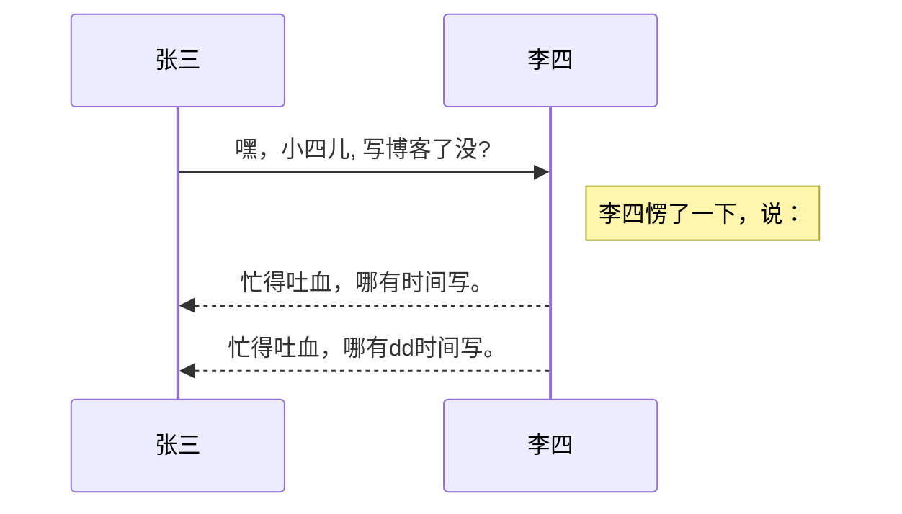
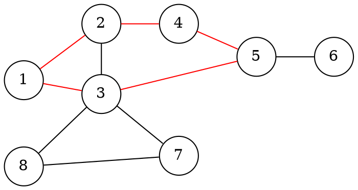

以下是官网示例 https://www.modevol.com/evoldown

# Evoldown

#d 欢迎使用Evoldown


> Evoldown 是一个所见即所得的Markdown编辑器。
>
> 不仅支持**CommonMark**和**GFM**，还加入了渐构特有的语法！
>
> 按下斜杠`/`可以查看所有命令，书写过程中伴随语法提示！

## 语法

#e 行内样式

更流畅的书写*Markdown*，使用选择提示增加行内样式。

*倾斜*

**加粗**

***加粗和倾斜混用***

~~删除~~

^上标^~下标~

`行内块`

[!隐藏的*倾斜*!]

https://www.baidu.com

[内部链接](#样式)

[外部链接](https://www.baidu.com)

行内公式：$$\sum_{i=1}^n a_i=0$$

#e 块级样式

> 引用
>
> > 多级引用

* 无序列表1

* 无序列表2

1. 有序列表

2. 有序列表

* [ ] 任务1

* [x] 已完成

1. [ ] 有序任务

[^1]: 注脚内容

引用注脚：[^1]

#e 代码块

```python
# python代码块
hello = 'world'
```

`Ctrl+回城`可以跳出代码块

还可以用代码块制图，支持Mermaid和Dot





#e 数学公式

$$
\begin{bmatrix}1 & 2 & 3\\ \ 4 & 5 & 6\\ \ 7 & 8 & 9\end{bmatrix}

$$

#e 表格

| 表头1 | 表头2 | 表头3 |
| :-- | :-- | :-- |
| 内容1 | 内容2 | 内容3 |

#e 导图描述

//: 这是一个描述

//: 这是另一个描述

#e 导图等级控制

使用导图折回来控制导图位置，其他从“语法”层级换到了Evoldown层级

/#

#e 其他

输入`shift+回车`可以插入硬换行这样文字就变成了两行，但没有行间距

[00:00]最后还有时间戳

------- 

以下是作者示例文章 https://www.modevol.com/document/jh19i7n3uj2zfwl03nn9c7i9

# Evoldown速览

#d 简介

Evoldown 是一个所见即所得的[渐构](https://www.modevol.com/)全站通用Markdown编辑器。 对Markdown编写的了解是灵活使用该编辑器的要点。

#d 支持语法

* [Markdown作者blog](https://daringfireball.net/projects/markdown)

* [CommonMark](https://commonmark.org)

  * [Markdown爱好者的通用规范](https://commonmark.org/help/)

* [GFM](https://github.github.com/gfm/)

  * [GitHub上写入](https://docs.github.com/zh/get-started/writing-on-github)

* [LaTeX](https://www.latex-project.org/)

  * [LaTeX数学公式：博客园文章LaTeX公式手册(全网最全) - 樱花赞 ](https://www.cnblogs.com/1024th/p/11623258.html)

* [Mermaid](https://mermaid.js.org/)

* [Graphviz](https://graphviz.org/)

## 特有语法

### 行内样式

#e 样式源码

```Evoldown
^上标^

~下标~

==高亮==

[!黑幕内容!]
```

### 段落操作

#e 段落格式

```Evoldown
#类型 段落关键字

段落内容
```

#d 段落类型 段落格式

| 类型  | 语法                |
| :-- | :---------------- |
| 描述  | `#d 段落关键字 `       |
| 例子  | `#e 段落关键字 `       |
| 迁移  | `#t 段落关键字 `       |
| 验证  | `#v 段落关键字 `       |
| 广告  | `#a 段落关键字 `       |
| 自定义 | `#c 自定义类型 段落关键字 ` |

#e B段落链接A段落

```Evoldown
#类型 A段落关键字

段落内容

#类型 B段落关键字 A段落关键字

段落内容

```

### 导图操作

#d 导图节点

导图节点是由各级标题和段落关键字生成

#e 导图节点描述

```Evoldown
//: 这是一个描述
//: 这是另一个描述
```

#e 导图层级控制

文章的结构是循序渐进的， 并不一定使导图的节点关系合理， 需要重新控制节点层级。

```Evoldown
/#
/##
/###
```

### 视频操作

#e 时间戳

用于文章和视频对应

```Evoldown
[00:00]
```

#c 声明 许可协议

by [刘鹏飞-冷瞳9I6](https://www.lt9i6.top/) 许可协议[CC BY-NC-SA 4.0 Deed | 署名-非商业性使用-相同方式共享 4.0 国际 | Creative Commons](https://creativecommons.org/licenses/by-nc-sa/4.0/deed.zh-hans)

-------------
段落功能测试

#c Type Custom

Text content

#d Description

Text content

#e Example

Text content

#t Transfer

Text content

#v Verification

Text content

#a Advertisement

Text content

#c Type Custom1 Custom

Text content

#d Description1 Description

Text content

#e Example1 Example

Text content

#t Transfer1 Transfer

Text content

#v Verification1 Verification

Text content

#a Advertisement1 Advertisement

Text content

#d Description2 Custom

#e Example2 Verification

#t Transfer2 Custom

#c Type Custom2 Description

#v Verification2 Example

#a Advertisement2 Description

#c Type Custom3 Custom4

Text content

#d Description3 Description4

Text content

#e Example3 Exampl4e

Text content

#t Transfer3 Transfer4

Text content

#v Verification3 Verification4

Text content

#a Advertisement3 Advertisement4

Text content
