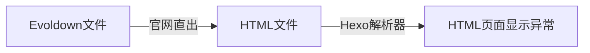
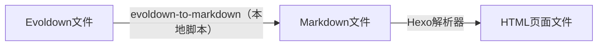

#c 起因 兼容问题

我在使用渐构官网的导出HTML文件，发现与我正在使用的博客框架Hexo对Markdown的处理并不一样，这让渐构官网的导出HTML文件不兼容我的博客的显示。

#d 更新流程 Markdown原理

由于难以更改渐构官网和Hexo框架的代码，所以我对流程进行了一定的改变。

原先流程：

现在流程：


通过参考Markdown原理，我通过Python代码将Evoldown转换成符合一般规范的Markdown，然后再使用其他第三方的Markdown转HTML工具进行处理，以此解决往后会发生的兼容问题。

同时，也可以利用这次的实践，学习如何用代码开发对文本处理的工具。

#d Markdown原理

就像[Markdown作者博客](https://daringfireball.net/projects/markdown/#:~:text=%E2%80%9CMarkdown%E2%80%9D%20is%20two%20things%3A%20(1)%20a%20plain%20text%20formatting%20syntax%3B%20and%20(2)%20a%20software%20tool%2C%20written%20in%20Perl%2C%20that%20converts%20the%20plain%20text%20formatting%20to%20HTML)上说的：

> “Markdown”是两件事：（1）纯文本格式语法; （2）用Perl编写的软件工具，用于转换纯文本 格式化为 HTML。

#d Markdown一般规范

Markdown作者    
https://daringfireball.net/projects/markdown

Markdown爱好者（通用规范）    
https://commonmark.org/    
https://commonmark.org/help/

 GitHub Flavored Markdown    
https://docs.github.com/zh/get-started/writing-on-github     
https://github.github.com/gfm/

#d 关于Evoldown

官网示例： https://www.modevol.com/evoldown

个人整理： https://www.modevol.com/document/jh19i7n3uj2zfwl03nn9c7i9


#e 代码展示

```python
# 引入正则表达式库  
import re  
# 引入系统操作库  
import os  
# 引入lxml处理svg代码  
from lxml import etree  
# 引入模板引擎  
from jinja2 import Template  
  
# 定义段落类型与对应svg图标的映射关系  
icon_svg_filename = {  
    '#d': 'Description',  
    '#e': 'Example',  
    '#t': 'Transfer',  
    '#c': 'Custom',  
    '#v': 'Verification',  
    '#a': 'Advertisement'  
}  
  
# 定义段落svg图标的参数  
icon_svg_changes = {  
    'fill': 'currentColor',  # 使用当前文字的颜色填充  
    'width': '2em',  # 宽度是文字大小的两倍  
    'height': '2em'  # 高度是文字大小的两倍  
}  
  
# 定义段落类型与对应hsl()颜色的映射关系  
card_color = {  
    '#d': '200 72% 50%',  
    '#e': '0 72% 50%',  
    '#t': '50 72% 50%',  
    '#c': '0 0% 50%',  
    '#v': '260 72% 50%',  
    '#a': '300 72% 50%'  
}  
  
  
# f-string 是 Python3.6 引入的一种新的字符串格式化方式，  
# 它允许在字符串中插入变量值或表达式结果，  
# 使用 {} 括起来，并在字符串前面加上 f 或 F。  
# 获取本项目svg文件夹里的SVG图标的源代码,并更改样式  
def extract_modify_svg_content(svg_filename, svg_changes):  
    """  
    从SVG文件中提取并修改内容。  
  
    Parameters:        svg_filename (str): SVG文件名。  
        svg_changes: 变化参数  
  
    Returns:        str_content: 修改后的SVG内容。  
  
    """    # 构建SVG文件的路径  
    svg_path = os.path.join('svg', f'{svg_filename}.svg')  
    # 打开SVG文件并读取内容  
    with open(svg_path, 'r', encoding='utf-8') as svg_file:  
        svg_code = svg_file.read()  
    # 将 Unicode 字符串转换为字节字符串  
    svg_bytes = svg_code.encode('utf-8')  
    # 使用 lxml 解析 SVG 文件  
    svg_root = etree.fromstring(svg_bytes)  
    # 修改svg的属性  
    for key, value in svg_changes.items():  
        svg_root.attrib[key] = value  
    # 获取 <svg> 标签内的内容  
    svg_content = etree.tostring(svg_root, encoding="unicode")  
    return svg_content  
  
  
# 该函数的输入参数是evoldown文件的位置和输出的markdown文件位置  
def convert_evoldown_to_markdown(evoldown_file, markdown_file):  
    """  
    将Evoldown格式转换为Markdown格式。  
  
    Parameters:        evoldown_file (str): 输入的Evoldown文件位置。  
        markdown_file (str): 输出的Markdown文件位置。  
    """    # 以utf-8格式读取evoldown文件给file对象，然后把内容保存到evoldown_text里面，  
    with open(evoldown_file, 'r', encoding='utf-8') as input_file:  
        evoldown_text = input_file.read()  
        # print(evoldown_text)  
  
    # 识别标签语法  
  
    # raw string 是一种特殊的字符串，它以 r 或 R 开头，并且对反斜杠 \ 不进行转义处理。  
    # 正则表达式匹配：学习材料的类型，学习材料的关键词，关联的学习材料。  
    pattern = r'(#[detva])( \S+)( \S+)?'  
    # 正则表达式匹配：学习材料的类型、自定义的学习材料的类型、学习材料的关键词、关联的学习材料。  
    pattern_c = r'(#c)( \S+)( \S+)( \S+)?'  
  
    # 提取根据表达式提取内容  
    matches = re.findall(pattern, evoldown_text)  
    matches_c = re.findall(pattern_c, evoldown_text)  
  
    # 创建字典方便根据关键词寻找类型  
    dict_matches = {}  
    dict_matches_c = {}  
    # 遍历 matches，将关键词和材料类型添加到字典中  
    for match in matches:  
        material_type, keywords, associated_keyword = match  
        dict_matches[keywords] = material_type  
    # 遍历 matches_c，将关键词、材料类型和自定义类型添加到字典中  
    for match_c in matches_c:  
        material_type, custom_type, keywords, associated_keyword = match_c  
        dict_matches_c[keywords] = [material_type, custom_type]  
  
    # print(matches)  
    # print(matches_c)    # print(dict_matches)    # print(dict_matches_c)  
    # 查询的函数实现  
    def find_associated_type(key):  
        # 首先在 dict_matches 中查找关键字  
        if key in dict_matches:  
            return [dict_matches[key], None]  
        # 如果在 dict_matches 中未找到，则在 dict_matches_c 中查找  
        elif key in dict_matches_c:  
            return dict_matches_c[key]  
  
    # 段落文本标记替换成HTML代码  
    new_markdown_text = evoldown_text  
  
    # 定义段落标记 HTML 模板  
    tag_html_template = """  
<div style="display: flex; flex-direction: row; align-items: center;">  
{{ material_card }}  
{{ find_associated_svg }}  
{{ associated_card }}  
</div>  
    """    # 定义卡片 HTML 模板  
    card_html_template = """<span style="display: flex; flex-direction: row; align-items: center; color: hsl({{ color_value }}); background-color: hsl({{ color_value }}/0.08); padding: 0 0.4em; border-radius: 0.4em;; line-height: 2.5em">  
<span style="display: flex; flex-direction: row; align-items: center; margin-right: 0.4em; ">  
{{ svg_code }}  
  
<span style="">{{ custom_type }} |</span>  
  
</span>  
{{ keywords }}  
</span>  
    """  
    # 创建 Jinja2 模板对象  
    tag_template = Template(tag_html_template)  
    card_template = Template(card_html_template)  
  
    """  翻译参考  
    Learning material tags, learning material types,    learning material type cards, custom learning material types,    learning material keywords, associated_keyword learning materials. No association found    学习材料标记、学习材料的类型、学习材料类型卡、自定义的学习材料的类型、学习材料的关键词、关联的学习材料。未发现关联  
    """    # d、e、t、v、a类型段落标记替换成HTML代码  
    for match in matches:  
        # print(match)  
        # 段落标签内容  
        material_type, keywords, associated_keyword = match  
  
        # 段落卡片数据  
        material_card = card_template.render(  
            color_value=card_color[material_type],  
            svg_code=extract_modify_svg_content(icon_svg_filename[material_type], icon_svg_changes),  
            keywords=keywords.strip(),  
        )  
  
        # 关联段落卡片数据  
        if associated_keyword:  
            # 如果关联关键词存在  
            associated_types = find_associated_type(associated_keyword)  
            if associated_types:  
                # 找到关联段落  
                associated_type = associated_types[0]  
                associated_custom_type = associated_types[1]  
                associated_card = card_template.render(  
                    color_value=card_color[associated_type],  
                    svg_code=extract_modify_svg_content(icon_svg_filename[associated_type], icon_svg_changes),  
                    custom_type=associated_custom_type,  
                    keywords=associated_keyword  
                )  
                find_associated_svg = extract_modify_svg_content('Associated', icon_svg_changes)  
            else:  
                # 找到关联段落  
                associated_card = card_template.render(  
                    color_value='0 0% 70%',  
                    keywords=associated_keyword  
                )  
                find_associated_svg = extract_modify_svg_content('NotFoundAssociated', icon_svg_changes)  
        else:  
            # 如果没有关联关键词  
            associated_card = ''  
            find_associated_svg = ''  
  
        # 生成完整HTML代码  
        tag_html_code = tag_template.render(  
            material_card=material_card,  
            find_associated_svg=find_associated_svg,  
            associated_card=associated_card,  
        )  
  
        # print(tag_html_code)  
        # 找到对应文本并替换  
        new_markdown_text = new_markdown_text.replace(  
            f'\n{material_type}{keywords}{associated_keyword}\n', tag_html_code)  
  
    # c类型段落标记替换成HTML代码  
    for match_c in matches_c:  
        # print(match_c)  
        material_type, custom_type, keywords, associated_keyword = match_c  
  
        # 段落卡片数据  
        material_card = card_template.render(  
            color_value=card_color[material_type],  
            svg_code=extract_modify_svg_content(icon_svg_filename[material_type], icon_svg_changes),  
            custom_type=custom_type,  
            keywords=keywords.strip(),  
        )  
  
        # 关联段落卡片数据  
        if associated_keyword:  
            # 如果关联关键词存在  
            associated_types = find_associated_type(associated_keyword)  
            if associated_types:  
                # 找到关联段落  
                associated_type = associated_types[0]  
                associated_custom_type = associated_types[1]  
                associated_card = card_template.render(  
                    color_value=card_color[associated_type],  
                    svg_code=extract_modify_svg_content(icon_svg_filename[associated_type], icon_svg_changes),  
                    custom_type=associated_custom_type,  
                    keywords=associated_keyword  
                )  
                find_associated_svg = extract_modify_svg_content('Associated', icon_svg_changes)  
            else:  
                # 没有关联段落  
                associated_card = card_template.render(  
                    color_value='0 0% 70%',  
                    keywords=associated_keyword  
                )  
                find_associated_svg = extract_modify_svg_content('NotFoundAssociated', icon_svg_changes)  
        else:  
            # 如果没有关联关键词  
            associated_card = ''  
            find_associated_svg = ''  
  
        # 生成完整HTML代码  
        tag_html_code = tag_template.render(  
            material_card=material_card,  
            find_associated_svg=find_associated_svg,  
            associated_card=associated_card,  
        )  
        # print(tag_html_code)  
  
        # 找到对应文本并替换  
        new_markdown_text = new_markdown_text.replace(  
            f'\n{material_type}{custom_type}{keywords}{associated_keyword}\n', tag_html_code)  
  
    # print(new_markdown_text)  
  
    # 将生成的HTML代码发送给output_file,以UTF-8格式保存到新的Markdown文件中  
    with open(markdown_file, 'w', encoding='utf-8') as output_file:  
        output_file.write(new_markdown_text)  
  
  
# 测试  
convert_evoldown_to_markdown(r'markdown\example.md', r'markdown\example_output.md')
```

#d 重绘SVG图形

为了方便自己对svg的处理和实现自己的显示风格的图标，所以重绘了官网的图标。

【尝试重绘渐构的段落图标】  
https://www.modevol.com/document/clyqfgqgweaz61a3ybq3fm18  
  
【第二次尝试重绘渐构的段落图标】  
https://www.modevol.com/document/aakjqpiefnxddaqh661udjwr


[[尝试重绘渐构的段落图标]]
[[尝试重绘渐构的段落图标-存在的问题]]
[[第二次尝试重绘渐构的段落图标]]


#c 声明 许可协议

- 完整项目地址： https://github.com/LengTong9I6/evoldown-to-markdown 


by [刘鹏飞-冷瞳9I6](https://www.lt9i6.top/) 许可协议[CC BY-NC-SA 4.0 Deed | 署名-非商业性使用-相同方式共享 4.0 国际 | Creative Commons](https://creativecommons.org/licenses/by-nc-sa/4.0/deed.zh-hans)